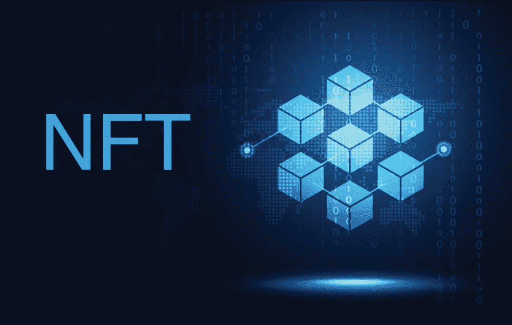

# 什么是 NFT，它是如何工作的

> 原文：<https://medium.com/coinmonks/what-is-an-nft-and-how-does-it-works-1f85a5734f84?source=collection_archive---------33----------------------->

## NFTs 解释道

NFT 是一种数字令牌或资产。

无论何时你购买 NFT，你都是在购买特定资产的权利。

*   不可替换的意思是，它一旦被创建就不能被改变，你不能把它分割开来，而且它必须能与其他东西区分开来。
*   一个*令牌*就是你拥有的一小段数据。