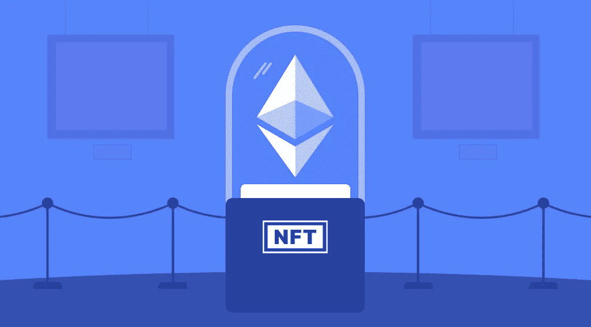

# 什么是 NFT，如何创建不可替换的令牌？

> 原文：<https://medium.com/coinmonks/what-is-an-nft-and-how-to-create-a-non-fungible-token-d39aeb466b4d?source=collection_archive---------67----------------------->

什么是 NFT？不可替代令牌(NFT)被称为 2021 年的主要趋势，它在 2022 年变得更加流行。理解它的工作方式以及如何创建一个[不可替换的令牌](https://stealthex.io/blog/2019/12/04/what-is-nft-why-do-we-need-it/)比听起来容易。以下是[如何在 NFT](https://stealthex.io/blog/2021/12/30/how-to-invest-in-nft-tokens/) 投资以及在哪里购买代币。只需要花一点时间通读，学习你需要的一切。

# NFT 代表什么？

被解密为不可替换令牌的 NFT 是一个单元，利用该单元为任何唯一的项目创建数字广播。这可以是任何声称独特的内容(图片、照片、视频、音乐)。它们在收藏家和艺术爱好者中很有价值，可以通过拍卖来买卖。

这些令牌存储在区块链中，这是一个巨大的区块链，每个区块都包含信息。与数据存储在一个地方的服务器不同，这些数据块驻留在世界各地的多个设备上。

# NFTs 将如何改变世界？

令牌化为任何数字商品增加了许多功能，从而提高了商品的价值。

主要优势是真正的所有权和不可转让性。您的数字资产是分散的。它独立于它所在的系统。这适用于游戏中的物品。你购买它们，但是只要开发商允许，你就拥有它们。有了不可替换的令牌，您就拥有了该项目的所有权证书。另一个问题是，它的价值取决于游戏有多好，以及它现在是否有效，这取决于开发者。

另一个好处是流动性。如果人们不确定某样东西的原创性，他们是不会买的。如果你能验证一件数字艺术品的原创性，它就更容易卖出去。除非开发者有一个专门的市场，否则你无法从游戏中出售一把传奇之剑。加密游戏中的 NFT 军刀可以在任何市场出售。它会进入你的钱包，连接到游戏，游戏会看到这把剑现在是你的了。

# NFT 行业前三名

# 游戏中的 NFT

带有收藏品的游戏是 NFT 地区最常见的。第一个成功的项目是 CryptoKitties。它变得如此受欢迎，以至于在 2017 年末，由于高活跃度，玩家们正在使以太坊区块链超载。

CryptoKitties 的目的是喂养虚拟小猫。它们可以互相杂交产生具有独特外貌的后代。小猫越稀有，就越值钱。任何时候，小猫都可以被交换或出售给 ETH。

这款游戏的独特之处在于它是基于区块链的。首先，每只小猫由一个 ERC-721 令牌代表。第二，决定新小猫遗传密码的算法是在一个封闭源代码的智能合同中。第三，NFT 的价格由玩家决定，开发商不干涉。

区块链为游戏机制带来了以前只有物理游戏才有的新功能。例如，创建可以在游戏之外运作的二级市场。想象一下，能够将一个虚拟机发送到另一个游戏、展览或拍卖。F1 赛车模拟器 Delta Time 中的 NFT 就是这样设置的。

# [NFT 数字艺术](https://stealthex.io/blog/2021/10/14/what-is-nft-art-how-to-create-and-buy-nft-crypto-art/)

代币包含艺术品的链接和所有者的地址，并作为所有权的证明。

标记化的数字艺术品还有另一个显著的好处。一份聪明的合同可以阐明创作者将获得版税(作品销售额的百分比)的条款。

所有权和排他性使得实物艺术品具有价值。在数字世界中，NFT 可以提供价值。许多艺术家已经开始尝试技术。Open Sea、Nifty Gateway、SuperRare 和 Rare Art Labs 已经开发了发布和查找此类艺术品的平台。

# [音乐 NFT](https://stealthex.io/blog/2021/11/19/nft-music-marketplace-its-impact-on-the-crypto-art/)

音乐 NFT 是可以买卖的独特音频或音乐作品的所有权证书。

例如，世界著名的艺术家崔·颂推出了一个独家的 NFT 神秘盒子，里面有作者创作的未发行的新歌和独特的曲目。

NFTs 的日益流行允许用户购买音乐会门票。他们的好处是，你受到保护，免受诈骗，永远不会失去它。

# 如何制作一个不可替换的令牌？

由于市场易于使用，如何[创造一件 NFT](https://stealthex.io/blog/2021/10/14/what-is-nft-art-how-to-create-and-buy-nft-crypto-art/) 艺术品的过程只需要几分钟。

它始于通过钱包在平台上注册并获得授权。接下来，找到主页上的“创建”按钮，上传您的数字对象，并添加它们的描述。这种平台允许用户创建单独的 NFT 和它们的集合。

# 哪里可以买到 NFT？

# 选择 NFT 市场

第一件事是选择一个 NFT 市场。购买 NFT 最受欢迎的平台有:

*   开阔海域。有成千上万种不同的 NFT:从绘画到虚拟土地和域名。有一个拍卖功能，并完全融入加密结构。
*   Rarible 使用一个本地 RARI 令牌。艺术家可以在这里创作和出售他们的作品。与 OpenSea 不同，在 Rarible 上，你可以在自己的智能合约上发布 NFT。这个平台与艺术家互动，推广他们的作品。
*   NiftyGateway 是一个市场，具有买卖 NFT 的便利功能。用户可以使用法定货币购买代币)，卖家可以从他们的信用卡或借记卡中提取收益。与 OpenSea 和 Rarible 不同，NiftyGateway 专门交易加密艺术 NFT。

# 创建市场帐户

通过创建一个 [marketplace](https://stealthex.io/blog/2021/11/19/nft-music-marketplace-its-impact-on-the-crypto-art/) 账户，你将能够与 NFT 进行交易。在这种情况下，你只需要将你的钱包连接到平台上。它将成为你在市场上的客户。在市场主页上，单击钱包图标并选择合适的选项。

# 注册加密货币钱包

获得一个加密货币钱包来存储和管理您的 NFT。此外，在 Opensea 等平台上铸造新的不可替代令牌也需要钱包。

通常，使用像 Metamask 这样的 Chrome 扩展钱包，但显然有更多的选择——只要仔细检查 NFT 支持上的信息，并注意支持哪个区块链。

# 如何购买 NFT？

最后一个阶段是挑选一个代币并购买它。这里唯一的障碍是为你的购买选择一种加密货币。为了简化这一过程，选择以太坊，这是一种可靠的资产，其质量已被投资者证明。

购买 ETH 最安全的方式是 [StealthEX 密码交易所](https://stealthex.io/)。它提供 400 多种加密货币，让你在几分钟内购买代币，没有隐藏费用。

通过以下 5 个步骤获得以太坊:

1.  去 [StealthEX](https://stealthex.io/?from=btc&to=eth&amount=0.1) 网站。它会自动引导你到“交换加密”窗口。
2.  选择您想要交换的货币。例如， [BTC](https://stealthex.io/coin/btc) 到 [ETH](https://stealthex.io/coin/eth) 。
3.  输入您的加密钱包地址。
4.  把押金寄到 StealthEX 生成的地址。
5.  收到存款后，您会将兑换的资金发送到步骤 3 中提供的地址。

你也可以用你的借记卡或信用卡购买 ETH。为此，您需要打开“购买”加密窗口，而不是步骤 1 中的“交换”加密。

在 [Medium](https://stealthex-io.medium.com/) 、 [Twitter](https://twitter.com/Stealthex_io) 、 [Telegram](https://t.me/StealthEX) 、 [YouTube](https://www.youtube.com/channel/UCeES_XBesX76ge7xf1meuSw) 和 [Reddit](https://www.reddit.com/user/Stealthex_io) 上关注我们，获取 [StealthEX.io](https://stealthex.io/) 更新和关于密码世界的最新消息。

*此处表达的观点和意见仅代表作者个人。每一次投资和交易都有风险。做决定时，你应该进行自己的研究。*

**非常欢迎您来参观**[**StealthEX exchange**](https://stealthex.io/)**看看**有多快多方便。

*原载于 2022 年 4 月 1 日*[*https://stealthex . io*](https://stealthex.io/blog/2022/04/01/what-is-an-nft-and-how-to-create-a-non-fungible-token/)*。*

> 加入 Coinmonks [电报频道](https://t.me/coincodecap)和 [Youtube 频道](https://www.youtube.com/c/coinmonks/videos)了解加密交易和投资

# 另外，阅读

*   [如何使用 Solidity 在以太坊上创建 DApp？](https://coincodecap.com/create-a-dapp-on-ethereum-using-solidity)
*   [币安 vs FTX](https://coincodecap.com/binance-vs-ftx) | [最佳(索尔)索拉纳钱包](https://coincodecap.com/solana-wallets)
*   [如何在 Uniswap 上交换加密？](https://coincodecap.com/swap-crypto-on-uniswap) | [A-Ads 评论](https://coincodecap.com/a-ads-review)
*   [加密货币储蓄账户](/coinmonks/cryptocurrency-savings-accounts-be3bc0feffbf) | [YoBit 评论](/coinmonks/yobit-review-175464162c62)
*   [Botsfolio vs nap bots vs Mudrex](/coinmonks/botsfolio-vs-napbots-vs-mudrex-c81344970c02)|[gate . io 交流回顾](/coinmonks/gate-io-exchange-review-61bf87b7078f)
*   [CoinFLEX 评论](https://coincodecap.com/coinflex-review) | [AEX 交易所评论](https://coincodecap.com/aex-exchange-review) | [UPbit 评论](https://coincodecap.com/upbit-review)