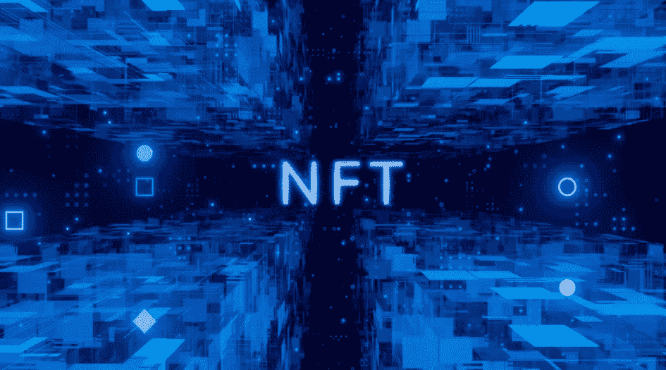
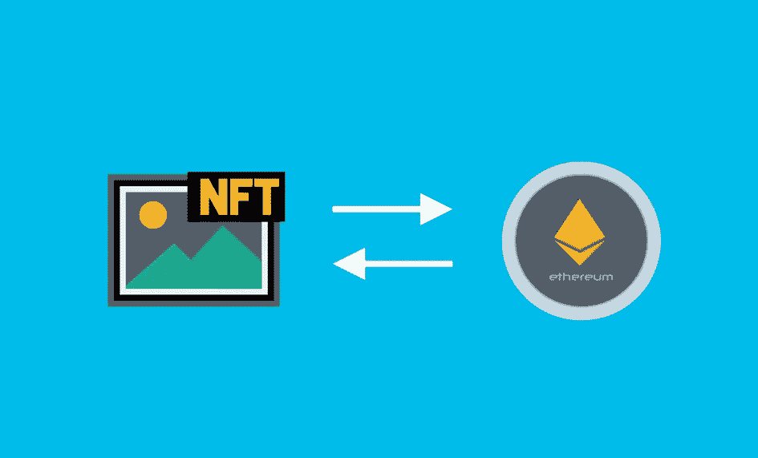

# 什么是 NFT？

> 原文：<https://medium.com/coinmonks/what-is-an-nft-e722da892aff?source=collection_archive---------63----------------------->

在本文中，我们解释了什么是 NFT，并概述了最重要的事实。

首先，让我们解释一下这个名字:NFT 是不可替换令牌的缩写。该术语的组成部分可以解释如下:

**令牌** 令牌是资产的数字化形式。这种资产具有一定的价值或功能。计算机生成的图像是直接数字化的，因此不需要首先数字化。房地产和音乐版权的情况不同。这些可以通过覆盖令牌上的相关权限来进行令牌化。数字化使得版权更容易交易。

**不可替代**
一个令牌可以是可替代的，也可以是不可替代的。基本上，不可替换等同于唯一，因为不可替换令牌不能一对一地与另一个令牌交换。一个很好的例子是绘画。你可以交换它们，但交换对象的价值与另一幅画没有直接的可比性。

比特币的情况有所不同。比特币可以随时兑换，因为每个比特币代表一个相同的价值。一般来说，这同样适用于现金或法定货币。

那么，NFT 和区块链有什么关系呢？

与加密货币一样，NFT 基于区块链，这是一个分散的数据库。简单地说，这个数据库是由信息块组成的，这些信息块就像链条上的链环一样串在一起。每个块都包含实际数据及其哈希值和前一个块的哈希值。存储在块中的数据可以包括例如加密货币或 NFT 的交易细节:卖方、买方和交易金额。

哈希值可以被认为是电子指纹。它总是唯一的，用于标识特定的块。由于每个块也包含其前一个块的哈希值，因此会创建一个区块链。

从技术上讲，区块链是基于对等网络的，即在该网络中，每个参与者都拥有区块链的完整副本。当一个新的信息块被创建时，网络中的所有计算机接收该信息，检查它，然后确认包含。

如果有人想给《区块链》添加一条错误信息，他们必须把它复制成所有的版本。由于这(几乎)是不可能的(参见[https://bitcoin . org/bitcoin . pdf)，](https://bitcoin.org/bitcoin.pdf),)区块链是一种极其安全的数据存储方式。因为数据被永久的保存在区块链上，并且可以追踪，NFT 的每一笔买卖都可以被很好的追踪。令牌的所有者被清楚地记录下来。

**哪里可以买到 NFT？**

许多交易网站都在网上提供非功能性交易。最著名的是 OpenSea、Rarible 和 Mintable。在大多数情况下，购买 NFTs 需要一种存储在数字钱包中的加密货币。如今，以太坊(ETH)是领先的加密货币。然而，其他货币，如索拉纳，至少也值得一看。

交易网站通常只用于转售。许多项目在自己的网站上，在一个自定义的铸造日期专门提供首次销售。我们将在另一篇文章中总结这样做的原因以及如何找到好的 NFT 项目。

**一个好的 NFT 项目的例子**

对于每一个好的 NFT 项目，至少有两倍多的坏的 NFT 项目。我们建议您看看我们的 NFT 世界新闻项目:[《世界新闻报》(nft-world.news)](https://nft-world.news/#/) 。

**对 NFT 艺术的批评**

一些批评者认为，NFT 的图像也可以通过简单的右键单击保存，因此记录区块链的所有权没有提供任何附加值。请随意阅读我们关于这个主题的故事:

[NFTs —直接复制？。对于这个问题:“我为什么应该购买…| NFT 世界新闻| coin monks | 2022 年 3 月| Medium](/coinmonks/nfts-just-copy-it-f2844ab8f617)

> 加入 Coinmonks [电报频道](https://t.me/coincodecap)和 [Youtube 频道](https://www.youtube.com/c/coinmonks/videos)了解加密交易和投资

# 另外，阅读

*   [有哪些交易信号？](https://coincodecap.com/trading-signal) | [Bitstamp vs 比特币基地](https://coincodecap.com/bitstamp-coinbase) | [买索拉纳](https://coincodecap.com/buy-solana)
*   [ProfitFarmers 点评](https://coincodecap.com/profitfarmers-review) | [如何使用 Cornix 交易机器人](https://coincodecap.com/cornix-trading-bot)
*   [十大最佳加密货币博客](https://coincodecap.com/best-cryptocurrency-blogs) | [YouHodler 评论](https://coincodecap.com/youhodler-review)
*   [my constant Review](https://coincodecap.com/myconstant-review)|[8 款最佳摇摆交易机器人](https://coincodecap.com/best-swing-trading-bots)
*   [MXC 交易所评论](/coinmonks/mxc-exchange-review-3af0ec1cba8c) | [Pionex vs 币安](https://coincodecap.com/pionex-vs-binance) | [Pionex 套利机器人](https://coincodecap.com/pionex-arbitrage-bot)