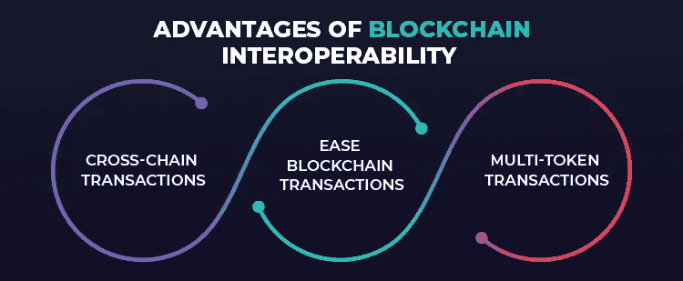
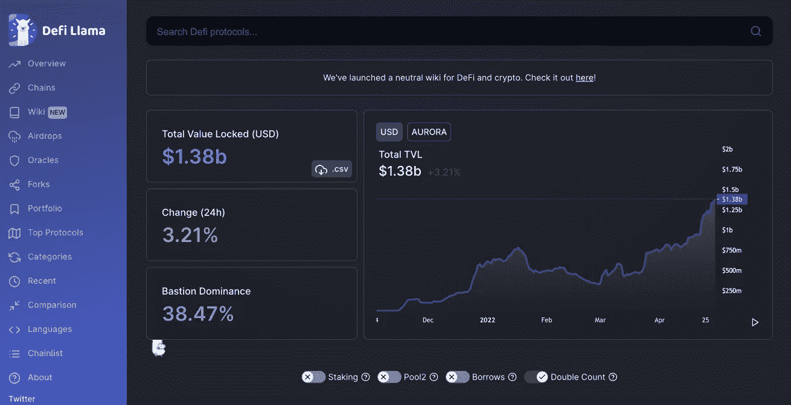

# 什么是极光网络？它如何解决互操作性

> 原文：<https://medium.com/coinmonks/what-is-aurora-network-how-it-solves-interoperability-a02e65175098?source=collection_archive---------6----------------------->

自比特币和以太坊诞生以来，区块链技术已经走过了漫长的道路。网络和技术的爆炸式发展带来了各种各样的设计，旨在解决受集中金融影响的问题。

最初的关键价值主张之一是权力下放。网络和技术开源或由社区运行的能力，而不是中央财政采用的模式。

随着对区块链技术需求的增加，处理可扩展性、速度和互操作性的需求也越来越大(互操作性是不同区块链网络之间交换和利用数据，以及在网络各自的区块链之间移动独特类型的数字资产的能力)。

互操作性是影响区块链技术的一个问题。这给社区造成了孤立，就像一个不能与外界交流信息的孤岛。缺乏互操作性不利于去中心化，并重新建立了集中式 web 的割据。

区块链技术之间缺乏互动阻碍了进步、创新、经济增长和自由贸易。为特定网络构建的区块链技术只对该网络有用，这限制了其他社区的采用。

> 当你想到高昂的汽油费时，你会想到什么
> 
> 以太坊对吗？

由于以太网的高额燃气费，许多用户不愿充分利用这项技术。

我们将重点介绍 Aurora 网络，这是一种第 2 层技术，可解决与区块链技术相关的可扩展性、速度和互操作性问题。

## 什么是极光网络

Aurora 网络是第 2 层利益证明(POS)技术，构建为基于 Near 协议的智能合同。Aurora 是一个以太坊虚拟机(EVM ),它有助于扩展以太坊生态系统，使开发人员能够在兼容以太坊的高吞吐量、可扩展、未来安全的低交易费用平台上运行他们的应用程序。

Aurora 的 EVM 使得以太坊的原生应用迁移到 Near 的第二层网络成为可能，该网络是作为智能合同而构建的。开发人员还可以访问以太坊工具，如 Aurora 上的 solidity smart contract。极光的基本费用在以太坊，这为 dApps 用户提供了良好的体验。

Aurora 的彩虹桥允许用户从以太坊、Near 和 Aurora 转移代币。更多的桥梁即将到来，这使得互操作性成为可能。

> 区块链桥是允许令牌和/或任意数据从一个链传输到另一个链的连接。两个链可以有不同的协议、规则和治理模型，但是桥提供了一种兼容的方式来安全地在两端进行互操作。

Aurora 的总锁定价值在过去几个月里有了巨大的增长

[Aurora’s TVL from Defi Llama](https://defillama.com/chain/Aurora)

Aurora Network 是一项区块链技术，它构建了 dApps，为以太坊提供了可扩展性和互操作性解决方案。随着更多的项目建立在网络上，如 Bastion、Aurigami、Trisolaris 等。这将为 DeFi 空间做出巨大贡献，并推动其采用。

我希望你对这篇文章感兴趣，我对自由写作的角色持开放态度。您可以关注我或向我问好

[推特](https://twitter.com/jeamz007)

jamesobande2015@gmail.com

> 加入 Coinmonks [电报频道](https://t.me/coincodecap)和 [Youtube 频道](https://www.youtube.com/c/coinmonks/videos)了解加密交易和投资

# 另外，阅读

*   [如何在 FTX 交易所交易期货](https://coincodecap.com/ftx-futures-trading) | [OKEx vs 币安](https://coincodecap.com/okex-vs-binance)
*   [OKEx vs KuCoin](https://coincodecap.com/okex-kucoin) | [摄氏替代品](https://coincodecap.com/celsius-alternatives) | [如何购买 VeChain](https://coincodecap.com/buy-vechain)
*   [ProfitFarmers 点评](https://coincodecap.com/profitfarmers-review) | [如何使用 Cornix 交易机器人](https://coincodecap.com/cornix-trading-bot)
*   [如何匿名购买比特币](https://coincodecap.com/buy-bitcoin-anonymously) | [比特币现金钱包](https://coincodecap.com/bitcoin-cash-wallets)
*   [瓦济里克斯 NFT 评论](https://coincodecap.com/wazirx-nft-review)|[Bitsgap vs Pionex](https://coincodecap.com/bitsgap-vs-pionex)|[坦吉姆评论](https://coincodecap.com/tangem-wallet-review)