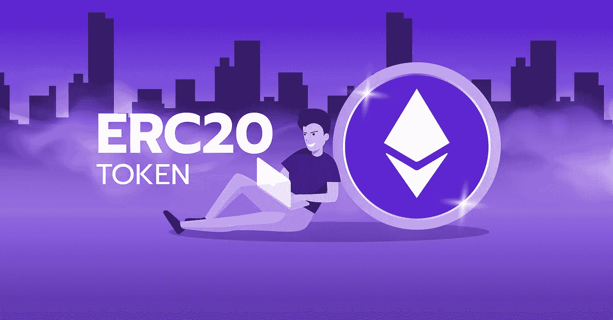
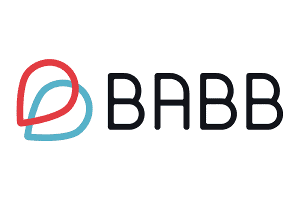
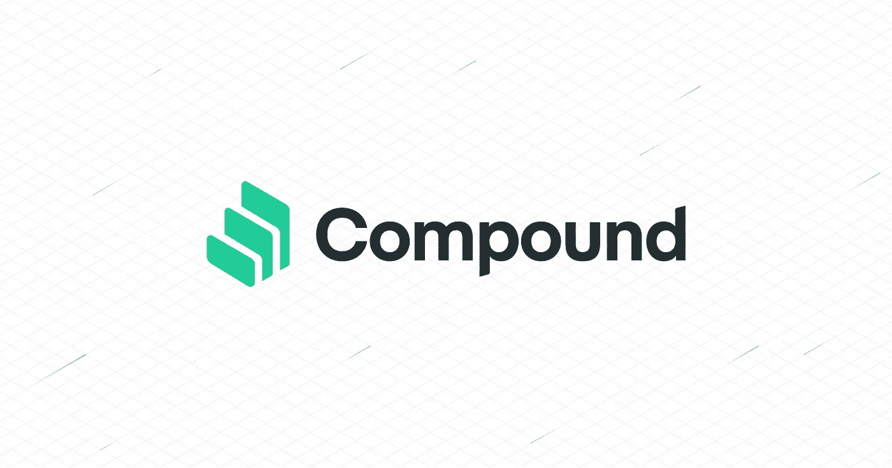

# 什么是 BABB (BAX)和复合(COMP)，了解这两个被低估的加密资产。

> 原文：<https://medium.com/coinmonks/what-is-babb-bax-and-compound-comp-why-these-two-cryptocurrencies-should-be-on-your-radar-da1fc7071889?source=collection_archive---------17----------------------->

什么是 BABB？

Babb 是一个金融区块链平台，成立于伦敦(英国)，旨在为没有银行账户和银行服务不足的人群提供便捷的金融服务。Babb 的使命是成为一个分散的银行平台，利用区块链、人工智能和生物识别技术为世界上的任何人提供点对点金融服务。至少有 20 亿人没有银行账户或基本的银行服务，传统的银行系统无法为他们服务。Babb 是一种新方法，使用创新技术来众包金融服务，并完全消除我们所知的对银行的需求。

Babb 正准备推出一个分布式应用平台，将法定货币符号化。Babb 应用程序、合作伙伴服务、全球银行和发展中国家的中央银行将使用这些象征性基金。

BAX 是 Babb 平台的生命线，用于在平台服务的所有地理区域和管辖范围内运营平台服务。

**为什么巴布令人兴奋**

BABB 正在建立一个分散化的银行。任何有智能手机的人都可以开一个英国银行账户，如果你完全验证了你自己，你就可以和你的朋友和家人在一起了。这些集成的数字身份允许任何人快速加入，尤其是那些生活在银行业务可能更具挑战性的地区的人。

这个创新和雄心勃勃的项目背后也有自己的象征，这比标准银行体系允许的自由要多得多。用户甚至可以获得独立于 Visa 或 Mastercard 系统的支付卡。

这个区块链项目的目标是发展中国家，这些国家有很高比例的公民没有银行账户，但有越来越多的移动电话用户，使他们的解决方案成为这些经济体的完美补充。

**主要障碍是什么？**

没有人知道 BABB 是否合法，因为它需要得到它经营的每个国家的政府和中央银行的许可。BABB 还需要得到美国联邦存款保险公司(FDIC)等其他机构的批准。

根据 coinmarketcap 的数据，BAX token 的流通供应量为 498.5 亿英镑，总供应量为 50 万亿英镑，这使得雄心大于现实。投资者最好谨慎投资 BABB，直到该公司证明它能够实现自己的梦想。

BABB 是一个好的投资吗？

BABB 是一个优秀的长期投资，可以成为未来加密世界的据点。然而，这需要你的耐心，因为艰难的几年即将到来。

**什么是复合？**

Compound (COMP)是一个基于以太坊的令牌，允许社区管理 Compound 协议。该协议由分散的利率市场组成，使用户能够以可变利率供应和借入以太币。

**为什么复合令人兴奋**

大多数加密货币在交易所平台上大多是被动的，对你的投资者没有任何作用。Compound 旨在通过其开放的贷款平台来改变这种情况，该平台允许任何人存放受支持的以太坊令牌，以轻松获得余额利息或获得担保贷款。这是基于一种“无信任系统”，在这种系统中，用户不需要相互了解或信任。

**主要障碍是什么？**

复合有一些障碍，投资者应该被告知。由于加密货币的不可预测性，抵押品的清算有时会给复合用户带来巨大的挫折。加密商品是一个高度不稳定的基于算法的智能合约系统，它会导致 DeFi 系统中的技术错误。可供用户借贷的加密货币数量有限。产量农业风险极大，因为用户可以交易比他们投入的实际价值大得多的密码。

**复合投资是好的投资吗？**

化合物已经成为一种受欢迎的 Defi 标志。然而，在过去几个月里，它的价格走势一直是看跌的。红利券是否适合你的投资组合取决于你的环境和风险承受能力。在投资之前，最好先估计一下你准备承担的风险水平。永远不要投资你输不起的钱。

希望你有一个精彩的阅读，并记住这不是财务建议

> 加入 Coinmonks [电报频道](https://t.me/coincodecap)和 [Youtube 频道](https://www.youtube.com/c/coinmonks/videos)了解加密交易和投资

# 另外，阅读

*   [如何在 FTX 交易所交易期货](https://coincodecap.com/ftx-futures-trading) | [OKEx vs 币安](https://coincodecap.com/okex-vs-binance)
*   [OKEx vs KuCoin](https://coincodecap.com/okex-kucoin) | [摄氏替代品](https://coincodecap.com/celsius-alternatives) | [如何购买 VeChain](https://coincodecap.com/buy-vechain)
*   [ProfitFarmers 回顾](https://coincodecap.com/profitfarmers-review) | [如何使用 Cornix 交易机器人](https://coincodecap.com/cornix-trading-bot)
*   [如何匿名购买比特币](https://coincodecap.com/buy-bitcoin-anonymously) | [比特币现金钱包](https://coincodecap.com/bitcoin-cash-wallets)
*   [瓦济克斯 NFT 评论](https://coincodecap.com/wazirx-nft-review)|[Bitsgap vs Pionex](https://coincodecap.com/bitsgap-vs-pionex)|[Tangem 评论](https://coincodecap.com/tangem-wallet-review)