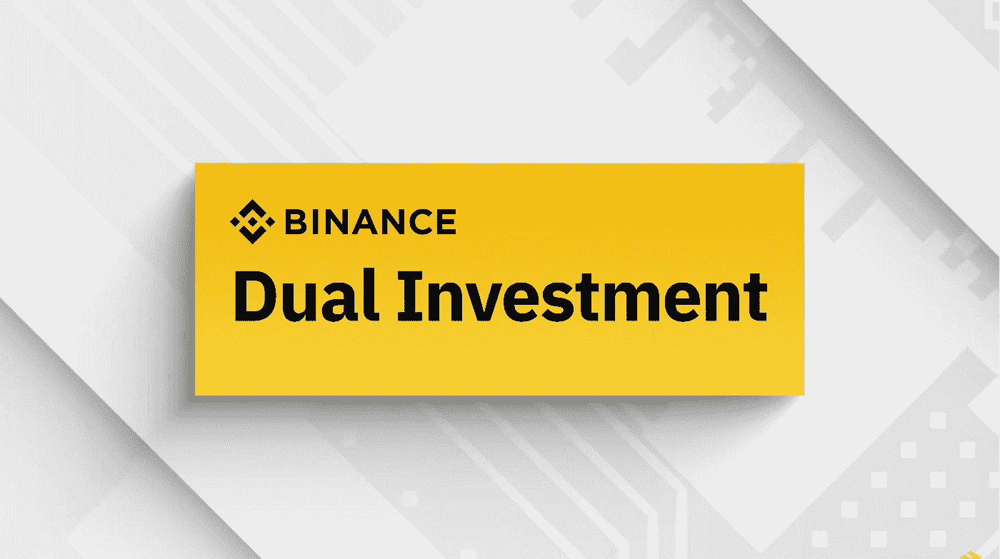
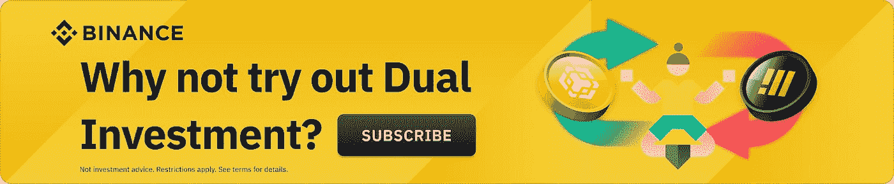

# 什么是币安双重投资？

> 原文：<https://medium.com/coinmonks/what-is-binance-dual-investment-762e63bede0d?source=collection_archive---------2----------------------->

*双重投资让你赚到钱，不管市场脉搏如何。*

Photo: Binance

*简单地将你的市场观点货币化，获取高回报。*

**币安双重投资是一种诱惑**

高卖或低买。选择范围广。没有交易费。高利息收入。听起来怎么样？的确很诱人，不是吗？欢迎[双投资](https://app.binance.com/en/dual?_dp=L3dlYnZpZXcvd2Vidmlldz90eXBlPWRlZmF1bHQmdXJsPWFIUjBjSE02THk5M2QzY3VZbWx1WVc1alpTNWpiMjB2WTI0dlpIVmhiQSZuZWVkTG9naW49ZmFsc2UmbmF0aXZlVXJsPUwyVmhjbTV6TDJSMVlXdz0=?ref=P10U1GSP)上[币安](https://accounts.binance.com/en/register?ref=P10U1GSP)。在币安双重投资中，你可以按照自己喜欢的价格和日期买卖加密货币。币安双重投资也让你从头寸中赚取高利息收益，而不管市场脉搏如何。

双重投资是一种(非保本结构性)储蓄产品，通过两种加密货币提供健康的收益。认购后，选择要投资的资产、存款币种、认购金额和结算日。回报将以存款或替代货币计价。

在评估可用的 apy 和当前资产价格后，只需选择一项资产。从决定高卖或低买开始。然后输入认购金额，查看中奖情况。最后确认订阅。

**币安的双重投资产品类别:**

1.  **卖高**:卖高双投产品中，如果结算价超出目标价，则产品“行权”如果结算价格大于等于目标价格，则产品被“执行”。与此相反，如果结算价格低于目标价格，则产品“未行使”。换句话说，在 Sell High Dual 投资产品中，如果市场价格触及目标价格(在结算日)，您可以出售您的加密货币。用户的加密资产(非稳定资产)被存放，随后选择出售其加密的目标价格。如果在结算日，市场价格保持高于目标价格，订单被执行。随后，你的认购金额和利息收入被卖出(按目标价)。之后，你会在 BUSD 收到退货。或者，如果在交货日期，市场价格低于目标价格，订单不会被执行。但是，除了收到您存入的相同金额外，您仍然可以获得利息收入。
2.  **低买**:在低买双投产品中，如果结算价小于等于目标价，则执行该产品。如果结算价格高于目标价格，则不执行产品。在低买双投产品中，如果市场价低于目标价，可以在结算日买入加密货币。只需存入你的稳定币(BUSD 或 USDT)并选择一个目标价格来购买替代货币(如 BTC)。然后，在结算日，如果市价低于目标价格，订单将被执行。此后，你的认购金额和利息收入用于购买 BTC(按目标价)。用户在 BTC 获得回报。

在任何一种双重投资产品中，(如果产品没有被执行)你都可以获得存款货币的回报。或者，您可以在产品执行时获得替代货币的回报。每个订购产品都有一个结算日期。

**币安双重投资 vs 现货限价单或 HODLing**

使用双重投资的两个主要原因如下:

1.  为了执行订单，你可能要考虑低买高卖的双重投资。
2.  你决定持有加密货币或稳定货币，同时获得健康的 APY 收入。然后你简单地将你的市场观点货币化，希望订单不会被执行。

**双重投资 vs .霍德林**

在很多情况下，双重投资可能会成为一种可靠的策略，而不是无所事事地把你的密码或稳定密码放在现货钱包里。虽然，有时候，持有加密货币会更好。在下面列举的例子中，我们打算遵循卖出高价双重投资策略。但是，即使对于低买双重投资，类似的策略也是适用的。

实例 1:

双重投资是理想的，因为如果目标价格没有实现，你可以保留你的加密货币，同时获得高利息收益。

实例 2:

当目标价格已经达到，但市场价格相对于目标价格并没有高很多时，双重投资也是理想的。如果你决定以相对低于市场价的价格出售你的加密货币，额外的利息收入可以作为一个缓冲，允许你出售加密货币而不是持有。

实例 3:

在达到目标价格，但市场价格完全高于目标价格的情况下，霍德林是理想的。在这种情况下，以低于当前市场价的价格出售您的密码仍然会产生额外的利息收入来抵消交易价格的变化。

**双重投资对现货限价单**

如果 ***买入下跌*** 或 ***获利*** (以期望的目标价格)的交易策略让你感兴趣，那么**双重投资**会适合你的风格。双重投资以及现货限价单涉及以特定目标价格购买或出售加密货币。而在双重投资中，不需要支付交易费用，但可以赚取高额利息收入。虽然，在双重投资中，与现货限价订单不同，如果在结算日订单没有执行，会有内在的风险。

**新:双重投资初学者模式**

币安新推出的“双重投资”**初学者模式**”本质上是为了让新手熟悉双重投资产品。只需在 web 或移动版本中使用切换按钮来使用初学者模式，并访问一步一步的指南来订阅。在合理熟悉双重投资导航后，关闭初学者模式切换按钮以(重新)访问高级功能。

要遵循的步骤:

1.  选择您要购买或出售的加密货币。
2.  决定是低买还是高卖。
3.  考虑首选目标价格、结算日和 APY，选择合适的产品。
4.  只需存入您的资金。

**双重投资风险**

双重投资风险与在现货市场买卖加密货币(限价单格式)无关。虽然市场波动的性质是一个决定性因素，但过高买入或过低卖出也是可能的。

1.  市场价格没有达到目标价格可能会让你失去以盈利价格买入或卖出的机会。
2.  认购的资产被锁定，用户在结算日期之前不能取消或赎回。
3.  执行交易的唯一场景可能是每个结算日的市场价格。

新来币安吗？[今天报名](https://accounts.binance.com/en/register?ref=P10U1GSP)！

**免责声明**:本文仅用于教育目的，不应理解为投资建议。

> *加入 Coinmonks* [*电报频道*](https://t.me/coincodecap) *和* [*Youtube 频道*](https://www.youtube.com/c/coinmonks/videos) *了解加密交易和投资*

# 另外，阅读

*   [Bookmap 评论](https://coincodecap.com/bookmap-review-2021-best-trading-software) | [美国 5 大最佳加密交易所](https://coincodecap.com/crypto-exchange-usa)
*   最佳加密硬件钱包 | [比特币点评](/coinmonks/bitbns-review-38256a07e161)
*   [新加坡 10 家最佳数字货币交易所](https://coincodecap.com/crypto-exchange-in-singapore) | [收购 AXS](https://coincodecap.com/buy-axs-token)
*   [红狗赌场点评](https://coincodecap.com/red-dog-casino-review) | [Swyftx 点评](https://coincodecap.com/swyftx-review) | [CoinGate 点评](https://coincodecap.com/coingate-review)
*   [投资印度的最佳加密货币](https://coincodecap.com/best-crypto-to-invest-in-india-in-2021) | [WazirX P2P](https://coincodecap.com/wazirx-p2p) | [高收益点评](https://coincodecap.com/hi-dollar-review)
*   [加拿大最佳加密交易机器人](https://coincodecap.com/5-best-crypto-trading-bots-in-canada) | [比特币点评](https://coincodecap.com/kucoin-review)