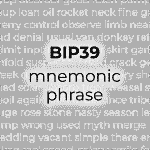
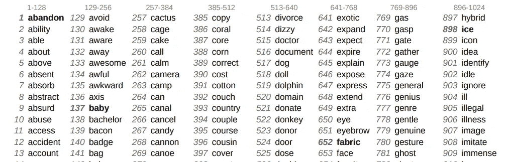

# 什么是 BIP39 助记短语？

> 原文：<https://medium.com/coinmonks/what-is-bip39-mnemonic-phrase-ce4cc9b8c150?source=collection_archive---------13----------------------->

## 它保护您的加密钱包，并允许轻松恢复。了解有关此功能的更多信息。

# BIP39 标准之前

在更早的时候，比特币和其他加密货币钱包是使用私钥生成和访问的。私钥是确定性的，这意味着使用给定的字符串([私钥](https://getcoinplate.com/blog/is-a-seed-phrase-the-same-as-a-private-key-the-ultimate-guide-to-private-keys-and-recovery-seed-phrases/?utm_source=medium.com&utm_medium=article&utm_campaign=m1))钱包可以生成并访问加密货币钱包。私钥有多个字符长，由字母和数字组成。这是很难使用的，即使有一个字符出错也会让你失去钱包。

旧型比特币私钥的例子大概是这样的:
*8e 4616 c 0 b 8d 9 e 6d 60 D5 DDC 5 e 0 be 61 AC 492 CB 11 e 7737d 73 e 0 EEC 81 da 1 C1 FD 2 f 14*

# BIP39 —工作原理

随着 BIP39 的推出，生成和访问比特币和其他加密货币钱包的整个过程得到了简化。这是为了简化为您的钱包创建恢复种子和恢复它的过程。BIP39 来自*第 39 号比特币改进提案*。

通过 BIP39 恢复短语(也称为助记短语)，用户可以备份和恢复比特币和其他加密货币钱包，而无需使用复杂的私钥。相反，钱包可以使用自然语言单词组成的种子短语来恢复。BIP39 允许用户使用一组单词来访问他们的加密货币钱包，而不是复杂的私钥。这组单词将由钱包软件翻译以生成确定性的钱包地址。钱包软件使用算法从你的 BIP39 字内部创建一个私钥。

BIP39 助记短语的例子有 12 个单词:
*荣耀保持耸肩扩展饲料他们注意到类似的图表获取小时剃刀*

通过这个例子，您可以看到 BIP39 助记短语确实比前面的私钥恢复短语更容易使用。写下来的时候也更难出错。

BIP39 协议使用了 2048 个精心挑选的英语单词。虽然存在不同语言的列表，但不建议使用它们，因为大多数钱包不支持除英语单词之外的其他单词。

fragment of BIP39 Wordlist

# BIP39(助记符)单词表的特点:

*a)智能选择单词:
单词列表的创建方式是，只需键入前四个* *字母，即可明确识别单词*

*b)避免使用相似的词:
像“build”和“build”、“woman”和“women”，或者“quick”和“quick”*这样的词对不仅使记住句子变得困难，而且更容易出错 *更难猜*

*c)排序的单词列表:*
*单词列表被排序，这允许更有效地查找码字* *(即，实现可以使用二分搜索法而不是线性搜索)* *—这也允许使用 trie(前缀树)，例如为了更好的压缩*

[官方 BIP39 字表](https://getcoinplate.com/blog/official-bip39-word-list-mnemonic-in-english-verified/?utm_source=medium.com&utm_medium=article&utm_campaign=m1)

此外，如果您想打印单词表:[Pdf 格式的完整 BIP39 单词表](https://getcoinplate.com/blog/bip39-wordlist-in-english-printable-one-page-pdf/?utm_source=medium.com&utm_medium=article&utm_campaign=m1)

# BIP39 —钱包和安全性

各种钱包可以使用不同长度的助记符种子(恢复)短语。例如，硬件钱包分类帐 Nano S 和 Nano X 使用 24 个字的恢复短语，而 Trezor T 使用 12 个字。*阅读*[*bip 39 兼容钱包的完整列表*](https://getcoinplate.com/blog/bip39-compatible-wallets-list-2022-updated/?utm_source=medium.com&utm_medium=article&utm_campaign=m1) *。*

理论上，更长的恢复周期=更安全的钱包。但即使是 12 个单词的助记短语也能为这一刻(2022 年 1 月)提供足够的安全感。在可预见的未来，24 个词的恢复短语将是黄金标准。24 个单词的恢复短语的组合数量比已知宇宙中的原子还要多。这就是为什么全长(24 个字)恢复种子短语给你提供全面保护，从黑客试图随机生成您的助记短语，并获得您的基金。这只是基础知识，我们会在以后写更多关于这个话题的内容。

钱包软件生成一个单词列表，并要求用户将它写在一张纸上，并将其放在安全的位置。凭借你的比特币助记短语或恢复种子短语，任何人都可以完全访问你的整个钱包，包括你的所有资金。这意味着你应该把它存放在一个安全的地方，这样除了你没有人可以访问它。阅读有关安全[种子短语存储](https://getcoinplate.com/blog/the-best-crypto-seed-phrase-storage-the-ultimate-guide/?utm_source=medium.com&utm_medium=article&utm_campaign=m1)的更多信息。

你写在一张纸上的助记短语，即使存放在一个锁着的保险箱里或埋在一堆其他文件里，也仍然是一张纸。不同的情况会把你的备份短语置于危险之中，使它在将来变得不可读。纸很容易被破坏。

这就是为什么你应该使用金属，最好是不锈钢加密钱包，如 [Coinplate](https://getcoinplate.com/?utm_source=medium.com&utm_medium=article&utm_campaign=m1) 来备份你的种子短语。所有 Coinplate 产品都使用 24 字 BIP39 标准。例如，使用 [Coinplate Alpha](https://getcoinplate.com/product/coinplate-alpha/?utm_source=medium.com&utm_medium=article&utm_campaign=m1) ，您可以轻松备份 1 个 Ledger Nano S/X 钱包或 2 个 Trezor T 钱包。

不锈钢比纸坚固得多。像 [Coinplate Alpha](https://getcoinplate.com/product/coinplate-alpha/?utm_source=medium.com&utm_medium=article&utm_campaign=m1) 或 [Coinplate Grid](https://getcoinplate.com/product/coinplate-grid/?utm_source=medium.com&utm_medium=article&utm_campaign=m1) 这样的不锈钢比特币钱包可以在房屋失火或倒塌、被卡车碾过的情况下存活，并且在 10 年、20 年甚至更长时间后仍然完全可读。 [Coinplate 不锈钢钱包](https://getcoinplate.com/?utm_source=medium.com&utm_medium=article&utm_campaign=m1)防锈防水。不锈钢即使在海水中也能很好地生存，所以你可以放心，它可以使用几十年。

*原载于*[*https://getcoinplate.com*](https://getcoinplate.com/en_US/blog/What-is-BIP39-mnemonic-phrase-2022-update/3)

> 加入 Coinmonks [电报频道](https://t.me/coincodecap)和 [Youtube 频道](https://www.youtube.com/c/coinmonks/videos)了解加密交易和投资

## 另外，阅读

*   [如何购买 Ripple (XRP)](https://blog.coincodecap.com/buy-ripple-india) | [非洲最好的加密交易所](https://blog.coincodecap.com/crypto-exchange-africa)
*   [非洲最佳加密交易所](https://blog.coincodecap.com/crypto-exchange-africa) | [胡交易所评论](https://blog.coincodecap.com/hoo-exchange-review)
*   [eToro vs 罗宾汉](https://blog.coincodecap.com/etoro-robinhood)|[MoonXBT vs Bybit vs Bityard](https://blog.coincodecap.com/bybit-bityard-moonxbt)
*   [有哪些交易信号？](https://blog.coincodecap.com/trading-signal) | [比特斯坦普 vs 比特币基地](https://blog.coincodecap.com/bitstamp-coinbase)
*   [ProfitFarmers 回顾](https://blog.coincodecap.com/profitfarmers-review) | [如何使用 Cornix Trading Bot](https://blog.coincodecap.com/cornix-trading-bot)
*   [如何在势不可挡的域名上购买域名？](https://blog.coincodecap.com/buy-domain-on-unstoppable-domains)
*   [印度的秘密税](https://blog.coincodecap.com/crypto-tax-india) | [altFINS 审查](https://blog.coincodecap.com/altfins-review) | [Prokey 审查](/coinmonks/prokey-review-26611173c13c)
*   [赢取注册奖金——10 大最佳加密平台](https://blog.coincodecap.com/earn-sign-up-bonus)
*   [Blockfi vs 比特币基地](https://blog.coincodecap.com/blockfi-vs-coinbase) | [BitKan 点评](https://blog.coincodecap.com/bitkan-review) | [Bexplus 点评](https://blog.coincodecap.com/bexplus-review)
*   [南非的加密交易所](https://blog.coincodecap.com/crypto-exchanges-in-south-africa) | [BitMEX 加密信号](https://blog.coincodecap.com/bitmex-crypto-signals)