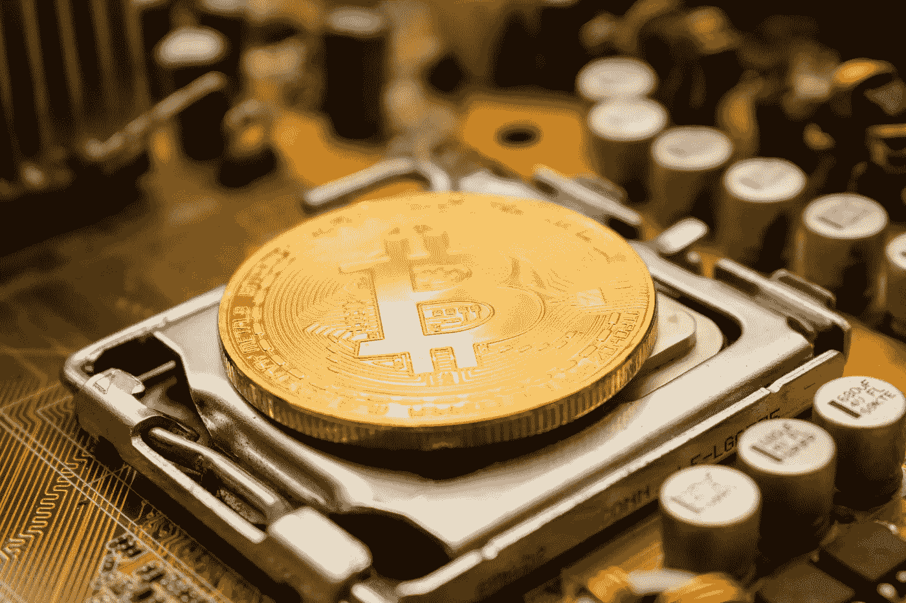

# 比特币是什么？

> 原文：<https://medium.com/coinmonks/what-is-bitcoin-194d8103013b?source=collection_archive---------52----------------------->

Source photo Unsplash.com

2008 年，化名程序员中本聪发布了一篇九页的论文，提出了一种新的去中心化数字货币。他们创造了比特币这个术语。

比特币是世界上第一个成功的去中心化加密货币和支付系统，由一位昵称为中本聪的匿名开发者于 2009 年开发。术语“加密货币”指的是一类数字资产，其中的交易…