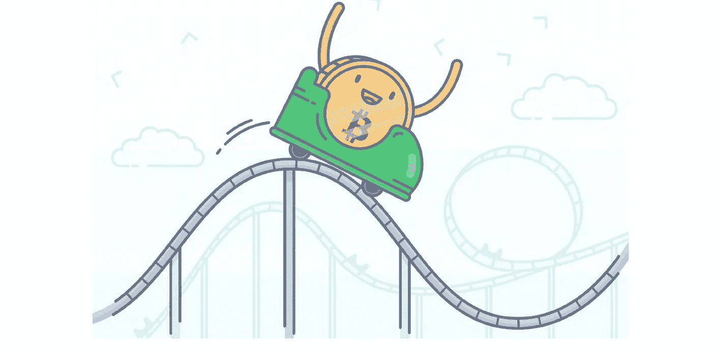

# 比特币是什么？

> 原文：<https://medium.com/coinmonks/what-is-bitcoin-af7a5c58bf66?source=collection_archive---------59----------------------->

在我们的 YouTube 上观看视频的同时，享受这个流的资源！

YouTube:[https://youtu.be/9QG6a5x-ZIU](https://youtu.be/9QG6a5x-ZIU)

不和:【https://discord.gg/J73qhkj7kr】T2

推特:【https://twitter.com/CryptoverseDAO】

linktree:[https://linktr.ee/cryptoversedao](https://linktr.ee/cryptoversedao)

-

比特币是什么？

比特币是世界上最受欢迎的加密货币，也是世界上第一个去中心化的点对点(P2P)支付网络，允许用户在没有中间人参与的情况下转移资金。

戴伟在 1998 年创造了“加密货币”这个术语，而神秘人物中本聪在 2009 年第一个实现了它。Satoshi 于 2010 年消失，他的身份一直是个谜。

许多人误以为 Satoshi、它的矿工或鲸鱼控制着比特币，然而事实并非如此，因为这个网络属于它的所有用户。比特币只有在所有用户同意的情况下才能发挥作用，这是通过一个被称为挖掘的过程完成的。为了赚取比特币，这种方法验证每笔交易的合法性，并需要使用专门的硬件。在前端，这通过包含用于交易的钱包的移动应用或计算机程序来显示。

本质上，比特币建立了加密和共识(即点对点)验证的基本系统，这是当今大多数加密形式的基础。

比特币的历史

2008 年，一个化名为中本聪的个人或一群人发表了一篇名为“比特币:一种点对点电子现金系统”的论文这不是有史以来第一个数字货币案例——几十年前有过许多尝试——但这可能是第一个提出“无信任”电子交易系统的案例，该系统将依赖于通过区块链技术的点对点验证系统。这种创新的方法还解决了数字货币的一个长期问题，即所谓的重复消费问题——或者说数字货币可能被黑客攻击并被多次消费的风险。

由于本白皮书中详细介绍的研究，第一批比特币于 2009 年 1 月诞生，比特币挖掘系统也随之建立。但是市场上 BTC 的数量是有上限的。虽然截至 2021 年 11 月，流通中的比特币代币超过 1880 万枚，价值超过 1 万亿美元，但总限额为 2100 万 BTC。

你可以在这里阅读比特币的白皮书:[https://bitcoinwhitepaper.co/](https://bitcoinwhitepaper.co/)

比特币的工作原理

比特币矿工使用功能强大的计算机来验证交易块并生成更多比特币——这是一个复杂、耗时的过程，称为工作证明(PoW)。每一笔交易都被永久记录在区块链上，这有助于验证和保护每个比特币以及整个网络。

每当用户发现一个新的区块时，就会产生比特币。一个区块由一定数量的比特币组成。每四年，用户找到一个区块后获得的比特币数量就会减少。在用户求解由 SHA256 算法加密的散列后，发现一个新块。用最简单的术语来说，这可以理解为一个复杂的难题。这个谜题是一串需要使用高计算能力解码的字符。每当用户向区块链添加一个区块，他们就会获得比特币奖励。

如果你在 2009 年向区块链添加一个区块，你会得到 50 个比特币。今天你只有 12.5 分。这个数字每四年修订一次。随着越来越多的区块被发现，比特币被释放，解决这个“难题”的难度也在增加。这确保了当我们接近 2100 万比特币时，挖掘它们变得越来越困难。

比特币的利与弊:

优点:
比特币是迄今为止最开放的金融系统。你可以在世界各地全天候使用比特币进行支付，即使是在没有银行系统的地方。
与传统银行和服务相比，使用比特币进行国际货币转账更快、更便宜。
比特币是有史以来唯一不能被强行夺走的资产(如果采取了适当的预防措施)。此外，BTC 的交易是不受审查的，所以没有人能阻止你进行交易。
比特币是化名的，任何人都可以通过互联网打开钱包，无需任何验证或信用记录。这在银行不发达的地区和第三世界国家尤其有益，在这些地方，大多数人都很难获得资金。
你可以像使用传统数字货币一样使用比特币——通过台式电脑、手机或借记卡。
与法定货币不同，比特币是通货紧缩的，这意味着其价值被设计为升值。
比特币是有史以来最便携的资产，可以通过卫星甚至无线电波转移。
与其他加密货币相比，比特币在各类零售商和组织中最具品牌认知度、流动性、生态系统最发达、接受度最高。
闪电网络使比特币能够用于小额、低费用的日常零售交易，如购买茶叶、食品杂货或只是在网上给某人小费。比特币引入了可编程货币的概念，这使得类似“智能合约”的进一步金融创新成为可能。
比特币打破了货币垄断，为不信任政府、某些机构、政客或仅仅相信去中心化力量的人提供了另一种选择。
市值:crypto-verse 有数千名玩家，但比特币超过了他们所有人，截至 2021 年 11 月 15 日，其市值超过 1.1 万亿美元。举个例子:市值排名第二的加密公司以太坊(Ethereum)的市值约为 55 亿美元，是它的一半。

反对意见:当事情变糟时，很少甚至没有监管监督。
尽管人们试图实现比特币的离线支付，但这种货币的使用仍在很大程度上取决于互联网的可用性。
由于比特币仍处于发展阶段，交易速度和费用往往会因挖掘效率和网络拥塞而异。
将比特币转换成法币会产生费用，通常费用很高。
不是每个商店或服务提供商都接受比特币。不过，这个数字还在增长。
比特币交易是不可变的，也就是说一旦钱离开你的钱包，就没有办法再拿回来。虽然许多声誉管理工具正在开发中，但“买家保护”还不是比特币的特色。相反，它可以使商家受益，因为接受 BTC 消除了欺诈性退款的机会。大多数人还没有准备好为自己的资产承担全部责任，也无法安全地管理自己的私钥。许多私人比特币密钥已经丢失，无法恢复，从而导致比特币的通缩和升值。
学习比特币生态系统的所有现有细节呈现出陡峭的学习曲线。大多数比特币应用程序的用户界面仍然不是万无一失的，网络也没有准备好为世界上的每个人服务。
保障比特币安全需要基本的网络安全知识和意识。虽然网络几乎是不可破解的，但组织和个人用户却可以。比特币的核心意识形态与最强大的机构、政府、政治、银行、监管机构和审查制度背道而驰，在这些参与者能够容忍或批准它之前，可能会遇到很多阻力。

尽管存在缺点，但比特币是一个不断发展的系统，继续增长，其开源开发者社区正在积极寻求改进的解决方案。罗马不是一天建成的，为什么一种新的全球标准货币？只有时间能告诉我们比特币的结局，但它被积极使用的时间越长，变得越分散，它就越有可能找到自己的立足点。在那之前，我们建议你利用这种波动性来积累财富。

> 加入 Coinmonks [电报频道](https://t.me/coincodecap)和 [Youtube 频道](https://www.youtube.com/c/coinmonks/videos)了解加密交易和投资

# 另外，阅读

*   [新加坡十大最佳加密交易所](https://coincodecap.com/crypto-exchange-in-singapore) | [购买 AXS](https://coincodecap.com/buy-axs-token)
*   [投资印度的最佳加密软件](https://coincodecap.com/best-crypto-to-invest-in-india-in-2021) | [WazirX P2P](https://coincodecap.com/wazirx-p2p)
*   [7 大最佳零费用密码交易平台](https://coincodecap.com/zero-fee-crypto-exchanges)
*   [最佳网上赌场](https://coincodecap.com/best-online-casinos) | [期货交易机器人](/coinmonks/futures-trading-bots-5a282ccee3f5)
*   [分散交易所](https://coincodecap.com/what-are-decentralized-exchanges) | [比特 FIP](https://coincodecap.com/bitbns-fip) | [宾邦评论](https://coincodecap.com/bingbon-review)
*   [用信用卡购买密码的 10 个最佳地点](https://coincodecap.com/buy-crypto-with-credit-card)