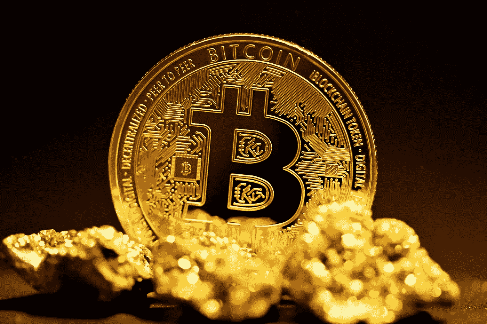

# 什么是比特币，它是如何工作的？

> 原文：<https://medium.com/coinmonks/what-is-bitcoin-and-how-does-it-work-7e2619bd8d85?source=collection_archive---------16----------------------->

[Unsplash](https://unsplash.com/photos/rhm7H8X5J98)

**比特币** (BTC)是一种只虚拟存在的开源数字货币。它是由一个分散的 P2P(点对点)网络形成的，这个网络是不受任何中央机构或任何类型的中介控制的**。**

比特币的**概念**是由*中本聪*引入并开发的，它描述了使用 P2P 网络生成和维护电子交易系统的方法，而不依赖任何可信的权威机构。

比特币是一个允许匿名货币交易的系统，在这个系统中，没有人知道收款人或收款人到底是谁。这是一个遍布互联网的点对点网络，由全球数百万匿名贡献者支持。因此，任何当局或组织都不会知道在其中进行的任何交易。

# 比特币是如何运作的？

比特币的硬币数量有限，因此具有一定的价值，总共 2100 万个比特币。因此，虽然并不是所有可能存在的比特币都被释放(目前流通的**近****1900 万**)，但每次开采一个区块都会释放一定数量的比特币，目前每块 **6.25 个比特币**。每块比特币的数量会随着时间的推移而减少，因此每四年，或多或少(产生 210，000 块)，每块的奖励会减少一半。

为了生成或开采一个区块，必须使用计算机或其他电子系统找到 Satoshi 数学问题的新解决方案，这就是所谓的**比特币开采**。采矿试图通过执行非常困难的算法来找到解决方案，这就是为什么称为*ASIC*的特定系统通常用于此。以前，使用 GPU 显卡甚至简单的计算机进行挖掘是可能的，但所需的时间和为此获得的回报使其无利可图。

# 比特币的使用给我带来了哪些好处或坏处？

因为使用比特币的优势在于:

*   付款简单快捷。只需要接收者的比特币钱包地址。
*   它使用一种带有安全加密技术的协议，确保交易同样安全。
*   **交易匿名**进行，交易双方互不认识。相反，这样的交易是公开的，即任何人都可以看到任何交易。你所不能知道的是它的起点和终点。请记住，在每笔交易中，用户的 IP 地址都会被记录下来，所以如果你想保持完全匿名，就必须考虑到这一点。

缺点是:

*   **支付是不可逆的**，也就是说，如果出现错误或成为某种类型的敲诈或欺诈的受害者，交易就无法消除和恢复。要回你的钱的唯一方法是收件人退款。
*   这种货币的接受程度是**有限的**，尽管在线和离线交易都在不断增加这种货币的支付。
*   这是一种非常不稳定的货币价值，因为没有权威机构可以控制它，所以它相对于其他货币如欧元或美元的价值可以在短时间内发生很大变化。

真正决定是否使用比特币的是用户，他们也是让这种虚拟货币具有目前价值的人，因为如果没有人想要或使用它，它就会失去价值，变得一无所有。

> 加入 Coinmonks [电报频道](https://t.me/coincodecap)和 [Youtube 频道](https://www.youtube.com/c/coinmonks/videos)了解加密交易和投资

# 另外，阅读

*   [支持卡审核](https://coincodecap.com/uphold-card-review) | [信任钱包 vs 元掩码](https://coincodecap.com/trust-wallet-vs-metamask)
*   [Exness 回顾](https://coincodecap.com/exness-review)|[moon xbt Vs bit get Vs Bingbon](https://coincodecap.com/bingbon-vs-bitget-vs-moonxbt)
*   [如何开始用加密贷款赚取被动收入](https://coincodecap.com/passive-income-crypto-lending)
*   [加密货币储蓄账户](/coinmonks/cryptocurrency-savings-accounts-be3bc0feffbf) | [加密交易机器人](https://coincodecap.com/best-crypto-trading-bots)
*   [BigONE 交易所评论](/coinmonks/bigone-exchange-review-64705d85a1d4) | [CEX。IO 审查](https://coincodecap.com/cex-io-review) | [Swapzone 审查](/coinmonks/swapzone-review-crypto-exchange-data-aggregator-e0ad78e55ed7)
*   [最佳比特币保证金交易](/coinmonks/bitcoin-margin-trading-exchange-bcbfcbf7b8e3) | [比特币保证金交易](https://coincodecap.com/bityard-margin-trading)
*   [加密保证金交易交易所](/coinmonks/crypto-margin-trading-exchanges-428b1f7ad108) | [赚取比特币](/coinmonks/earn-bitcoin-6e8bd3c592d9)
*   [WazirX vs CoinDCX vs bit bns](/coinmonks/wazirx-vs-coindcx-vs-bitbns-149f4f19a2f1)|[block fi vs coin loan vs Nexo](/coinmonks/blockfi-vs-coinloan-vs-nexo-cb624635230d)
*   [BlockFi 信用卡](https://coincodecap.com/blockfi-credit-card) | [如何在币安购买比特币](https://coincodecap.com/buy-bitcoin-binance)
*   [火币交易 Bot](https://coincodecap.com/huobi-trading-bot) | [如何购买 ADA](https://coincodecap.com/buy-ada-cardano) | [Geco？一次审查](https://coincodecap.com/geco-one-review)