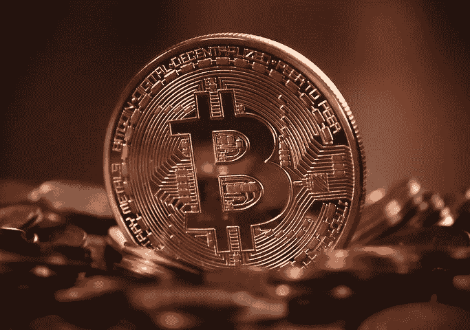

# 比特币到底是什么？

> 原文：<https://medium.com/coinmonks/what-is-bitcoin-anyway-ebeb60aeaae1?source=collection_archive---------74----------------------->

Pixabay

NFT 在加密领域很流行，但我认为最好记住它是如何开始的。

简单来说，比特币是一种数字形式的货币。这种货币形式并非始于比特币，但比特币被认为是第一种数字货币，于 2009 年开发。在 20 世纪 90 年代早期，解决货币电子谜题的想法引起了密码学家的注意