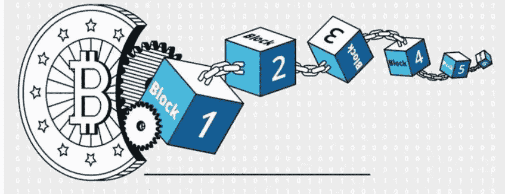
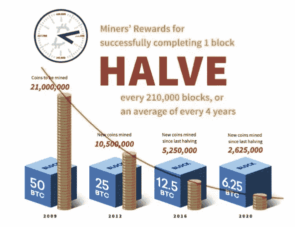

# 比特币是什么？

> 原文：<https://medium.com/coinmonks/what-is-bitcoin-e98b2b77c81b?source=collection_archive---------50----------------------->

在当今精通互联网的一代中，几乎每个人都听说过比特币。然而，事实仍然是，尽管比特币被广泛采用，但对世界上第一种也是最著名的加密货币的不完全了解仍然存在。任何想了解区块链和加密货币领域的人都可以从比特币速成班开始。

**来历**

区块链的[概念最早出现在 20 世纪 90 年代](/coinmonks/history-and-evolution-of-blockchain-17e5332e4a6c)，但仍然非常初级。然后在 2008 年，在 Bitcoin.org 的网站上，中本聪发表了他的白皮书，题为“**比特币:一个点对点的电子现金系统**”。他认为区块链是一项具有实际应用价值的技术，这一想法彻底改变了现有的电子现金交易系统。他建议消除银行和政府等可信的第三方，使用分散的网络。比特币软件的第一个版本于 2009 年问世，随后是 genesis 区块的开采。

[**Bitcoin blockchain**](https://www.researchgate.net/figure/Blockchain-structure-with-example-of-the-Bitcoin-Taken-from-Reiff-Nathan-February_fig1_339298940)

因此，简单地说，比特币可以被定义为一种数字货币，其功能是在没有中介的情况下在双方之间进行价值转移。它还被用作对在比特币区块链上验证交易的参与者的奖励机制。

一个比特币最初只值几美分。它的最小单位是一亿分之一，被称为一个 Satoshi。

**供应与开采**

比特币的一个突出特点是供给固定。这与传统货币形成鲜明对比，在传统货币中，政府和银行可以引用任意的政策来铸造新的货币。世界上只能有 2100 万个比特币。

现在一个明显的问题是比特币如何进入流通。如前所述，加密货币被用作矿工的区块奖励，因此通过将每个后续区块添加到创世纪区块中而出现。

[**Bitcoin mining and halving**](https://www.investopedia.com/terms/b/bitcoin-mining.asp)

由于生产比特币的数量有限制，每当完成 210，000 个[区块](https://coinsbench.com/understanding-the-architecture-of-a-blockchain-f50ad412bdc4)时，矿工的奖励就会减少 50%。这大约每四年发生一次。到目前为止，已经有三次减半事件，导致矿工现在每块获得 6.25 个比特币，而 2009 年是 50 个比特币。

**所有权和分配**

最初，只有成功解决密码术难题的[矿工](https://coinsbench.com/understanding-the-architecture-of-a-blockchain-f50ad412bdc4)才能拥有加密货币。但随着越来越多的人接受比特币作为一种有效的支付方式，这种有条件的所有权不再可行。为了满足这种对比特币交易便利性的需求，加密货币交易所应运而生。

现在，任何人都可以拥有比特币。与股票市场的功能相同，加密货币交易所允许用户[购买和出售全部或部分比特币](/@DC.600/real-world-uses-of-bitcoin-2036d14c612)来代替货币，也称为法定货币。此外，人们可以使用比特币作为交换对来交易其他加密货币。任何想保住自己比特币的人都可以使用[硬件和软件钱包](/@DC.600/learning-about-crypto-wallets-897a30f8f79a)。

根据 2021 年一项关于比特币所有权趋势的研究，全球前 10%的矿工仍占拥有约 90%的流通加密货币，其中约 50%由精英的 0.1%矿工控制。例如，中本聪被认为挖掘了超过 22，000 个区块，估计拥有超过 100 万个比特币。在上市公司中，MicroStrategy 和特斯拉分别拥有约 0.5%和 0.2%的全球当前供应量。就私人所有权而言，Block.one 约占流通比特币总量的 0.67%。

**利弊**

[**Bitcoin pros and cons**](https://trading-education.com/pros-and-cons-of-investing-in-bitcoin-will-it-be-a-millionaire-maker)

比特币的去中心化性质使其成为一个有吸引力的拥有或交易提议。快速浏览一下它的优势就能看出它的独特之处。

●没有中央机构、中央服务器或中央存储系统，它比传统的货币系统更安全、更具成本效益。

●任何拥有计算机和互联网连接、能够运行硬件来解决底层加密难题并验证区块的人都可以成为矿工，从而享受维护比特币公共账本的特权。

●任何人都可以在没有任何文件证明或信用记录的情况下买卖加密货币，这使得加密货币比其他传统金融服务更容易获得。

●比特币是一种高流动性的投资选择，通常用于投资组合多样化和对冲通胀。

●即使没有任何无风险利润的保证，其丰厚的投资回报也高于黄金和石油等保守资产。

然而，比特币并非十全十美，它有很多缺点。

●比特币的协议很旧，速度非常慢，无法实现其他替代币可以提供的快速交易。

●比特币的匿名性和安全交易机制经常让它与非法活动联系在一起。

●比特币挖矿因其陈旧的[工作证明](/@DC.600/understanding-the-role-of-consensus-in-blockchain-db724fa63a53)模式导致过高的功耗，该模式正迅速被更先进、更节能的利益证明协议所取代。

●高度不受监管的市场的波动性仍是比特币投资的主要障碍。尽管它是加密货币中市值最大的，但它也不能幸免于间歇性熊市引发的估值大幅下跌。

●其他令人沮丧的因素包括严格的密码法和因国而异的高税收。

**结论**

就 T4、区块链和 T5 的技术发展而言，比特币是否是一只濒临灭绝的恐龙，或者它的普遍流行是否有助于它保持相关性，目前还没有定论。比特币确实已经将自己重塑为一种价值储存手段，并且通常被认为是黄金的数字替代品。此外，它有机会通过开发闪电网络来挽回其遗留地位，从而[提高其交易速度](https://coinsbench.com/what-is-sidechain-4d4dc912ec50)并推动采用。

**也读作:**

[*什么是区块链*？](/coinmonks/what-is-blockchain-a7082404caa2) *|* [*了解区块链的架构*](/@DC.600/understanding-the-architecture-of-a-blockchain-f50ad412bdc4)

跟随我:

[**LinkedIn**](https://www.linkedin.com/in/a600dc/)|[**Twitter**](https://twitter.com/dc_111)

联系人:**arnab.dc111@gmail.com**

> *加入 Coinmonks* [*电报频道*](https://t.me/coincodecap) *和* [*Youtube 频道*](https://www.youtube.com/c/coinmonks/videos) *了解加密交易和投资*

# 另外，阅读

*   [3 商业评论](/coinmonks/3commas-review-an-excellent-crypto-trading-bot-2020-1313a58bec92) | [Pionex 评论](https://coincodecap.com/pionex-review-exchange-with-crypto-trading-bot) | [Coinrule 评论](/coinmonks/coinrule-review-2021-a-beginner-friendly-crypto-trading-bot-daf0504848ba)
*   [莱杰 vs n rave](/coinmonks/ledger-vs-ngrave-zero-7e40f0c1d694)|[莱杰 nano s vs x](/coinmonks/ledger-nano-s-vs-x-battery-hardware-price-storage-59a6663fe3b0) | [币安评论](/coinmonks/binance-review-ee10d3bf3b6e)
*   [Bybit Exchange 审查](/coinmonks/bybit-exchange-review-dbd570019b71) | [Bityard 审查](https://coincodecap.com/bityard-reivew) | [Jet-Bot 审查](https://coincodecap.com/jet-bot-review)
*   [3 commas vs crypto hopper](/coinmonks/3commas-vs-pionex-vs-cryptohopper-best-crypto-bot-6a98d2baa203)|[赚取加密利息](/coinmonks/earn-crypto-interest-b10b810fdda3)
*   最好的比特币[硬件钱包](/coinmonks/hardware-wallets-dfa1211730c6) | [BitBox02 回顾](/coinmonks/bitbox02-review-your-swiss-bitcoin-hardware-wallet-c36c88fff29)
*   [BlockFi vs 摄氏度](/coinmonks/blockfi-vs-celsius-vs-hodlnaut-8a1cc8c26630) | [Hodlnaut 审核](/coinmonks/hodlnaut-review-best-way-to-hodl-is-to-earn-interest-on-your-bitcoin-6658a8c19edf) | [KuCoin 审核](https://coincodecap.com/kucoin-review)