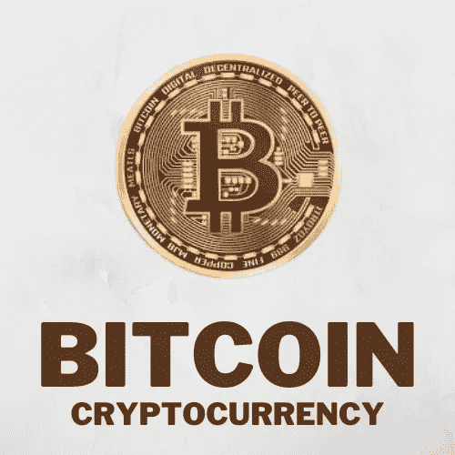

# 比特币是什么:比特币合法不合法？

> 原文：<https://medium.com/coinmonks/what-is-bitcoin-is-bitcoin-legal-or-not-80351ff8167a?source=collection_archive---------61----------------------->

What is Bitcoin

“**比特币**这个词每年都是 Google 的热门搜索，这是什么原因？这个词被如此广泛地搜索，比特币到底是什么？

所以不使用任何专业术语或者复杂的词语，让我们用简单的话来理解。

如果你找遍全世界，为什么有人给你钱？只有当你增加价值或做一些工作作为回报时，才有人给你钱。即使是在办公室，你也是在为公司做了一些工作或者为公司增加了价值的情况下才拿到工资的。

在某种程度上，

**金钱=价值=信任**

相信我，有时候，不同的东西代表了金钱。早些时候，人们通过给麦粒来完成工作。渐渐地，人们对所有那些寿命更长、价值更高的东西表现出兴趣，比如黄金。但是带着黄金到处走并不容易，所以政府提供了一个选择，你不必带着黄金。

你可以把你的黄金存放在政府那里。作为回报，你会得到一张收据。基于令牌，你可以进行交易，然后以后；同样的票会兑换成纸币。

那时，人们相信政府会代表他们的钱。作为承诺，政府说，如果你带着这张纸币去某个地方，你会得到它的价值，但如果是这样，为什么不让政府印更多的纸币呢？

假设还剩 1 公斤土豆，所有想买的人都有 1315 美元，那么土豆将会给拥有超过 1315 美元的人。所以自动地，土豆的价格超过了 1.315 美元。

所以即使政府印了钞票，也解决不了问题。只会涨价。只有当资源完整时，问题才会得到解决。然后，逐渐地，纸币开始转换成数字现金。

但是即使有了数字货币，最大的挑战是跟踪交易。如果钱从你的账户中被扣除，它应该被转到另一个账户。不应该出现这样的情况:钱进入了别人的账户，但没有从你的账户中扣除。建立了一个中央银行系统来跟踪这一切。

但是这种集中烘烤系统也有挑战。银行把你存的钱投资到银行，如果投资有任何损失，那么你的钱就会有风险，就像 PMC 银行的情况一样。人们无法从银行取出自己的钱。

2008 年，当雷曼兄弟作为一家金融机构陷入亏损时，全球范围内出现了衰退。如果今天大家一起开始取钱，银行就给不了钱了。显示在你账户上的余额只是一个数字，是你现有的银行通过旋转来维持的。在某种程度上，你把你的钱交给了别人。这里面有透明度的问题。因为一些选定的机构控制着这些钱，腐败就牵涉其中。

如果政府愿意，它也可以取消你的钱的合法地位。正如我们在《去货币化》中看到的，2008 年 10 月，一份文件被公布，发布这份文件的人自称中本聪。中本聪到底是谁？至今不得而知。这份文件建议如何通过比特币货币取代我们当前的烘焙系统。那么这意味着什么呢？这意味着我们的银行通过中央系统保存所有交易的记录，并确保营销成功。通过比特币货币也可以看出它的另类。

虽然许多加密货币已经进入市场，但我们将以比特币为例。

当您从 Paytm 购买产品或进行交易时，您会获得一些奖励积分。一般来说，只有在外部使用时，这些奖励积分才能在 Paytm 内部使用。

如果出现这种情况，大家都开始接受，那么这些积分的价值就会增加。比特币的情况也是如此。

比特币是一种加密货币。未来，它在什么层面上的存在，将取决于它的接受程度。人们通过哪种方式接受，在哪里购买。比特币是一种数字加密货币。它没有生物学价值。

当你购买一个比特币时，你购买了一个特定的比特币地址，通过它你在另一个特定的比特币地址执行交易。比特币是一种机械结构，不需要编程或编码。

它的算法在自动运行上运行，但是需要系统和计算机来运行这个算法。而且这么高的级别需要几千台电脑。而要维护这几千台电脑，就需要第三方。但如果有第三方介入，整个事情就会逆转，它会回到同样的银行结构。所有控制权都将交给第三方。为了避免这种情况，比特币挖矿的概念应运而生，人们在自己的电脑上运行算法，当交易成功时，你就可以获得比特币作为奖励。

由于整个系统是分布式的和区块链的，任何机构或实体或被黑客攻击的问题都在这里解决了。如果比特币矿工继续像这样产生比特币，那么整个事情将会发生逆转，回到我在土豆例子中解释的问题:通货膨胀率将会增加。

因此，为了避免这种情况，已经确认不会产生超过 2100 万个比特币。你会得到多少比特币作为奖励？要看有多少人在用电脑挖掘比特币。

在 2009 年，你可以在 2 到 3 天内生成 200 个比特币，但在今天，如果你想开发一个比特币，需要 150 多年的时间。

# 比特币有哪些缺点？

1.  第一件事是，它不是到处都被接受。

2.第二，这里面没有政府的介入，所以很多违法行为就发生在里面。

3.第三件事是它非常不稳定的本质。它的值每 30 秒改变一次。假设你买了一件商品，你要退货。在此期间，产品的价格会发生变化。现在店主会面临他要给多少钱作为回报的问题，因为这个东西没有机制。因为它是开源的，以后可能会内置一些工具。

# 最重要的是，比特币到底是不是到处都合法？

所以答案是，比特币在一些国家是合法的，但并非所有国家都是合法的。你做的所有交易和购买，所有的风险都是你的。在一些比特币不合法的国家，政府正在努力对其进行监管，但还没有任何结果。

第二，可以投资:2009 年，0.04 派萨可以买 1 个比特币，但今天比特币的价格超过了 18，000.000 卢比。投资回报率非常高，因为如果投资回报率高，风险也高。

如果你投资了它，并梦想一夜暴富，你肯定会遭受损失。但是如果你明智地投资它，你可以从中获利。

你也可以投资加密货币，比如埃隆马斯克、迈克泰森、梅西、脸书、摩根大通和贝宝。所有这些大实体都投资了它。

希望你已经知道什么是比特币。去开始探索更多。

> *加入 Coinmonks* [*电报频道*](https://t.me/coincodecap) *和* [*Youtube 频道*](https://www.youtube.com/c/coinmonks/videos) *了解加密交易和投资*

# 另外，阅读

*   [3 商业评论](/coinmonks/3commas-review-an-excellent-crypto-trading-bot-2020-1313a58bec92) | [Pionex 评论](https://coincodecap.com/pionex-review-exchange-with-crypto-trading-bot) | [Coinrule 评论](/coinmonks/coinrule-review-2021-a-beginner-friendly-crypto-trading-bot-daf0504848ba)
*   [莱杰 vs Ngrave](/coinmonks/ledger-vs-ngrave-zero-7e40f0c1d694) | [莱杰 nano s vs x](/coinmonks/ledger-nano-s-vs-x-battery-hardware-price-storage-59a6663fe3b0) | [币安评论](/coinmonks/binance-review-ee10d3bf3b6e)
*   [Bybit Exchange 评论](/coinmonks/bybit-exchange-review-dbd570019b71) | [Bityard 评论](https://coincodecap.com/bityard-reivew) | [Jet-Bot 评论](https://coincodecap.com/jet-bot-review)
*   [3 commas vs crypto hopper](/coinmonks/3commas-vs-pionex-vs-cryptohopper-best-crypto-bot-6a98d2baa203)|[赚取加密利息](/coinmonks/earn-crypto-interest-b10b810fdda3)
*   最好的比特币[硬件钱包](/coinmonks/hardware-wallets-dfa1211730c6) | [BitBox02 回顾](/coinmonks/bitbox02-review-your-swiss-bitcoin-hardware-wallet-c36c88fff29)