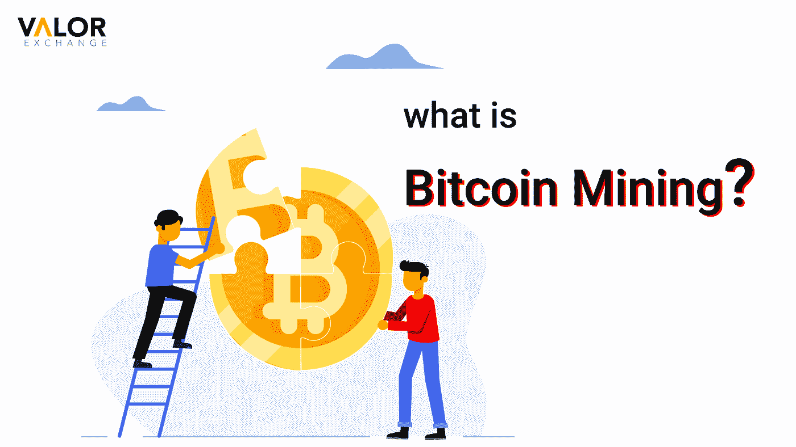
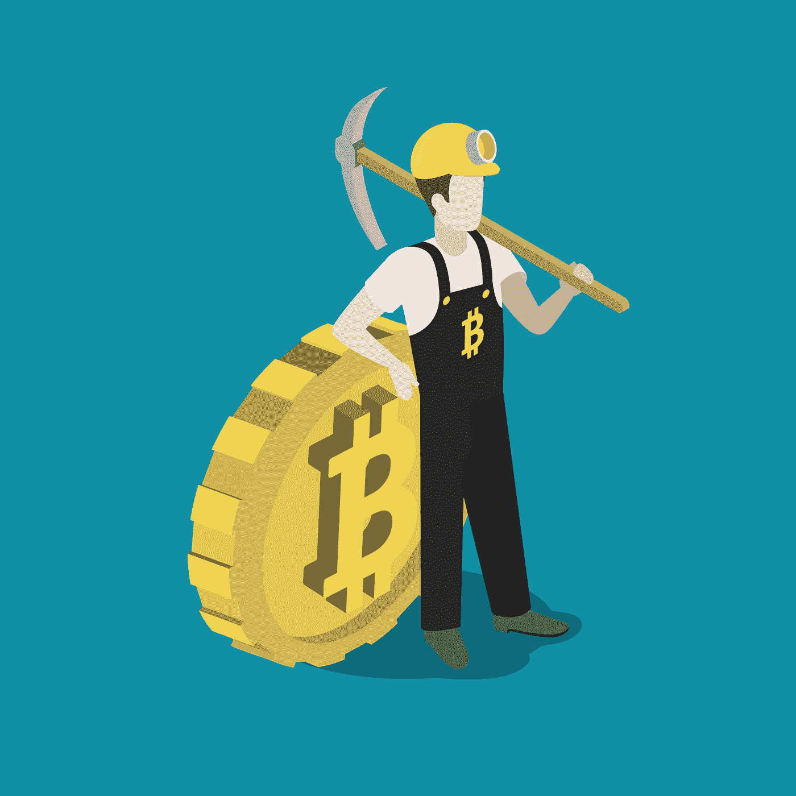

# 什么是比特币挖矿？——初学者指南。

> 原文：<https://medium.com/coinmonks/what-is-bitcoin-mining-a-beginners-guide-eba2f7281f2e?source=collection_archive---------82----------------------->

比特币挖矿是发现新比特币的过程。把它想象成真正的采矿，矿工使用铁锹和锄头。然而，对于比特币采矿，矿工们使用强大的计算机系统来解决复杂的数学方程。

当方程式被解出时，解出它的矿工会得到更多的比特币奖励。挖掘过程也确认交易。当事务发生在区块链时，必须在添加到块之前对其进行验证。因此，矿工在区块链生态系统中至关重要。

**迄今比特币挖矿概述**

比特币挖矿早期，使用的是台式电脑。这是一个单调乏味的过程，随着每一个数学难题的解决，算法变得更加困难。

为了找到更好的选择，矿工们发现了 GPU，它代表图形处理单元。这使得采矿速度更快、效率更高。该系统最大的缺点是耗电量大。处理需要大量的能量。现场可编程门阵列(FPGA)，另一种类型的 GPU，作为一种改进发布，但后来遭受了同样的命运。

如今，矿工使用定制的采矿机器，这些机器比以前的机器功能更强大，效率更高。

> 交易新手？试试[密码交易机器人](/coinmonks/crypto-trading-bot-c2ffce8acb2a)或者[复制交易](/coinmonks/top-10-crypto-copy-trading-platforms-for-beginners-d0c37c7d698c)

**以太坊是如何被发现的？** [点击这里了解](https://valorexchange.com/blog/post?slug=ethereum-a-beginners-guide-to-ether-how-it-works-and-why)以太坊的历史、用途和好处。

*photo credits: freepix*

**比特币挖矿如何进行？**

比特币挖矿过程利润丰厚，但竞争激烈。矿工通常需要昂贵的电脑和电力，才能从比特币采矿中获利。如果一个矿工不能解决任何方程，他们将在操作上浪费资金和时间，这是非常昂贵的。

目前，一名矿工完成一笔交易并添加一个有效区块可以获得 6.25 比特币。然而，这一数额每隔四年减少一半。矿商还会收到验证过程中支付的所有交易费用。

一旦交易被验证，一个新的块被添加到[区块链](https://valorexchange.com/blog/post?slug=what-are-the-types-of-blockchain-networks)，并且该过程被重复。该算法是预先设计的，用于修改下一个数学难题的难度，以调节引入区块链的添加块的数量。

如果你想开始，你可以加入一个采矿池。矿池是一组矿工，他们组合他们的资源，以获得最有效的设备，并分享回报。全球有无数的比特币矿池或钻机在运行。

**总之**

许多加密交易员认为，比特币等加密货币将成为全球商品买卖的全球货币。我们在 Telegram 上创建了我们的密码社区，以帮助人们从他们的密码中获得更多价值。我们分享工具和资源来帮助你[学习加密](https://valorexchange.com/blog/post?slug=why-was-bitcoin-created)，获得加密，并从你的分散货币中享受最佳收益。