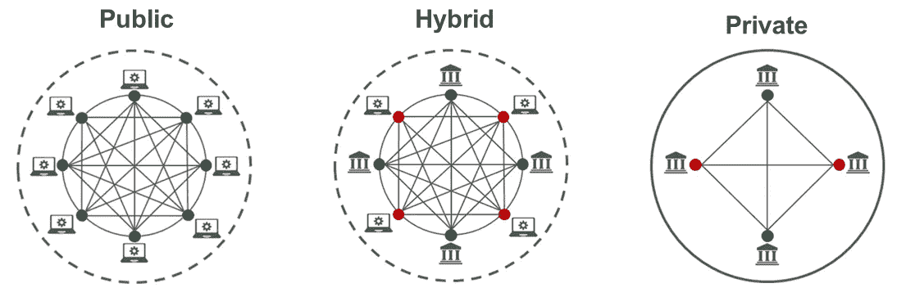

# 什么是区块链？

> 原文：<https://medium.com/coinmonks/what-is-blockchain-a7082404caa2?source=collection_archive---------12----------------------->

在过去的几年里，区块链一词吸引了大量的关注，尤其是在诸如比特币和 T2 以太坊等加密货币迅速流行之后。虽然这个术语很随意，但理解区块链的概念还是有好处的。

**定义**

通俗地说，区块链是一组以分散方式共享和链接在一起的记录或数据。在这个阶段经常出现的一个问题是区块链与任何其他数据库有何不同。理解区块链的结构可以回答这个问题。每个块都是分组并存储在节点中的信息集合。任何给定的块都有预定义的数据存储限制。当达到一个块的容量时，它就变成了一个自身完备的闭集。现在，当一条新信息到来时，它会被记录在后续的新块中，这些新块与之前完成的每个块不可逆地连接在一起。这就是它的名字——它是一串数据块。这与使用中央服务器上的表来存储信息的传统数据库有着根本的不同。

**类型**

根据定义，区块链是一个共享网络。现在，根据网络类型，它可以分为以下类型。

[**Types of blockchain**](https://www.foley.com/en/insights/publications/2021/08/types-of-blockchain-public-private-between)

**大众区块链**

顾名思义，这是最大的区块链，因为它对所有人开放。任何具有互联网连接的人都可以成为公共区块链的一部分。他们可以通过计算机程序验证数据的真实性，并参与交易交换。通常，公共区块链为参与其功能的用户提供经济激励。比特币和以太坊区块链就是最好的例子。公共区块链的主要缺点是完成每次验证所花费的时间。

**列兵区块链**

一个未经许可的公共区块链只能到此为止。这导致了某些区块链网络的兴起，这些网络依赖于许可协议。与公共部门截然不同的是，私人区块链对参与者的访问设置了一系列限制。这种区块链的常见例子包括 Ripple 和 Hyperledger。然而，一家私人区块链也不能幸免于欺诈和操纵。

由于公共和私人区块链都有无法消除的缺点，因此有必要开发财团和混合区块链作为解决这一难题的可能方案。

[**Hybrid blockchain structure**](https://blockchain.oodles.io/dev-blog/hybrid-blockchain/)

**混合动力区块链**

混合区块链以独特的功能集成了公共和私有区块链。用外行人的话来说，它在一个单一组织的控制下工作，就像在一个私人的区块链，而它的公共区块链部分确保[共识](/@DC.600/understanding-the-role-of-consensus-in-blockchain-db724fa63a53)得以维持。因此，它同时具有集中和分散的特征，它们如何组合决定了混合模型的性质。典型的混合区块链的一个例子是 IBM 食品信托公司，该公司经营其模型以扩大食品供应链业务的当前范围。

**区块链财团**

在一个私人区块链的权力下放的核心建立一个单一的权力机构被一个区块链财团所取代，在那里治理是由一组组织处理的。这有两个直接的好处——更高的安全级别和实施权力下放的更大范围。区块链财团成功的一个很好的例子是 R3，它是一家企业软件公司，提供数字经济解决方案。虽然这种合作业绩成倍提高了区块链的效率，但挑战仍然是维持联合体中各组织之间的长期合作。

**特点**

应用最广泛的区块链的主要特征是数字值的传递。加密货币是实现这一目标的首选模式。它们具有经济价值，因为它们被用作验证区块并将其添加到链中的激励措施。目前，不少于 2000 种加密货币在全球流通，比特币是其最著名的支持者。

区块链的另一个重要特性是它的 [**智能合约**](/@DC.600/what-is-ethereum-part-1-smart-contract-74f259708792) 功能。用于以分散的方式部分或完全自动化托管，其范围和适用性的巨大性不能被夸大。以太坊是一个最受欢迎的例子，它不仅允许使用其生态系统定制智能合约，还帮助[基于其协议构建其他应用](/@DC.600/what-is-ethereum-part-2-design-c9b9f1b39fda)。

**用途**

区块链技术有无数的应用，其中一些已经广泛使用。

●随着区块链寻求彻底改革数字安全、以经济高效的方式实现闪电般的交易以及不变性，**金融服务**行业成为其最大的受益者。换句话说， [**分权财务**](/@DC.600/what-is-ethereum-part-3-applications-12097472b9f9) 就是未来所有与金钱有关的事务。

●近年来，区块链功能在**游戏**中的整合范围正在扩大。他们率先为数字收藏品引入了**不可替代代币或 NFT**的概念，这种概念现在也用于其他受区块链启发的应用中。

●元宇宙的出现是区块链适用性的又一重大发展。它将增强现实、虚拟现实、分散金融和视频游戏整合在一起。

●区块链技术最具变革性的应用之一是**数字身份**，它允许使用具有增强防篡改安全性的基础设施来存储和管理数据。

●几个价值数十亿美元的行业，尤其是医疗保健、能源、食品供应、贵重商品交易、旅游和住宿以及保险，也在区块链最新发展的帮助下寻找下一代解决方案。区块链的其他用途正在迅速成为现实，包括人工智能、物联网、大数据、云计算和 5G 技术等领域。

**结论**

区块链将在未来几年内继续发展壮大。因此，当这项技术继续以其创新和应用席卷全球时，投入如此多的时间和精力来理解和探索这项技术的本质、范围和互操作性也就不足为奇了。

**也读作:**

[*了解।的架构*](/@DC.600/understanding-the-architecture-of-a-blockchain-f50ad412bdc4) 什么是 Sidechain？

跟随我:

[**LinkedIn**](https://www.linkedin.com/in/a600dc/)|[**Twitter**](https://twitter.com/dc_111)

联系人:**arnab.dc111@gmail.com**

> 加入 Coinmonks [电报频道](https://t.me/coincodecap)和 [Youtube 频道](https://www.youtube.com/c/coinmonks/videos)了解加密交易和投资

# 另外，阅读

*   [BigONE 交易所点评](/coinmonks/bigone-exchange-review-64705d85a1d4) | [电网交易 Bot](https://coincodecap.com/grid-trading)
*   [氹欞侊贸易评论](https://coincodecap.com/anny-trade-review) | [CoinSpot 评论](https://coincodecap.com/coinspot-review)
*   [新加坡十大最佳加密交易所](https://coincodecap.com/crypto-exchange-in-singapore) | [购买 AXS](https://coincodecap.com/buy-axs-token)
*   [投资印度的最佳加密软件](https://coincodecap.com/best-crypto-to-invest-in-india-in-2021) | [WazirX P2P](https://coincodecap.com/wazirx-p2p)
*   [西班牙 5 大最佳文案交易平台](https://coincodecap.com/copy-trading-spain)
*   [Pionex 双重投资](https://coincodecap.com/pionex-dual-investment) | [AdvCash 审查](https://coincodecap.com/advcash-review) | [支持审查](https://coincodecap.com/uphold-review)
*   [面向开发者的 8 个最佳加密货币 API](https://coincodecap.com/best-cryptocurrency-apis)