# 什么是区块链，它是如何工作的

> 原文：<https://medium.com/coinmonks/what-is-blockchain-and-how-does-it-work-17ce6144f613?source=collection_archive---------29----------------------->

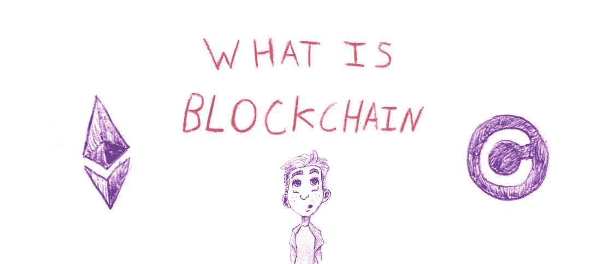

**解释区块链及其相关术语的含义。**

区块链是另一个不断出现的流行语，有人说它很神奇，有人认为它很没必要。

我认为它在互联网的未来扮演着一个非常令人兴奋的角色，但是和所有的技术一样，它并不能解决所有的问题。

在这篇博文中，我希望为我经常被问到的一个问题提供一个过于简单的答案:“什么是区块链？”以及“它是如何工作的？”。

请注意:

*   我将使用区块链的以太坊实现作为我将提到的许多内容的基础，但我所谈论的核心概念将适用于整个技术。
*   我将过分简化这些概念，希望让您对该技术有一个基本的了解——然后您可以根据自己的兴趣选择继续发展并学习底层的技术细节。

# TL；速度三角形定位法(dead reckoning)

*   区块链是一个分散在大型点对点计算机网络上的数据库。
*   网络上的计算机运行一致算法，该算法是使区块链能够验证和存储数据的过程。
*   区块链发行代币(也称为加密货币)，用于奖励和激励电脑所有者。
*   这些加密货币可以兑换成传统货币(例如/$)。
*   用户通过“加密钱包”与区块链应用程序进行交互，这可以在网络上识别他们，并允许他们使用加密货币作为支付进行交易。
*   用户之间的交易通过智能合约来协调，智能合约是一种“后端”代码，网络上的任何人都可以读取，以查看和了解数据和支付是如何管理的。
*   区块链的用途备受争议，该技术的一个核心论点是，它可以通过财务激励迫使组织、公司和政府诚信行事。
*   与区块链互动的用户的一些好处是，该技术使他们能够:1)拥有自己的数据，2)赚钱并从他们制作的内容中赚取版税，3)信任区块链平台上的数据并了解其使用/管理方式

# 区块链概述

“区块链”可能是一个很难理解的概念，所以让我们一点一点地分解它。

我已经**鼓起了**要害部位；)

## 区块链到底是什么？

**区块链是一个分散的数据库**，运行在一个点对点的计算机网络上，它验证并存储账本上地址之间的交易。

## 所以它是一个数据库，什么使它特别？

传统数据库需要一个中央机构来验证数据并管理谁可以对数据库进行读写的权限，这些中央机构的例子是我们每天使用的大公司/品牌。

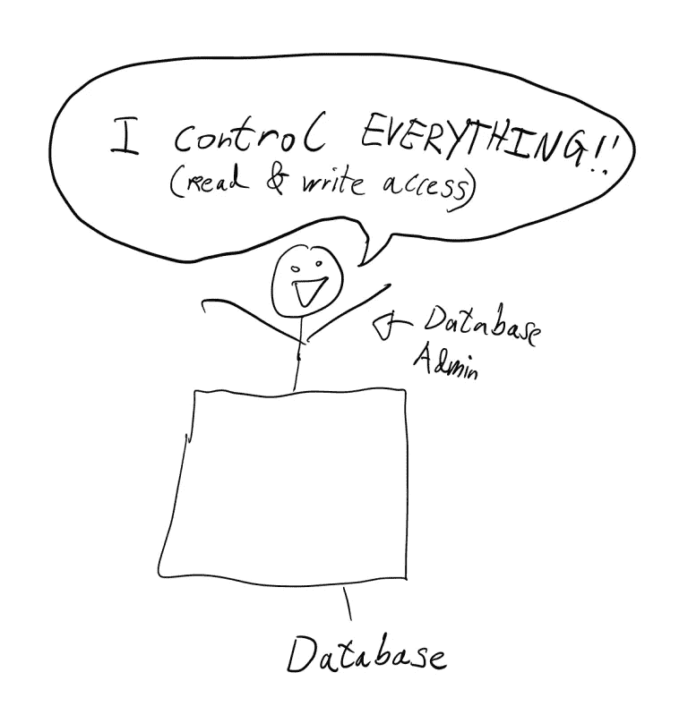

**区块链**不需要一个中央权威机构来验证数据或管理权限，这一职责**被**分配给**一个计算机网络，它们一起工作以达成共识**。

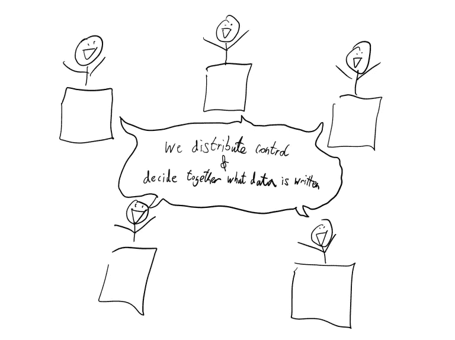

## 共识的价值是什么？

历史上，人们将信任外包给机构、组织、公司和政府，由它们代表他们达成共识并做出决定。

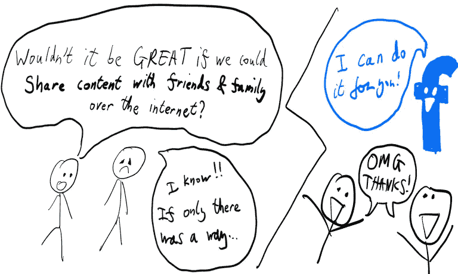

促成这些决定的过程通常是秘密进行的，结果往往会引起争议，例如与银行/政府/大型科技公司有关的丑闻。

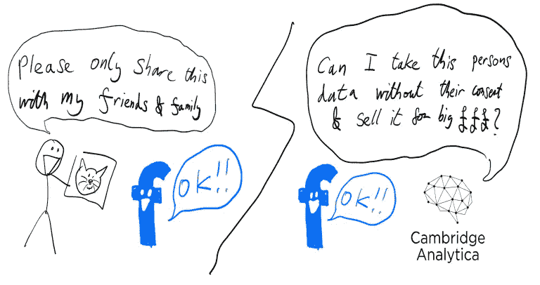

共识是实现**区块链**技术的机制的核心，它提供了一种替代方案，即**使人们能够以一种他们可以信任的方式彼此直接互动**。

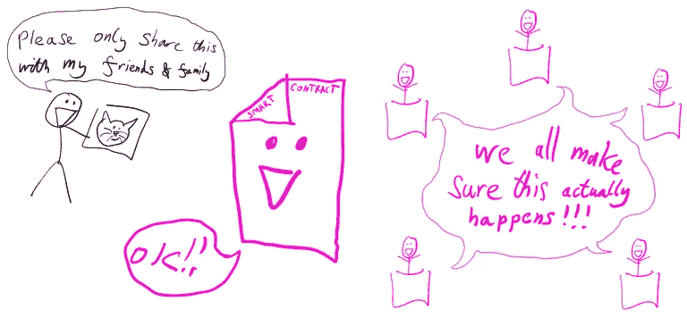

## 我能信任它吗？

区块链中的数据交易是通过智能合约实现的，智能合约本质上是定制开发的后端软件，网络上的任何人都可以读取。

这意味着你可以自己检查使你和另一个人之间的交易成为可能的代码的实际逻辑是什么(例如，在以太坊上，你可以通过以太扫描读取[智能合同)。](https://etherscan.io/contractsVerified)

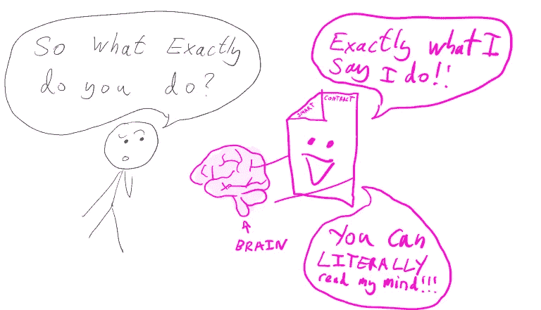

在我们目前生活的世界中，中央集权的当局(例如政府)可以对你说一件事，但实际上却在幕后做另一件事。

相比之下，实现区块链的计算机网络受到共识算法回报的激励，以正确验证这些合同是按照它们被编程的方式执行的。

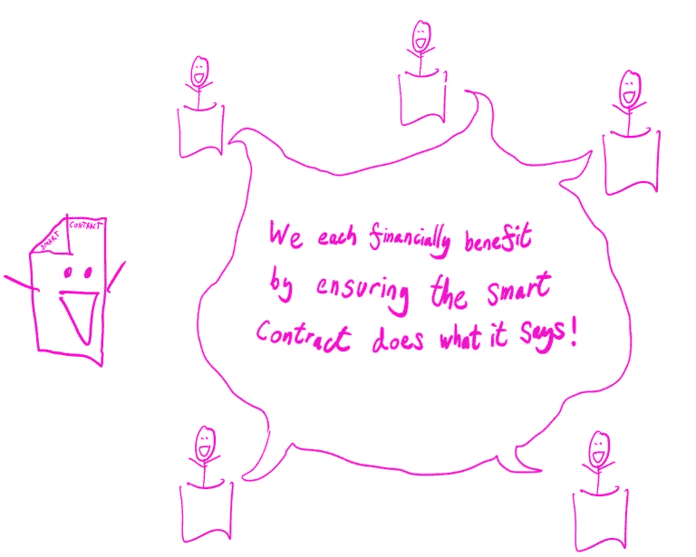

**通过区块链，你可以验证智能合约将执行什么流程——通过读取执行交易的代码中的内容。你可以相信共识算法会执行所写的内容。**

## 它安全吗，有多容易被黑客攻击？

**要将数据写入区块链，你需要网络上的计算机达成一致，以验证你的交易是有效的。**

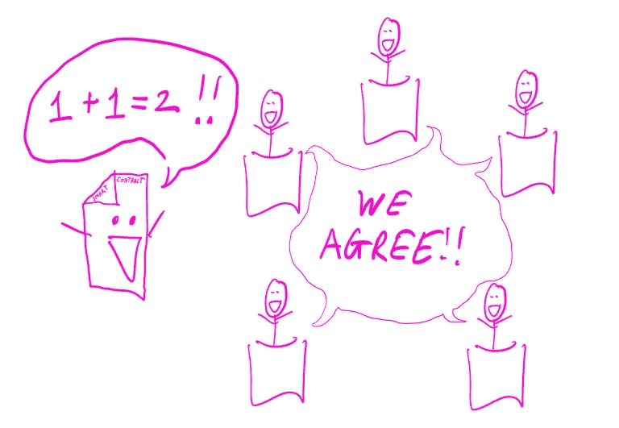

在节点之间达成共识和写入数据的工作将获得令牌奖励(例如交易费和新块创建奖励)。

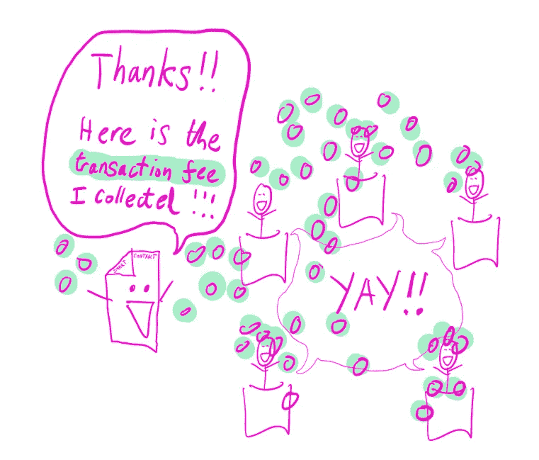

这意味着入侵网络中的一台计算机来尝试和验证虚构/欺诈交易是行不通的，因为这不会与网络中的其他计算机达成共识。

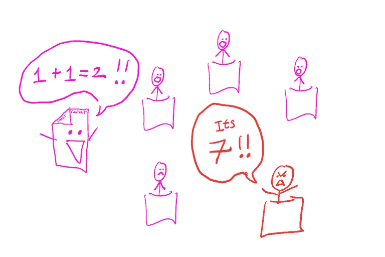

这种自我调节奖励正确验证交易的节点，并防止无效交易被记录。

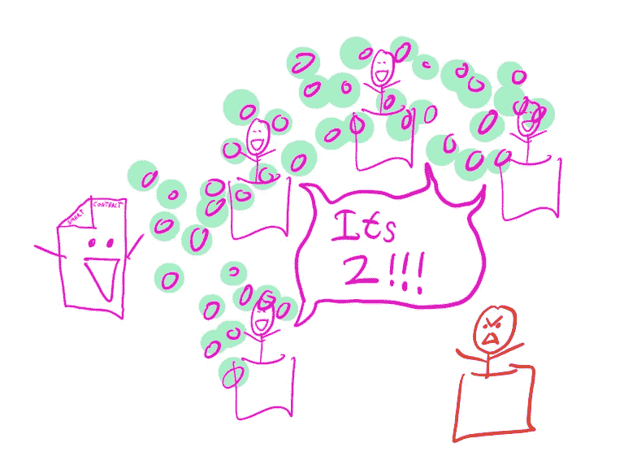

这些图表没有完全解释这个过程的细微差别，我想我会在将来写另一篇文章详细介绍共识算法😀。

**数据一旦写入区块链，就不可改变——这意味着它不能被删除。**这是因为数据被写入数据块，这些数据块经过加密哈希处理，然后被写入下一个经过哈希处理的数据块。这意味着重写/删除数据将从根本上打破这一链条，原因很容易确定。

与传统的数据库相比，单台计算机就可以被黑客攻击，数据可以相对容易地被修改/删除。

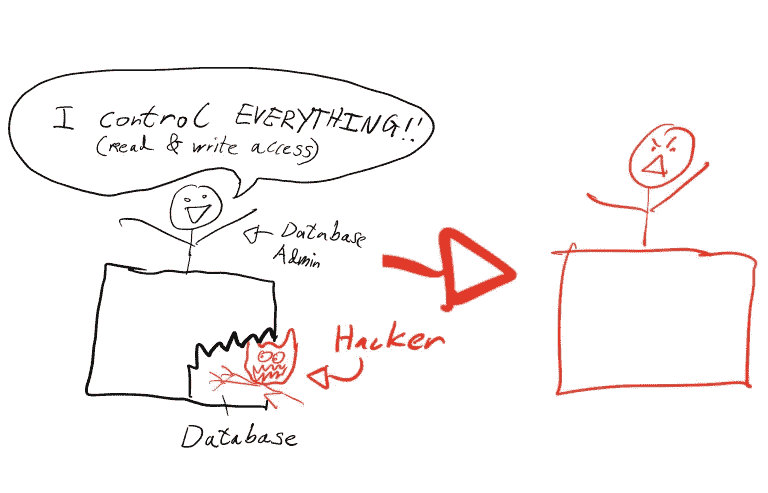

区块链如何被攻破的两个例子:

1.  如果一个黑客可以控制网络上 51%的电脑，那么他就可以绕过共识的需要，重写链条上的数据
2.  如果智能合同是以通过漏洞暴露用户资产的方式编写的，那么黑客可以利用这一点

## 数据是什么样的？

**区块链将数据存储为地址间交易的分类账，这些数据以区块的形式加密存储。**

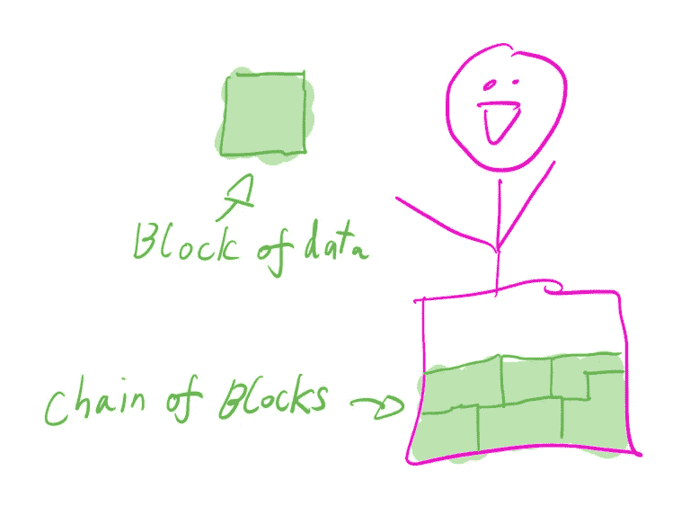

一个[模块](https://etherscan.io/block/14243482)包含:

*   块在链中的编号(例如链中的第一个、第二个或第三个块)以及块创建时的时间戳
*   遵照一致算法创建数据块的计算机所有者的信息(挖掘者)
*   关于对创建区块的矿工的奖励、存储的数据量以及共识算法的难度的信息
*   使用的汽油(进行交易的账户支付的代币数量)
*   与块的散列相关的数据(由事务数据、随机数和前一个块的散列组成)
*   事务(存储在块中的事务列表)

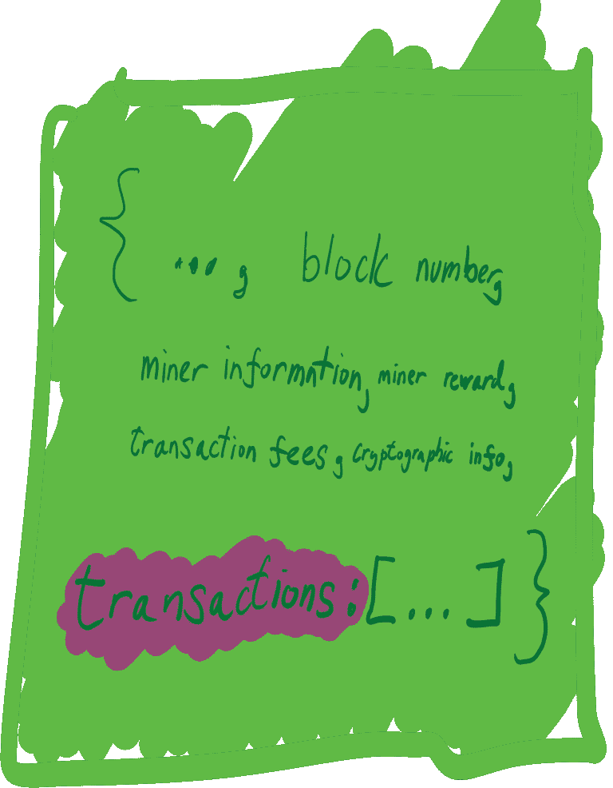

一个[交易](https://etherscan.io/tx/0xefe5a2058259fdb35364b57de82ba8b42f453500f0b2c2259b22045fc142f734)包含:

*   由事务数据、事务状态、包含事务的块以及生成事务的时间戳组成的散列
*   地址之间交换的代币的价值和为了奖励矿工而支付的费用
*   正在存储/发送的数据
*   令牌的地址被发送到

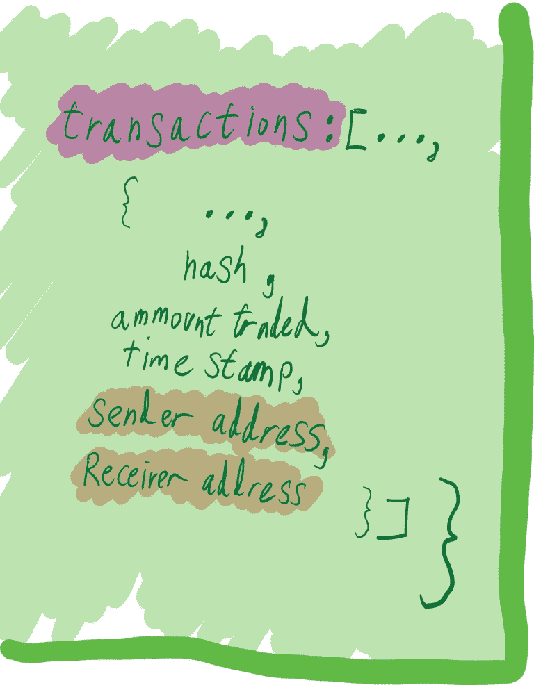

一个地址可以是一个[智能合同](https://etherscan.io/address/0x1612fc28ee0ab882ec99842cde0fc77ff0691e90)或一个[加密钱包](https://etherscan.io/address/0xea674fdde714fd979de3edf0f56aa9716b898ec8)，两者都有:

*   代币/资产余额的信息
*   他们所做交易的列表，交易的往来对象，交易的价值和它存储的块

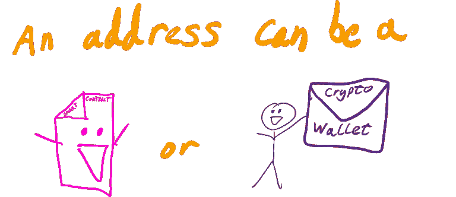

令牌可以是以下任何一种(还有其他令牌，但让我们保持简单):

*   用于交易的可替代代币，如 [ERC-20](https://etherscan.io/token/0x1e4ede388cbc9f4b5c79681b7f94d36a11abebc9?a=0xb7ff7692eef2dde2156117bd128b66e15e35a797) (包含价格、总供应量和持有者数量)
*   不可替代的令牌，如 [ERC-721](https://etherscan.io/nft/0xb4d06d46a8285f4ec79fd294f78a881799d8ced9/7601) ，用于声明具有价值的唯一资产(包含所有者、地址、创建者、内容 url、id 和交易列表)。

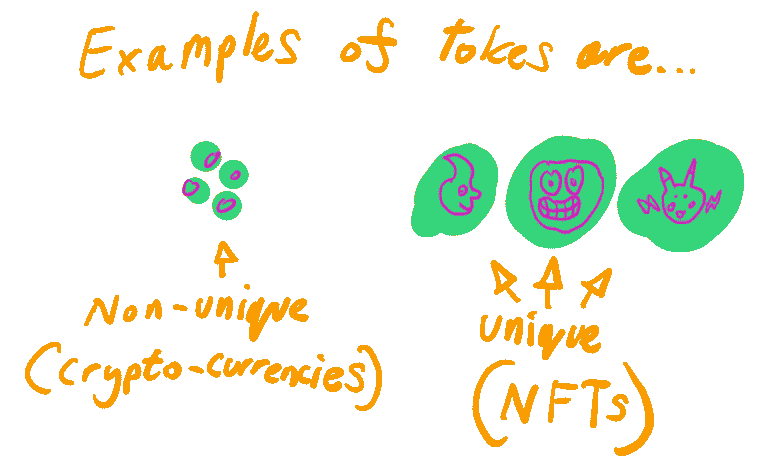

## 什么是加密货币和 NFT？

区块链网络中的价值概念在被称为代币的资产中有所描述，你应该了解的两个是 ERC-20 和 ERC-721

**ERC-20 代币也被称为** **可替换代币通常被称为加密货币**，可以在加密交易所交易为法定货币(如$/ /$)，这些加密货币的价值根据供求而变化。

区块链网络的共识算法使网络中计算机的所有者能够获得可替换的令牌(这就是通常所说的“挖掘”)。

**ERC-721 也是令牌，称为********不可替代令牌，是唯一的，用于声明资产**的创建者和所有者。****

****还有其他类型的令牌需要学习，但这是一个很好的起点🙂****

## ****我如何实际地与区块链互动？****

******要与区块链互动，您需要创建一个加密钱包，通过加密交易所购买代币，并找到代币的发送地址。******

****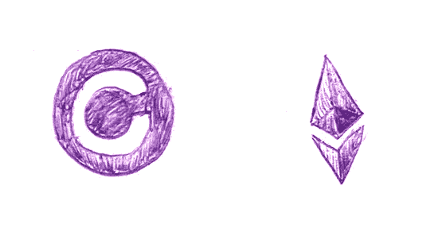****

*****Coinbase and Ethereum Logos*****

****一种方法是使用 [coinbase](https://www.coinbase.com/) ，创建一个加密钱包，并从区块链(例如[以太坊](https://ethereum.org/en/))购买代币——然后你需要做的就是找到一个朋友的钱包地址来发送加密。****

****如果你想购买一艘 NFT，那么你可以访问 [opensea](https://opensea.io/explore-collections) 并用你的代币购买一艘 NFT。****

## ****看起来很费力，但这真的有用吗？****

****🙂****

****从来没有解决所有问题的金子弹，区块链是针对特定问题的有用技术。****

****即使区块链是一个数据库，争论也不是“**区块链 vs 传统数据库”，而是** **分散共识 vs 集中决策**。****

****问题(区块链可以帮助的地方):****

*   ****我们生活在一个由中央集权(银行/政府/企业/公司/机构)主导的世界，我们如此依赖它们，很难影响它们的行为，也很难让它们对自己的行为负责。****
*   ****共识是关起门来达成的，你怎么相信它是公平的？****
*   ****现实世界中说的(或写的)和做的并不总是一样的，谁对此负责，我们信任这个权威吗？****
*   ****你并不拥有你的数据或内容，在你不知情/未经你同意的情况下，这些数据或内容可能会以你无法追踪和货币化的方式被使用。****
*   ****很难让组织/个人对已经采取的行动负责，你如何跟踪已经做了什么/谁拥有什么？****
*   ****将这些组织/个人联系在一起的过程通常充满了浪费时间的官僚作风和信息共享/交流的困难。****

****解决方案(区块链可以提供的帮助):****

*   ****以适当的方式分散和自动化部分组织，使其在区块链上可追踪。****
*   ****实施网络用户可以信任的共识算法，以激励正确的验证。****
*   ****创建智能合同，奖励那些实际实现预期的个人/组织的价值。****
*   ****通过 NFTs，使人们能够按照他们满意的条款拥有/共享/货币化他们的数据和内容。****
*   ****查看组织进行的数据/资产/价值的具体交易，并相信这是有效的。****
*   ****通过共享上下文相关信息的智能合同和对快速行动的财务奖励，激励组织间的快速合作。****

# ****结论****

****这可能看起来非常全面和深刻，但这是区块链可以做什么的核心论点。****

****当谈到这个话题时，真的有很多要涵盖的内容，我希望这篇文章让你对核心细节有了足够的理解——这样你就有了一个成长的基础。****

****它真的不是一切的解决方案，就我个人而言，我认为区块链是思维的一个重大转变，真的很难想象一个完全拥抱它的世界会是什么样子。****

****我认为这项技术可能会在未来几年内发展壮大——在越来越多的领域证明其价值，直到它不再是一个时髦的词汇，而是一个可以理解的有用工具。****

****…或者也许我错了，这种时尚将在几年后消失——让我们看看！！xDD****

> ****加入 Coinmonks [电报频道](https://t.me/coincodecap)和 [Youtube 频道](https://www.youtube.com/c/coinmonks/videos)了解加密交易和投资****

# ****另外，阅读****

*   ****[BlockFi vs Celsius](/coinmonks/blockfi-vs-celsius-vs-hodlnaut-8a1cc8c26630)|[Hodlnaut 点评](/coinmonks/hodlnaut-review-best-way-to-hodl-is-to-earn-interest-on-your-bitcoin-6658a8c19edf) | [KuCoin 点评](https://coincodecap.com/kucoin-review)****
*   ****[Bitsgap 审查](/coinmonks/bitsgap-review-a-crypto-trading-bot-that-makes-easy-money-a5d88a336df2) | [Quadency 审查](/coinmonks/quadency-review-a-crypto-trading-automation-platform-3068eaa374e1) | [Bitbns 审查](/coinmonks/bitbns-review-38256a07e161)****
*   ****[密码本交易平台](/coinmonks/top-10-crypto-copy-trading-platforms-for-beginners-d0c37c7d698c) | [Coinmama 审核](/coinmonks/coinmama-review-ace5641bde6e)****
*   ****[印度的加密交易所](/coinmonks/bitcoin-exchange-in-india-7f1fe79715c9) | [比特币储蓄账户](/coinmonks/bitcoin-savings-account-e65b13f92451)****
*   ****[OKEx vs KuCoin](https://coincodecap.com/okex-kucoin) | [摄氏替代品](https://coincodecap.com/celsius-alternatives) | [如何购买 VeChain](https://coincodecap.com/buy-vechain)****