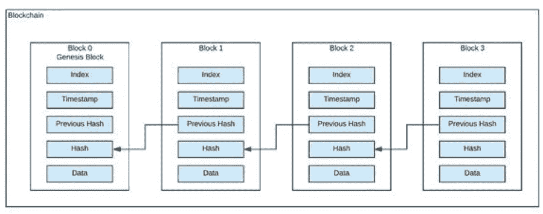

# 什么是区块链和成为区块链开发者的路线图？

> 原文：<https://medium.com/coinmonks/what-is-blockchain-and-roadmap-to-became-a-blockchain-developer-eb75933d244b?source=collection_archive---------6----------------------->

区块链是在计算机网络的节点之间共享的分布式数据库。作为一个数据库，区块链以数字格式存储电子信息。区块链最为人所知的是其在加密货币系统中的关键作用，如[比特币](https://www.investopedia.com/terms/b/bitcoin.asp)，用于维护安全和分散的交易记录。区块链的创新之处在于，它保证了数据记录的保真度和安全性，并在不需要可信第三方的情况下产生信任。

Blockchain Node Image

区块链使用 SHA256 哈希算法创建哈希，并使用数字签名进行加密。你可以在这里模拟区块链[。](https://andersbrownworth.com/blockchain/hash)

**区块链路线图**

先决条件
1)应该了解公钥加密
2)应该了解数字签名
3)了解编程基础

清晰的基础知识
1)了解比特币和以太坊
2)了解证明或工作和股权证明

DAPPs 开发
1)学习 [solidity](https://docs.soliditylang.org/en/v0.5.3/index.html) 编程语言使用[remix IDE](https://remix.ethereum.org/)使用[cryptozobic](https://cryptozombies.io/)清除 solidity 的基础。这是一个有趣的游戏，帮助你学习 Solidity
2)你必须知道如何使用一些工具-
[Remix IDE](https://remix.ethereum.org/)-来编写和测试 Solidity 代码
[meta mask](https://metamask.io/)-它是可以与区块链交互的钱包扩展。(总是从官方网站添加)
[Ganache](https://trufflesuite.com/ganache/index.html)——这是我们当地的区块链，我们可以在这里测试我们的 Dapps。
[Truffle](https://trufflesuite.com/)——这是一个开发环境、资产管道和测试框架，用于开发智能契约。
一个前端框架(推荐 [ReactJs](https://reactjs.org/docs/getting-started.html) ) —这里我们可以给 Dapps 客户端体验。
[web3Js](https://web3js.readthedocs.io/en/v1.7.0/) 或 [etherJs](https://docs.ethers.io/v5/) —是一个可以帮助你在区块链交流的库。

你可以借助这个 raodmap 开始学习区块链。我已经提供了主题名称的相关链接。很快我将在这里提供完整的区块链开发者博客。在那里你可以找到所有的主题和相关的网络资料。

谢谢每一个快乐的阅读。

> 加入 Coinmonks [电报频道](https://t.me/coincodecap)和 [Youtube 频道](https://www.youtube.com/c/coinmonks/videos)了解加密交易和投资

# 另外，阅读

*   [AscendEx 保证金交易](https://coincodecap.com/ascendex-margin-trading) | [Bitfinex 赌注](https://coincodecap.com/bitfinex-staking) | [bitFlyer 审核](https://coincodecap.com/bitflyer-review)
*   [Bitget Review](https://coincodecap.com/bitget-review)|[Gemini vs BlockFi](https://coincodecap.com/gemini-vs-blockfi)cmd |[OKEx 期货交易](https://coincodecap.com/okex-futures-trading)
*   [AscendEx Staking](https://coincodecap.com/ascendex-staking)|[Bot Ocean Review](https://coincodecap.com/bot-ocean-review)|[最佳比特币钱包](https://coincodecap.com/bitcoin-wallets-india)
*   [火币审核](https://coincodecap.com/huobi-review) | [OKEx 融资融券交易](https://coincodecap.com/okex-margin-trading) | [期货交易](https://coincodecap.com/futures-trading)
*   [网格交易机器人](https://coincodecap.com/grid-trading) | [隐孢子虫评论](/coinmonks/cryptohopper-review-a388ff5bae88) | [贝氏评论](https://coincodecap.com/bexplus-review)
*   [7 最佳零费用密码交换平台](https://coincodecap.com/zero-fee-crypto-exchanges)
*   [氹欞侊贸易评论](https://coincodecap.com/anny-trade-review) | [火笔融资融券](/coinmonks/huobi-margin-trading-b3b06cdc1519)