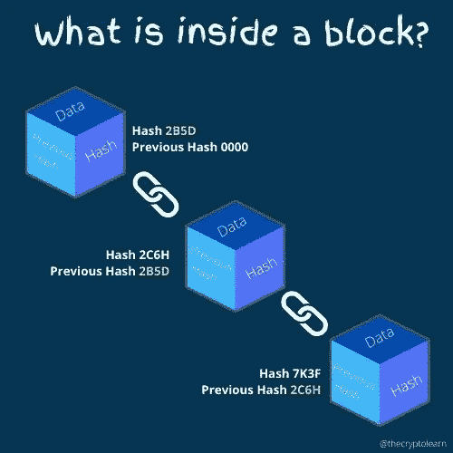
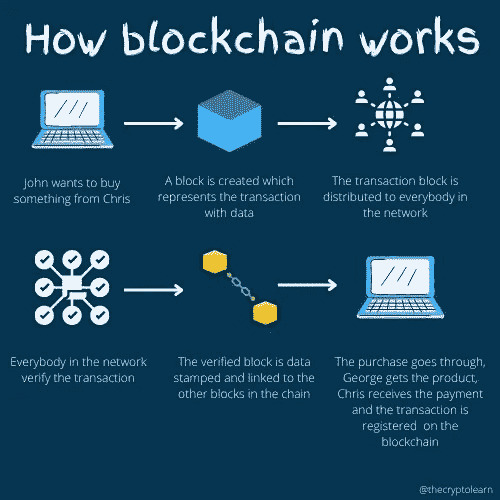

# 什么是区块链？简单解释了一下！

> 原文：<https://medium.com/coinmonks/what-is-blockchain-explained-simply-a1a5ca5dba8?source=collection_archive---------44----------------------->

区块链是一种存储数据的系统，这种方式很难或不可能改变、入侵或操纵数据。

> 从技术上讲，它是一个分布式数据库，在计算机网络(点对点)的节点之间共享，通过使用去中心化和加密散列法以数字格式电子存储信息。

简单地说，区块链是:

*   **一张** **数字总账**
*   **分发给网络的所有成员**
*   分散化因为没有任何权力机构对系统拥有最高权力
*   **加密**并通过加密手段保护
*   **不可变**，意味着每一个变化在分类帐上都是永久的
*   **共识**，网络的每个成员都遵循一种共识机制来允许数据交易

# 区块链的主要组成部分是什么

区块链由以下核心组件组成:

*   **节点:**系统内的一台计算机
*   **交易:**价值的实际交易
*   **块:**存储事务的数据结构
*   **链:**以特定顺序相互链接的一系列块
*   **挖掘器/验证器:**执行事务并验证事务的特定节点
*   共识:网络挖掘者/验证者达成一致的机制

# 区块链是如何创造出来的

区块链是由一系列的方块组成的，每一个方块都与它前面的方块相连。每个街区都有四个基本组成部分，构成了整个区块链的骨架:

*   **数据:**您想要安全存储在块中的任何信息
*   **散列:**分配给一个特定块的唯一标识符
*   **前一个块的散列:**包括前一个散列值构造块的结构
*   **元数据:**关于块内数据的相关数据(时间戳或块号)。

# 区块链是如何工作的

区块链是由众多节点或计算机组成的分布式网络，通过互联网在全球范围内运行。每个节点都能够生成块、验证事务、接收事务和进行事务。没有人可以伪造或操纵区块链中包含的数据，因为它是一个加密链接的块链(记录集)。

下图显示了区块链的工作原理:

# 区块链的主要特征是什么？

区块链技术的四个主要特征是:

*   **分发的**:网络的所有参与者和节点接收由区块链科技分发的账本的副本。如果作为区块链网络一部分的计算机上的硬盘崩溃，所有数据丢失，那么没有关系，因为它们都是由参与网络的每个成员(计算机)复制的
*   **无信任/共识**:区块链使用共识机制，帮助活跃在网络上的一组节点做出决策。参与者根据运行于其核心的算法迅速达成协议，使网络变得不可信。
*   **不可变**:在区块链上，每一次交易和新数据的添加都是永久的。系统上的每个节点都有一份数字账本。要添加事务，每个节点必须首先验证其合法性。如果多数人同意它是正确的，它被输入分类账。因此，数据不能被改变或更改。由于这个特性，它是不可变的。
*   分散化:网络是分散的，这意味着没有管理机构或个人负责基础设施。该网络由一组计算机维护，因此是分散的。

> 加入 Coinmonks [电报频道](https://t.me/coincodecap)和 [Youtube 频道](https://www.youtube.com/c/coinmonks/videos)了解加密交易和投资

# 另外，阅读

*   [最佳网上赌场](https://coincodecap.com/best-online-casinos) | [币安评论](/coinmonks/binance-review-ee10d3bf3b6e) | [BitMEX 评论](https://coincodecap.com/bitmex-review)
*   [麻雀交换评论](https://coincodecap.com/sparrow-exchange-review) | [纳什交换评论](https://coincodecap.com/nash-exchange-review)
*   [美国最佳加密交易机器人](https://coincodecap.com/crypto-trading-bots-in-the-us) | [经常性回顾](https://coincodecap.com/changelly-review)
*   [在印度利用加密套利赚取被动收入](https://coincodecap.com/crypto-arbitrage-in-india)
*   [Godex.io 审核](/coinmonks/godex-io-review-7366086519fb) | [邀请审核](/coinmonks/invity-review-70f3030c0502) | [BitForex 审核](https://coincodecap.com/bitforex-review)
*   [5 款最佳免费加密货币制图工具](https://coincodecap.com/crypto-charting-tools)
*   [最佳比特币保证金交易](/coinmonks/bitcoin-margin-trading-exchange-bcbfcbf7b8e3) | [萝莉点评](/coinmonks/lolli-review-e6ddc7895ad8) | [比特币保证金交易](https://coincodecap.com/bityard-margin-trading)