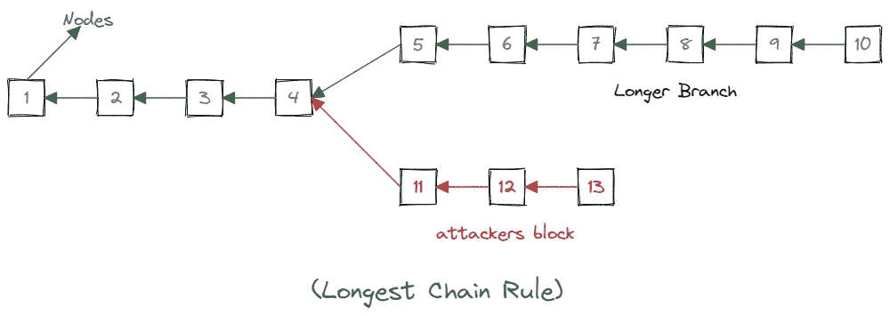

# 什么是区块链挖掘？它是如何发生的？

> 原文：<https://medium.com/coinmonks/what-is-blockchain-mining-and-how-does-it-happen-27962d0d9e02?source=collection_archive---------20----------------------->

**嗯，**

我希望一切都好。今天我们将了解区块链矿业及其流程。

**酷！**

**那么，区块链挖掘到底是什么？**

知道吗？

简而言之，挖掘就是在区块链总账上记录新交易的过程。或者我们可以说，这是我们在区块链网络中添加新块的过程。

*萨罗吉，这是什么过程，什么是开采，真让人摸不着头脑……嗯！多解释一下。*

等等伙计们，我们会深入了解的！

*:)*

# 采矿过程

如您所知，区块链是一个分散式网络(*或一组节点*)，没有中心节点或头节点。因此，当一个新节点想要加入该网络时，它不可能直接加入。它必须有一些过程添加到网络中，这被称为挖掘过程。

哦，是吗？Saroj，我们对挖掘过程有了一些想法，但是谁真正把这个节点添加到网络中呢？

阿雅，问得好。

*那么，谁来做挖掘工作呢？*

矿工需要去采矿！矿工只不过是一台计算机或一组计算机。人类也可以成为矿工，但解决方案对我们来说更复杂。矿工需要做一些解决方案来添加块。采矿奖励给予第一个找到复杂散列问题解决方案的矿工(*解决方案*)。

**还是，越来越迷茫？让我们试着用图表来理解。**

假设我是一名矿工。我需要解决一个数学问题来给网络添加一个模块。如果我找到了解决方案，那么该块将被添加到区块链网络。但是，如果我找不到解决方案会怎么样呢？在这种情况下，我的事务将被添加到事务池中。不过是一组未确认的交易，等待添加。

等等……还没完成呢！

让我们想象一下，有一个包含 30 个街区的区块链网络。有一个黑客，他/她想通过添加一个新的块或一组块来攻击这个网络。那就有问题了，对吧？

是的，萨罗吉，这是个大问题。我们如何解决这个问题？

这里，最长链规则开始出现。:)

# 最长链规则

最长链规则是一个矿工如果他/她想采矿就必须遵守的规则。

假设有两组街区(*节点*)，一组大约 6 个街区，第二组(*攻击者*)大约 3 个街区。在这种情况下，区块链网络将只接受最长的链段(*第一组*)，第二组将被拒绝。拥有更多积木的区块链比拥有更少积木的链条消耗更多的能量。并且，总是节点遵循最长链规则。

**同样，采矿也有两种类型**

*   **单干采矿**
*   **波罗矿业**

在 solo mining 中，只有一台计算机参与挖掘过程，而在 polo mining 中，一组计算机参与挖掘过程。

**对采矿和矿工有什么想法？**

是的，伙计，谢谢你提供的关于采矿和矿工的重要信息。

**太好了！**

谢谢你们阅读这篇文章。希望你觉得有趣:)

很快会看到你的新文章。

> 加入 Coinmonks [电报频道](https://t.me/coincodecap)和 [Youtube 频道](https://www.youtube.com/c/coinmonks/videos)了解加密交易和投资

# 另外，阅读

*   [瓦济里克斯 NFT 评论](https://coincodecap.com/wazirx-nft-review)|[Bitsgap vs Pionex](https://coincodecap.com/bitsgap-vs-pionex)|[Tangem 评论](https://coincodecap.com/tangem-wallet-review)
*   如何使用 Solidity 在以太坊上创建 DApp？
*   [币安 vs FTX](https://coincodecap.com/binance-vs-ftx) | [最佳(SOL)索拉纳钱包](https://coincodecap.com/solana-wallets)
*   [如何在 Uniswap 上交换加密？](https://coincodecap.com/swap-crypto-on-uniswap) | [A-Ads 评论](https://coincodecap.com/a-ads-review)
*   [加密货币储蓄账户](/coinmonks/cryptocurrency-savings-accounts-be3bc0feffbf) | [YoBit 审核](/coinmonks/yobit-review-175464162c62)