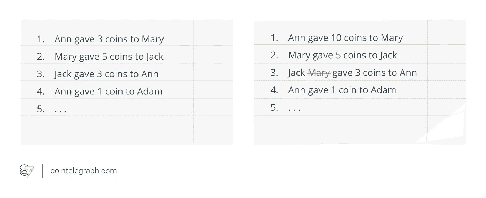
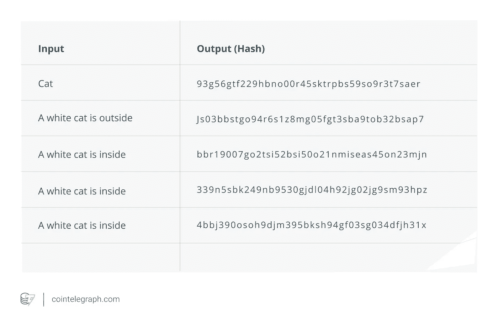
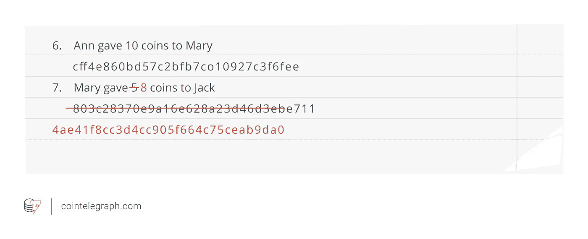
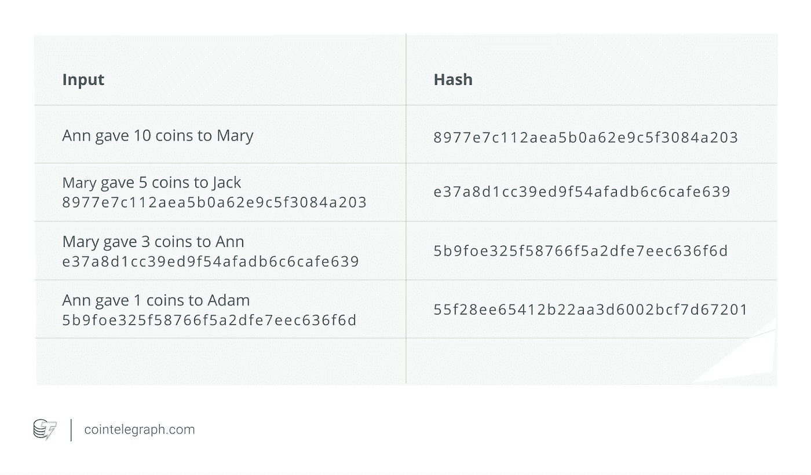
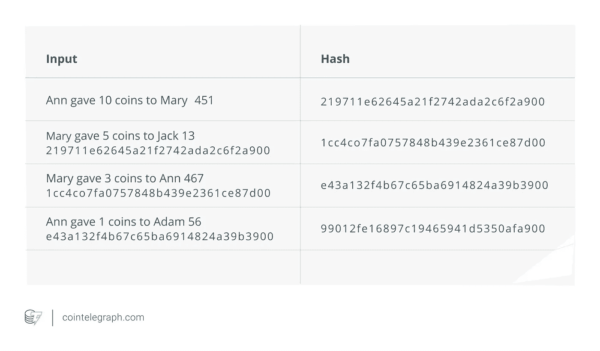
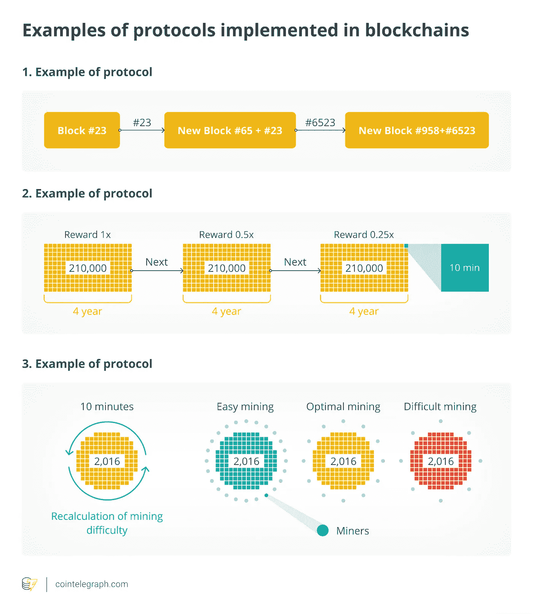
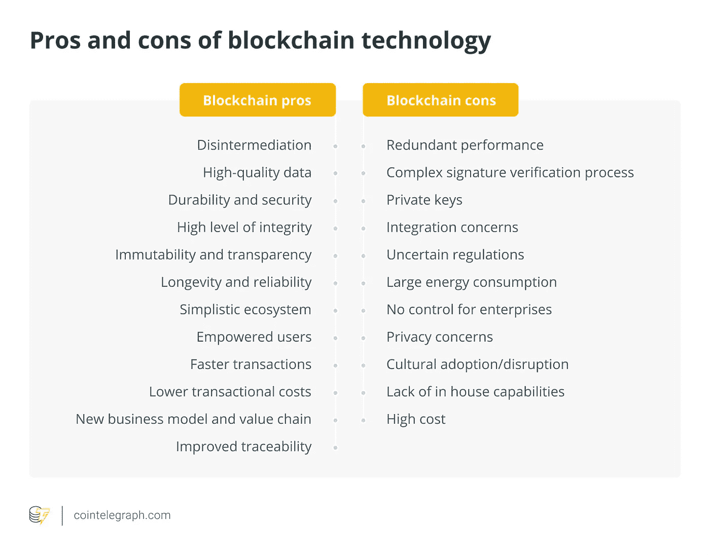
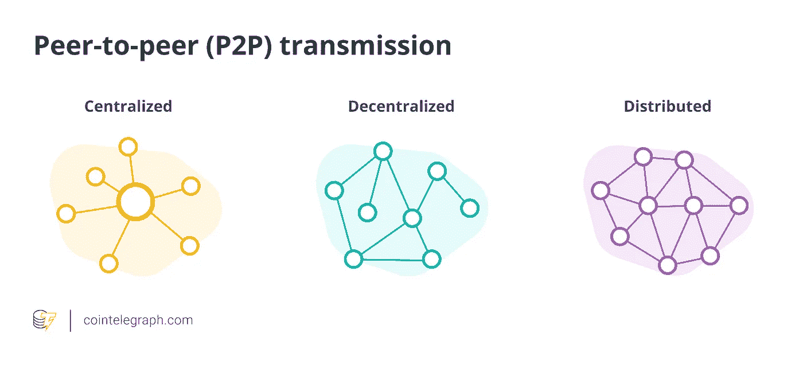
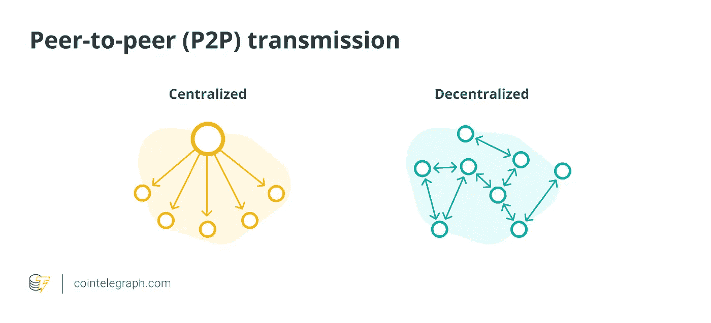
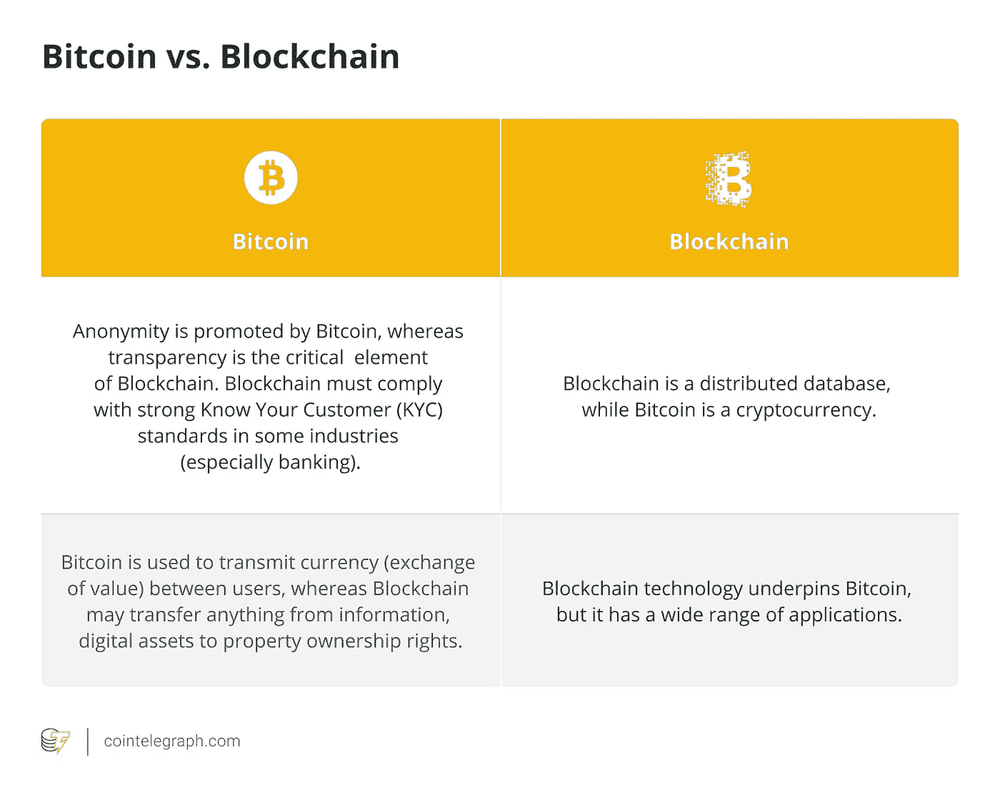

# 什么是区块链技术？它是如何工作的？

> 原文：<https://medium.com/coinmonks/what-is-blockchain-technology-how-does-it-work-bf1463b95f53?source=collection_archive---------24----------------------->

# 什么是区块链技术？它是如何工作的？

Credit: Cointelegraph Source

什么是区块链技术？它是如何工作的？

# 区块链解释

区块链是分布式的(即没有单个存储库),而[分散式数字总账](https://cointelegraph.com/bitcoin-for-beginners/how-blockchain-technology-works-guide-for-beginners)是防篡改的。在最基本的层面上，它们允许用户在该组内的共享分类账中记录交易。其结果是，在标准的区块链网络功能下，交易一旦发布就不能被修改。

2008 年，区块链的概念与许多其他技术和计算机概念相结合，创造了现代加密货币:由加密过程而不是中央存储库或权威机构保护的电子现金。

区块链的实现通常都有特定的目标或功能。[加密货币、智能合约和面向企业的分布式账本系统](https://cointelegraph.com/ethereum-for-beginners/what-are-smart-contracts-guide-for-beginners)都是功能性的例子。

[比特币是第一种基于区块链的加密货币](https://cointelegraph.com/bitcoin-for-beginners/what-is-bitcoin-a-beginners-guide-to-the-worlds-first-cryptocurrency)，允许用户公开分享数据，以便参与者可以独立验证交易的有效性。加密货币建立在区块链技术的基础上，该技术因大量使用加密功能而得名。

为了在系统内进行数字签名和安全交易，[用户使用公钥和私钥](https://cointelegraph.com/explained/secure-encryption-key-management-modules-explained)。用户可以使用加密哈希函数来解谜，希望在涉及采矿的基于加密货币的区块链网络中获得固定金额的支付。

随着新平台的不断推出，区块链技术领域取得了稳步发展，环境也在不断变化。除了加密货币，区块链技术还可以用来建立一个永久、公开、透明的账本系统，用于收集销售数据、跟踪数字使用情况以及向音乐人等内容创作者付款。

这篇文章解释了区块链技术，并概述了它的工作原理。

# 区块链是如何工作的？

区块链的基本目标是让人们——尤其是那些互不信任的人——以安全、防篡改的方式交流重要数据。

哈希函数、块、节点、挖掘器、钱包、数字签名和协议是区块链中的各种主要概念。

# 散列函数

让我们想象一下，一个房间里的 10 个人决定制造一种新货币。他们必须跟踪资金的流向，以确保新货币生态系统中硬币的有效性。一个人——让我们称他为鲍勃——决定在日记中记录所有的行动。然而，另一个人——姑且叫他杰克——决定偷钱。为了隐藏这一点，他修改了日记中的条目。

后来有一天，鲍勃注意到有人篡改了他的日记。他决定改变自己日记的格式，以防将来被篡改。他使用了一个名为哈希函数的程序，将文本转换成一组数字和字母，如下表所示。

这个过程利用一种安全散列算法(SHA ),将字母转换成字符串。Bob 可以选择不同类型的 sha，每种类型的 sha 都有不同的复杂性，并满足不同的需求。

散列是由散列函数产生的一串数字和字母。哈希函数是一种数学函数，它将可变数量的字符转换为固定数量的字符串。

一个字符串中的一个小小的改变就会产生一个全新的散列。在每个日记条目之后，鲍勃插入一个散列。但后来杰克决定再次更改条目。他找到了日记，更改了记录，生成了一个新的散列。

鲍勃注意到有人又翻看了日记。他决定把每笔交易的记录复杂化。在每条记录之后，他插入一条从记录的最后一条散列生成的新散列。因此，每个条目都依赖于前面的条目。

如果杰克试图改变记录，他将不得不改变所有先前条目中的散列。然而，杰克是一个坚定的小偷，所以他花了整个晚上数所有的散列。

Bob 不想放弃，所以他在每条记录后添加了一个不同的随机数。这个数字被称为“随机数”选择 Nonces 的方式应该使生成的哈希以两个零结尾。

为了用 Bob 更新的输入系统伪造记录，Jack 现在必须花费大量的时间来确定每一行的随机数。

即使是计算机也很难计算出随机数，但这项任务是可能的，因为作为区块链采矿过程的一部分，矿工们竞相发现随机数。

# 阻碍

Bob 的包含 5000 笔交易的初始电子表格被称为 genesis 块，这是区块链的起点。这种货币的采用已经普及，所以交易来得又快又频繁。创建的新块也可以容纳多达 5，000 笔交易，并且具有与以前的块相关联的代码，使它们不可伪造。

让我们假设这个区块链每 10 分钟用一个新块更新自己。它会自动这样做。没有主计算机或中央计算机指示计算机这样做。

电子表格、分类账或注册表一旦更新，就不能再更改。因此，不可能伪造它。您只能向其中添加新条目。网络上所有计算机上的注册表同时更新。对区块链的改变需要大多数网络参与者的一致同意。

区块链的一个潜在风险是“51%攻击”，在此期间，一方超过区块链的哈希速率的大多数，从而允许他们控制网络。

通常，块包含时间戳、对前一个块的引用、事务以及在块进入区块链之前必须解决的计算问题。必须达成共识的分布式节点网络使得欺诈在区块链几乎不可能发生。

# 节点

鲍勃用这种方式记了一段时间的日记。然而，随着新交易的不断出现，他很快就被记录的数量所累，认为他当前的系统是不可持续的。所以，当他的日记达到 5000 笔交易时，他就把它转换成一页的电子表格。玛丽检查了所有交易的准确性。

然后，Bob 将他的电子表格日记交给位于全球不同地区的 3000 台不同的计算机。这些计算机被称为节点。每次交易发生时，都必须得到这些节点的批准，每个节点都检查交易的有效性。一旦每个节点都检查了交易，实质上就发生了一种电子投票。一些节点可能认为交易是有效的，而其他节点可能认为它是欺诈性的。

每个节点都有一份电子表格日志。每个节点检查每个事务的有效性。如果大多数节点认为事务是有效的，那么它将被写入块中。

现在，如果 Jack 想要更改电子表格日志中的一个条目，所有其他计算机都将拥有原始散列。他们不会允许这种变化发生。

# 矿工

采矿是矿工将新的区块添加到链中的过程。区块链中的每个块都有其唯一的 nonce 和 hash，但它也引用链中前一个块的 hash，这使得挖掘块很困难，尤其是在大链上。

矿工利用专门的软件来解决极其困难的数学问题，即使用随机数生成可接受的散列。因为 nonce 只有 32 位长，而 hash 有 256 位长，所以在找到正确的组合之前，大约有 40 亿个 nonce-hash 组合需要挖掘。

当这种情况发生时，矿工被认为发现了“黄金现时”，他们的区块被添加到链中。对链中较早的任何块进行更改不仅需要重新挖掘受影响的块，还需要重新挖掘所有后续的块。

这就是操纵区块链技术如此艰难的原因。考虑一下“数学上的安全”,因为识别黄金随机数需要很长时间和大量的计算资源。当一个区块被成功开采时，网络中的所有节点都承认这一变化，并且开采者得到经济补偿。

# 钱包、数字签名和协议

继续同一个例子，Bob 将 10 个人聚集在一起(最初聚集的 10 个人是新货币的一部分)。他需要向他们解释新的数字硬币和分类账系统。

杰克向大家承认了他的罪行并道歉。为了证明他的诚意，他把硬币还给安和玛丽。

解决了所有这些问题后，鲍勃解释了为什么这种事情再也不会发生了。他决定实现一种叫做数字签名的东西来确认每一笔交易。但首先，他给了每个人一个钱包。

## 什么是钱包？

如果你拥有数字货币，那么你需要一个数字钱包或一个在线平台或交易所来存储。

钱包就是一串数字和字母，比如:18c 177926650 e 5550973303 c 300e 136 f 22673 b 74。随着交易的进行，该地址将出现在区块链内的各个区块中。不包括姓名或个人身份信息，只包括钱包号码。

公共钱包地址是可以向其发送特定资产的字符串。每个特定钱包的地址都是从公钥中生成的。

# 数字签名

为了进行交易，你需要两样东西:一个钱包，它是一个地址，和一把私人钥匙。私钥是一串随机数。然而，与地址不同，私钥必须保密。私钥控制其相关钱包中的资金。

当某人决定将硬币发送给其他任何人时，他们必须使用自己的私钥对包含交易的消息进行签名。由两个密钥组成的系统——一个私钥和一个公钥——是加密和密码术的核心，它的使用远远早于区块链的存在。它最早是在 20 世纪 70 年代提出的。

消息一旦发出，就被广播到区块链电视网。然后，节点网络对消息进行处理，以确保其中包含的事务是有效的。如果它确认了有效性，则事务被放在一个块中。之后，关于它的任何信息都不能更改。

# 什么是加密密钥？

密钥是一串数字和字母。加密密钥由密钥生成器或密钥组生成。这些密钥生成者使用非常高级的数学，包括质数来生成密钥。这种密钥可用于加密或解密信息。

## 协议

区块链技术由个体行为规范组成，这是一大套编入其中的规则。这些规范被称为协议。特定协议的实施本质上造就了区块链——一个分布式、对等、安全的信息数据库。

区块链协议确保网络按照其创造者的意图运行，即使它是完全自主的，不受任何人控制。

以下是区块链实施的一些协议示例:

*   每个散列号的输入信息必须包括前一个块的散列号。
*   在开采了 210，000 个区块后，成功开采一个区块的奖励减少一半。对于比特币( [BTC](https://cointelegraph.com/bitcoin-price) )，这被称为减半。按每个区块 10 分钟计算，开采 21 万个区块大约需要 4 年时间；因此，比特币每四年减半一次。
*   为了将开采一个区块所需的时间保持在大约 10 分钟，每 2016 个区块重新计算一次开采难度。挖掘难度本质上是平衡网络来说明矿工的数量。更多的矿工意味着竞争更加激烈，使得区块开采更加困难。矿工较少意味着开采区块相对更容易，从而吸引比特币矿工参与进来。

# 区块链技术:利弊

大多数区块链都是作为一个分散的数据库构建的，起到分布式分类帐的作用。这些区块链分类账以块的形式跟踪和存储数据，这些块按时间顺序排列，并通过加密证据链接。

区块链技术的发展已经为各行各业带来了诸多好处，包括在不信任的情况下增强安全性。然而，它是分散的这一事实有很大的缺点。例如，与典型的集中式数据库相比，区块链的效率有限，并且需要更多的存储空间。

区块链的各种利弊包括:

# 什么是区块链的权力下放，为什么它很重要？

区块链本质上是分布式数据库的类型。数据库是区块链，区块链上的每个节点都可以访问整个链。没有一个节点或计算机控制它所包含的信息。每个节点都可以验证区块链的记录。这一切都是在没有一个或几个中间人控制一切的情况下完成的。

它在体系结构上是分散的，没有会导致区块链崩溃的单点故障，这使得它成为区块链系统的关键组件。但是，区块链的节点在逻辑上是集中的，因为整个区块链是一个执行特定编程操作的分布式网络。

# 对等传输

在分散对等(P2P)传输中，通信总是直接发生在对等体之间，而不是通过中心节点。关于区块链上发生的事情的信息存储在每个节点上，然后传递给相邻的节点。这样，信息就传遍了整个网络。

# 区块链技术的透明度

任何检查区块链的人都能够看到每一笔交易及其哈希值。如果愿意，使用区块链的人可以使用假名，或者他们可以将自己的身份提供给其他人。在区块链上看到的只是钱包地址之间的交易记录。

一旦交易被记录在区块链和区块链更新，改变这个交易的记录变得不可能。为什么？该特定的事务记录与之前的每个事务记录相关联，因此是不可变的。区块链记录是永久的，它们按时间顺序排列，并且可供所有其他节点使用。

关闭网络几乎是不可能的。由于大量的节点在全球范围内存在和运行，一方不可能接管整个网络。

伪造区块也几乎是不可能的，因为每个区块的有效性，以及推而广之，是否包含在区块链中，都是由节点的电子共识所决定的。这些节点有数千个，分布在世界各地。因此，捕获网络需要一台功率大得几乎不可能的计算机。

然而，将区块链技术用作普通数据库将被证明是困难的。你能像使用 Microsoft Access、FileMaker 或 MySQL 等数据库平台一样，在区块链上存储 3gb 的文件吗？这不是个好主意。大多数区块链在设计上不适合这种情况，或者只是缺乏所需的容量。

传统的在线数据库通常使用客户机-服务器网络体系结构。这意味着拥有访问权限的用户可以更改存储在数据库中的条目，但总体控制权仍属于管理员。对于区块链数据库，每个用户负责维护、计算和更新每个新条目。每一个节点都必须协同工作，以确保它们都得出相同的结论。

区块链技术架构也意味着每个节点必须独立工作，并将自己的工作结果与网络的其余部分进行比较，因此达成共识可能非常耗时。正因为如此，与传统的数字交易技术相比，区块链网络历来被认为速度较慢。进步在某些情况下提高了与区块链相关的交易速度，如在一些加密资产、项目和解决方案中所见。

也就是说，用区块链技术生产数据库是有实验的。这些平台旨在采用企业级分布式数据库，并在此基础上构建，同时添加区块链的三个关键属性:去中心化、不变性以及注册和转移资产的能力。

# 区块链技术有多安全？

尽管区块链也不能幸免于黑客攻击，但其分散的性质为其提供了更强的安全防线。黑客或罪犯需要控制分布式账本中一半以上的机器才能改变它。

最著名和最大的区块链网络，如比特币和以太坊( [ETH](https://cointelegraph.com/ethereum-price) )，对所有拥有电脑和互联网连接的人开放。区块链网络中有更多的参与者有助于提高安全性，而不是制造安全隐患。参与的节点越多，意味着更多的个人在互相审查彼此的工作，并报告不良行为者。这就是为什么需要邀请才能加入的[私人区块链网络](https://cointelegraph.com/explained/private-public-and-consortium-blockchains-the-differences-explained)更容易受到黑客攻击和操纵的原因之一，这与直觉相反。

此外，区块链有利于打击支付和资金转移中的“双重支出”攻击。加密货币攻击是一个重要的担忧来源。在双重消费攻击中，用户将不止一次地消费他们的加密货币。是处理现金时不存在的问题。

如果你在一杯咖啡上花了 3 美元，你就再也没有 3 美元可以花在别的东西上了。然而，当涉及到加密时，在网络注意到之前，用户可能会花费加密货币无数次。

这是区块链可以帮助解决的事情。在加密货币的区块链中，整个网络必须就交易顺序达成一致，确认最近的交易，并公开发布，这有助于保护网络的安全。

# 比特币 vs 区块链

让我们来理解一下比特币和区块链是怎么一回事:

# 区块链技术可以用在哪里？

本文的最后一部分将讨论区块链的一些应用。区块链技术对于所谓的“智能合约”来说尤其理想。那么，什么是智能合约呢？

智能合同定义了特定协议的规则和惩罚，类似于传统合同的功能。然而，最大的区别在于，智能合约会自动执行这些义务。由于它们的编码，智能合约满足特定的标准。

# 分散金融

[分散金融，或 DeFi](https://cointelegraph.com/defi-101/defi-a-comprehensive-guide-to-decentralized-finance) ，是利用区块链技术，允许参与者访问类似于主流金融界常见的功能，除了以分散的方式。使用不同的 DeFi 解决方案，参与者可以借出和借入资金——以及访问其他机会——不受中央机构控制的区块链。

# 不可伪造的代币

不可伪造代币，或 NFT，作为区块链技术的应用，在几个不同的用例中具有巨大的潜力。这种代币是可验证的唯一代币，并且不能与其他代币一对一地交换相同的价值。NFTs 的一个潜在用例是艺术品的认证，艺术品绑定到 NFTs，这可以验证它们的真实性和所有权。

# 供应链

将区块链技术应用于供应链可以提供追踪原料、食品、材料等的能力，以证明其来源，并提供任何给定供应链的其他相关信息。

# 保修索赔

对于提出索赔的人来说，解决保修索赔既昂贵又耗时，而且通常很困难。使用区块链技术实现智能合约是可能的，这将不可避免地使这一过程变得明显更容易。

# 保险索赔

通过智能合同，可以为特定的保险相关情况建立一套标准。理论上，随着区块链技术的实施，你可以在网上提交你的保险索赔，并立即收到自动赔付——当然，前提是你的索赔符合所有要求的标准。

# 身份验证

由于区块链及其权力下放的特点，在线身份验证可能会更快，也可能更安全。随着区块链的使用，将在线身份数据保存在一个中心位置可能会成为过去，这意味着计算机黑客将不再有集中的易受攻击点。

# 物联网

物联网通过互联网连接在一起以实现交互，是一个软件友好项目的生态系统，如车辆和设备，其中包括使这种交互成为可能的特定技术规范。

区块链技术可能在物联网的未来发挥作用，部分是通过提供防范黑客的潜在方法。因为区块链是为分散控制而构建的，所以基于它的安全方案应该具有足够的可扩展性，以覆盖物联网的扩展。

# 存档和文件存储

Google Drive、Dropbox 和其他公司已经通过使用集中式方法彻底开发了文档的电子存档。集中式网站对黑客来说很有吸引力。区块链及其智能合约提供了大幅降低这种威胁的方法。

# 打击犯罪

随着该技术获得更多主流关注，区块链及其智能合同有可能帮助打击洗钱策略。

区块链提供了对系统更全面的分析，而不仅仅是监控入口和出口点。由于区块链是一个分散的网络，其中每个用户或节点负责验证更新，它增强了网络的安全性。

# 投票

智能合约和区块链可以极大地改善选举投票和类似过程。随着时间的推移，出现了各种相关的应用。

# 区块链技术的未来

区块链技术的潜力实际上是无限的，最近的进步使我们更接近一个去中心化、无信任的互联网、交易透明等等。

随着我们离开疫情时代，进入“新常态”时代，在应对这些新的社会挑战和在勇敢的数字货币新世界中重新定义财富的真正含义方面，区块链很可能处于我们进步的最前沿。

区块链技术的未来似乎一片光明，鉴于它已经在几乎每个领域展现出潜力，最好的前景似乎还在后头。

与此同时，看到区块链技术在未来的走向将是一件有趣的事情，特别是在银行服务、资金转移、分散市场和其他领域。

那么，请在评论区告诉我你的观点，以及你如何看待区块链科技为全球社区增加更多价值。

> 加入 Coinmonks [电报频道](https://t.me/coincodecap)和 [Youtube 频道](https://www.youtube.com/c/coinmonks/videos)了解加密交易和投资

# 另外，阅读

*   [阿联酋 5 大最佳加密交易所](https://coincodecap.com/best-crypto-exchanges-in-uae) | [SimpleSwap 评论](https://coincodecap.com/simpleswap-review)
*   [购买 Dogecoin 的 7 种最佳方式](https://coincodecap.com/ways-to-buy-dogecoin) | [ZebPay 评论](https://coincodecap.com/zebpay-review)
*   [最佳期货交易信号](https://coincodecap.com/futures-trading-signals) | [流动性交易所评论](https://coincodecap.com/liquid-exchange-review)
*   [火币的加密交易信号](https://coincodecap.com/huobi-crypto-trading-signals) | [Swapzone 审查](/coinmonks/swapzone-review-crypto-exchange-data-aggregator-e0ad78e55ed7)
*   最佳[密码交易机器人](https://coincodecap.com/best-crypto-trading-bots) | [购买索拉纳](https://coincodecap.com/buy-solana) | [矩阵导出审查](https://coincodecap.com/matrixport-review)
*   [Coldcard 评论](https://coincodecap.com/coldcard-review) | [BOXtradEX 评论](https://coincodecap.com/boxtradex-review)|[uni swap 指南](https://coincodecap.com/uniswap)
*   [比特币基地评论](/coinmonks/coinbase-review-6ef4e0f56064) | [德里比特评论](/coinmonks/deribit-review-options-fees-apis-and-testnet-2ca16c4bbdb2) | [FTX 评论](/coinmonks/ftx-crypto-exchange-review-53664ac1198f)
*   [n ave 零点回顾](/coinmonks/ngrave-zero-review-c465cf8307fc) | [Phemex 回顾](/coinmonks/phemex-review-4cfba0b49e28) | [PrimeXBT 回顾](/coinmonks/primexbt-review-88e0815be858)
*   最佳[区块链分析](https://bitquery.io/blog/best-blockchain-analysis-tools-and-software)工具| [赚比特币](/coinmonks/earn-bitcoin-6e8bd3c592d9)
*   [Cloudbet 赌场评论](https://coincodecap.com/cloudbet-casino-review) | [点火赌场评论](https://coincodecap.com/ignition-casino-review)