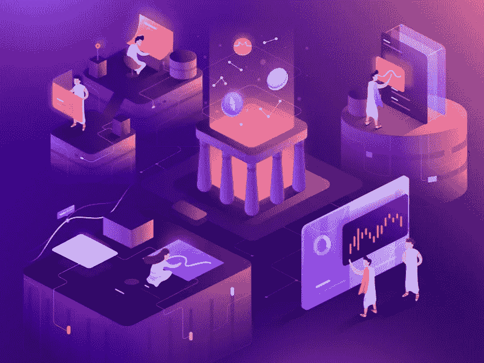
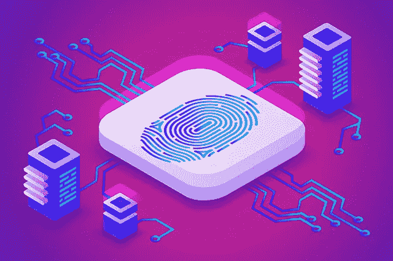
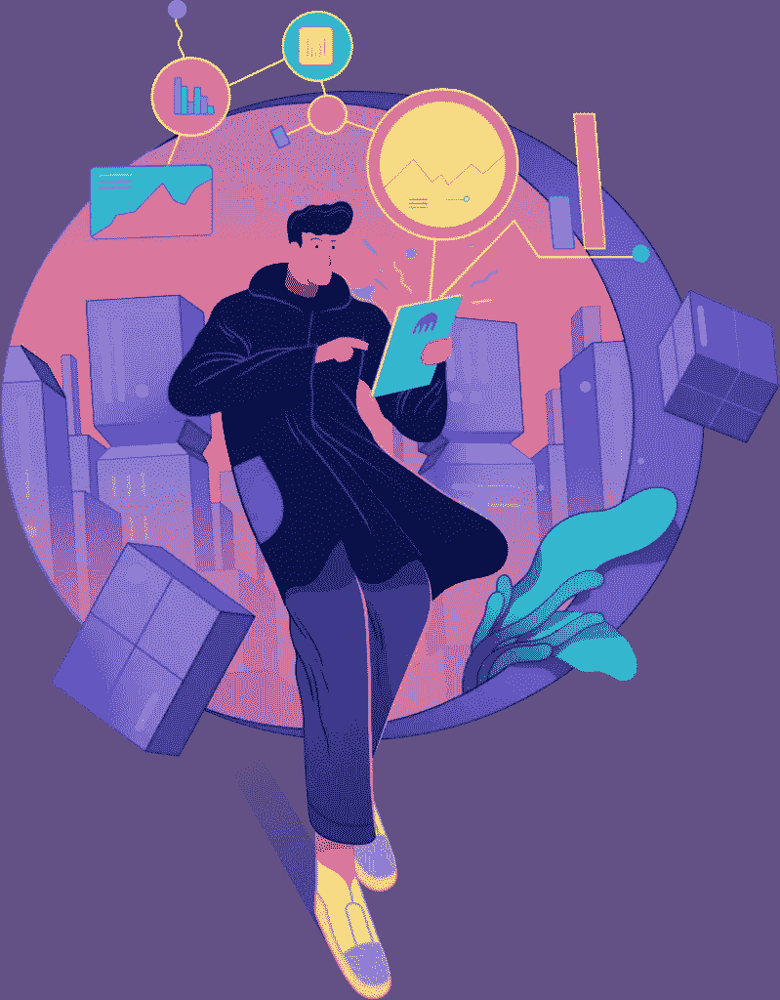
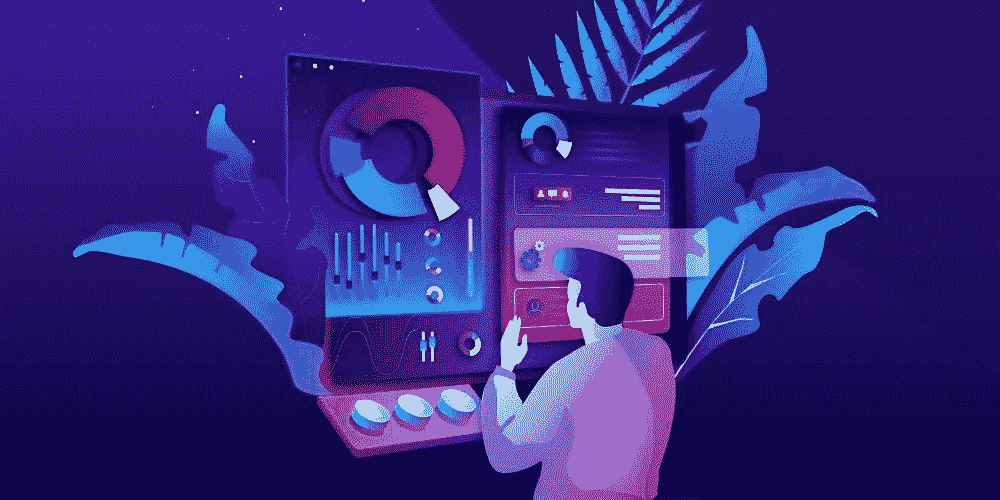

# 什么是区块链——下一代交易

> 原文：<https://medium.com/coinmonks/what-is-blockchain-the-next-generation-transactions-22771a5f31f6?source=collection_archive---------66----------------------->

区块链

故事最初发表于[https://koop360.com/blog/what-is-blockchain/](https://koop360.com/blog/what-is-blockchain/)

> *当你第一次开始学习区块链技术时，它可能会显得非常混乱——尤其是像去中心化、采矿、令牌、加密货币和智能合同这样的关键词。但是不要被这些术语和观念吓倒；区块链技术的基本原理很简单。*

在其最基本的形式中，区块链是交易数据的数字存档。因为这有时被称为分类账，所以通常使用“区块链技术”一词。当您有大量不同的数据集合时，使用基于链接在一起的数据块的系统将它们保存在一起。因为每块砖都与其周围的砖相连，所以它们相互作用。

这导致在一个系统中，如果一个块被改变，附近的块立即检测到问题并防止不正确的事务。因此，区块链上的交易不能被修改，导致网络上的每个人都可以访问的永久记录。

***区块链有能力改变我们看待和花钱的方式，以及我们将如何使各种协议、合同和技术合法化。***

# 区块链是如何运作的？

有许多类型的区块链，如公共区块链和区块链财团，但它们都有几个共同的基本核心组件。区块链是由积木组成的。数据包含在这些块中。数据中包含的信息必须存储在区块链的总账中。

**例如，在加密货币的情况下，数据包括:**

-发件人

-接收器

-寄了多少钱？

食品跟踪过程中还会用到区块链，如下所示:

-食物从哪里来的？

-处理它的工厂

-食物从哪里来的？

如果存在食源性疾病，自动区块链可让您立即确定产品的生产地和处理地。然后，您可以利用这些知识来防止他人被感染——这一切只需几分钟或几小时。如果汽车行业使用区块链，将有可能确保车辆里程表读数是正确的，禁止任何人篡改它们以提高或降低价值。

**下一代交易&元宇宙**

区块链是最先崛起的国家之一。根据定义，它是一个庞大且不可变的数据库。记录在链上的所有信息都可以以相当快的速度自动更新，同时保持数据完整性，不会被篡改。区块链首先将自己视为“分布式账本”，这是一个准确的描述。区块链可以被认为是一个巨大的账本，每一页都以密码的形式额外记录了前一页的内容。这使得它不可更改——如果你修改它，每个人都会注意到。

区块链的另一个特点是“去中心化”，这意味着分类账不属于某个“会计公司”，而只属于它自己。已经保存在链上的信息是不能更改的，不管交易规模有多大。

因此，“录音”成为了区块链的第一个使用场景。人们首先期待区块链提供的无限可能性——实时、流动和透明交易的未来。然而，在最近 10 年左右的时间里，除了让无数个人暴富或破产的“虚拟货币”，它还可能被冠以“虚拟货币”的称号。只能使用 NFT。

理论上，NFT 被认为是一个重要的应用。它的全称是“不可替换的令牌”，其功能类似于“数字签名”来识别所有权。在区分虚拟作品的版权时，这种方法很方便。如果使用得当，它有可能解决一些版权冲突，同时仍然保护艺术家个人的权利

你现在对 [**有了更好的理解，NFT 是什么**](https://koop360.com/blog/what-is-nft/) 以及它在区块链的背景下意味着什么。请记住，虽然大部分仍处于早期阶段，但它不会很快消失，而且肯定会成为你生活中更大的一部分。作为公司所有者或客户，你必须准备好更深入地理解这些原则，并为这类交易何时会在网上和元宇宙发生做好准备，这一点至关重要。您也可以通过利用 Authena 的 NFT 技术来保护您的业务免受盗窃和假冒，并确保您的消费者在互联网和众多平台上进行交易时有愉快而完美的体验。还有，在这里详细了解一下 [**什么是元宇宙？**](https://koop360.com/blog/what-is-metaverse/)

**利用 NFT、元宇宙和区块链为您的业务做好准备**

趁还来得及，现在是行动和准备的时候了。您不仅希望能够核实事情，还希望能够发现欺诈发生在哪里，以及谁最有可能受到指责。没有一刀切的防伪解决方案。这些是基于像 [**KOOP360**](https://koop360.com/) 和 [**分散式**这样的公司所要求的安全性和可靠性的数量的几个程序。](https://decentraland.org/)

[**KOOP360**](https://koop360.com/) 是业界首个可配置、开源、去中心化的机器人开发环境，允许利用 AI/ML 技术快速形成或开发 NFTs 和元宇宙生态系统。KOOP360 允许新人，无论他们是否是程序员，都可以赚钱，并最大限度地提高他们的津贴和激励。您可以使用简单的即插即用编程技术来制作、开发或设计 NFT 数字艺术，并在 KOOP360 市场上出售。使用结合了虚拟/增强现实和基于人类触摸的环境的自生成编程来创建元宇宙。KOOP360 是一个致力于社区管理和选择的非营利组织。由于机器人，生态系统将完全由社区拥有和监管，它将是一个开源的，点对点的技能开发环境，适用于从初学者到专家的所有人。

> 交易新手？尝试[加密交易机器人](/coinmonks/crypto-trading-bot-c2ffce8acb2a)或[复制交易](/coinmonks/top-10-crypto-copy-trading-platforms-for-beginners-d0c37c7d698c)