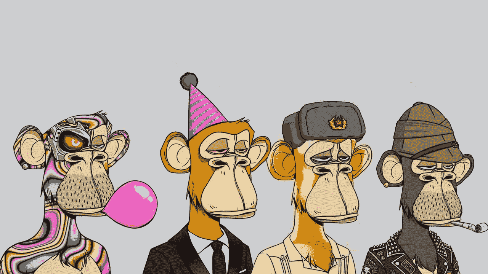

# 什么是无聊猿游艇俱乐部？(第一部分)

> 原文：<https://medium.com/coinmonks/what-is-bored-ape-yacht-club-part1-3a3877a39418?source=collection_archive---------15----------------------->

你知道内马尔、孟菲斯·德佩、沙奎尔·奥尼尔、斯蒂芬·克里、帕丽斯·希尔顿、DJ·哈立德、贾斯汀比伯、吉米·法伦、阿姆和马克·库班有什么共同点吗？几乎没有；只不过这些人都花了几十万美元购买了一些卡通猴子的图片集，名为无聊猿游艇俱乐部，并将其作为他们在社交媒体上的个人资料图片！但是这些奇怪的猴子的故事是什么，为什么它们如此著名，当然也如此昂贵？

Bored Ape Yacht Club，也被简称为 BAYC，是一个不可替代代币(NFT)的集合，灵感来自已经达到 10 亿美元交易量的 CryptoPunks 系列。这一系列独特的设计吸引了许多粉丝。大写字母，甚至像阿迪达斯这样的知名品牌都是这些不可替代代币的粉丝。2021 年，许多职业交易员通过在 OpenSea 平台上买卖无聊的 Ape 游艇俱乐部代币获得了巨额利润。2021 年，许多职业交易员通过在 OpenSea 平台上买卖无聊的 Ape 游艇俱乐部代币获得了巨额利润。根据 NFTStreet 的数据，这种情况一直持续到这些无聊的猴子的前 20 个代币的价格！已经达到 100 万到 300 万美元了！

Bored Ape 游艇俱乐部不仅是许多有影响力的人和名人的个人资料照片，也是一张特殊的会员卡，可以进入为其成员提供特殊福利的在线俱乐部。要了解更多关于这些流行和有争议的 NFT 的信息，请继续关注本文的其余部分。

Bored Ape 游艇俱乐部是美国公司宇迦实验室的产品，在区块链以太坊收集了 10，000 个具有 ERC-721 令牌标准的独特令牌。这些表征由 170 个显著特征组成，例如各种各样的外表、奇怪的衣服和不同的面部表情。

应该注意的是，NFT 充当数字产品的所有权契约，给予购买者专有所有权。NFT 的买家会收到一个无聊的猿卡通猴子的图像，它有着怪异、随意的特征、颜色和服装。有趣的是，这 10，000 只猴子中没有两个图像是相同的，每个特征的稀缺性可以增加这些令牌的价值。

**你可以从下面的链接阅读全文**

*原载于**[***https://read . cash***](https://read.cash/@Masoud_Crypto/what-is-bored-ape-yacht-club-part1-29a1c4d9)***。****

> *加入 coin monks[Telegram group](https://t.me/joinchat/Trz8jaxd6xEsBI4p)学习加密交易和投资*