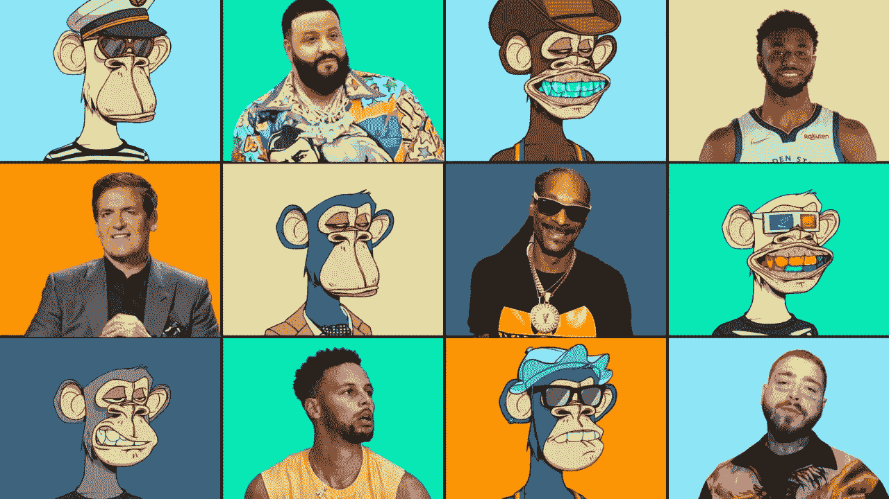
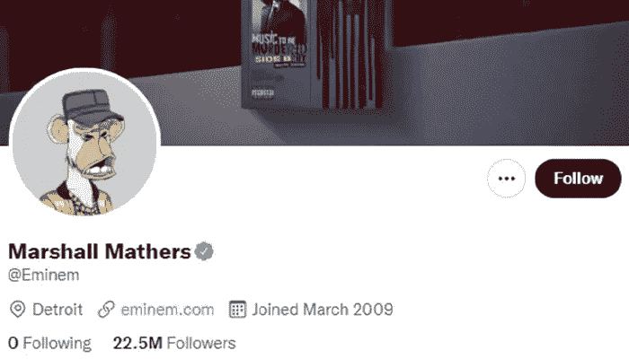
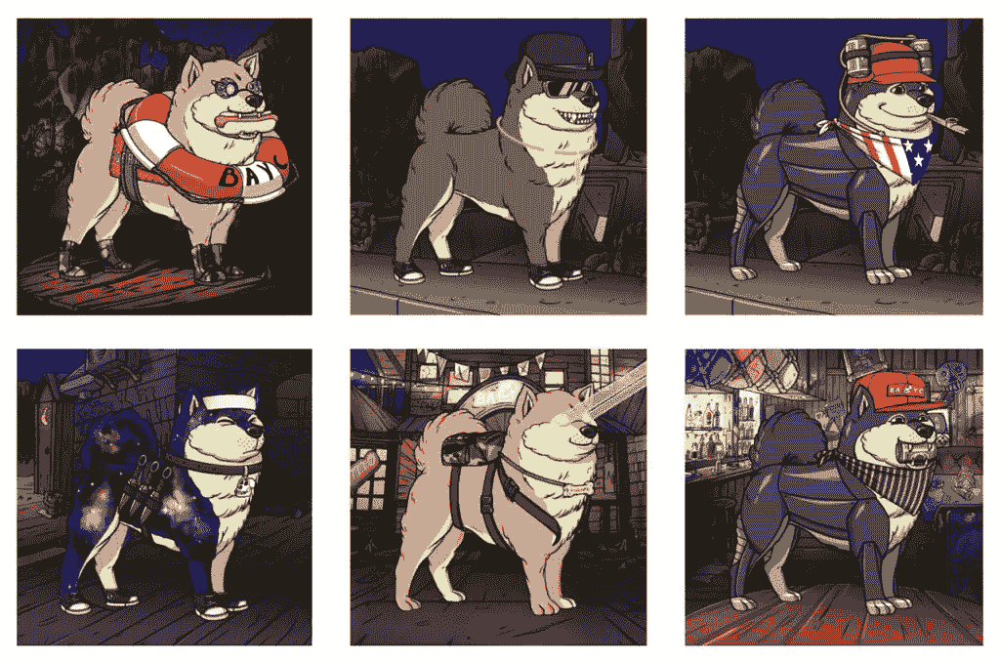
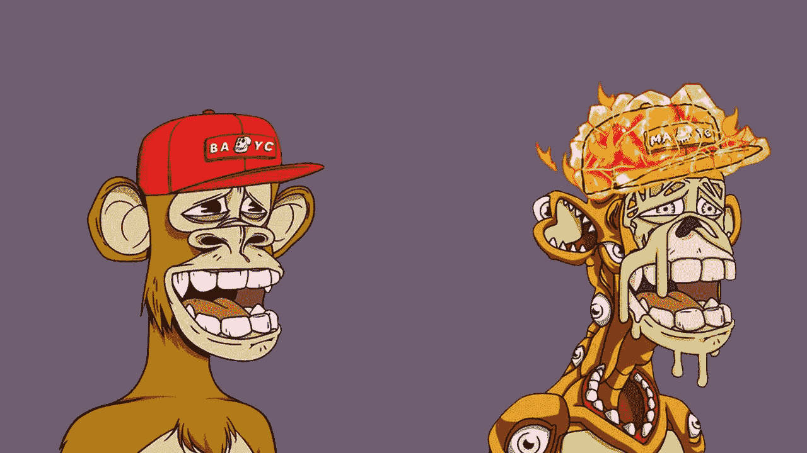

# 什么是无聊猿游艇俱乐部？(最后一部分)

> 原文：<https://medium.com/coinmonks/what-is-bored-ape-yacht-club-the-last-part-85437328bf5a?source=collection_archive---------21----------------------->

[在介绍完无聊猿游艇俱乐部](https://read.cash/@Masoud_Crypto/what-is-bored-ape-yacht-club-part1-29a1c4d9)之后，我们来谈谈这个项目的其他一些要点:

## [与大品牌合作](https://read.cash/@Masoud_Crypto/what-is-bored-ape-yacht-club-the-last-part-3161997d#collaboration-with-big-brands)

有趣的是，即使像阿迪达斯这样的知名品牌也对这个系列表示欢迎。2021 年 12 月，阿迪达斯与 Bored Ape 开始了其与 NFT 项目的首次合作。这个著名的运动器材制造商品牌只向为该公司提供 Ape 代币的特殊客户提供一些独特的产品。这些代币的成功发行带来了 2200 万美元的利润。当然，如此可观的利润只有在 Bored Ape 和阿迪达斯的合作下才有可能实现。

另一个令人兴奋的 Bored Ape 项目是与投资公司 Animoca Brands 的合作。这两家公司正在致力于一个“玩到赚”的游戏项目，该项目旨在扩大无聊的 Ape 代币的可用性。鉴于 Animoca 品牌之前的成功，许多人都期待着这款游戏的发布。

## [加入社区的兴奋感](https://read.cash/@Masoud_Crypto/what-is-bored-ape-yacht-club-the-last-part-3161997d#the-thrill-of-joining-a-community)

如前所述，百无聊赖的猿代币数量有限，如果打算加入社团，进步的机会不大。由于这些代币的持有者会有特殊的聚会和节日，通过购买一只数码猴子，你就有机会参加一个可能由 DJ Khaled 或吉米·法伦等名人参加的仪式！

围绕失去购买这些不可替代代币的机会而形成的 FOMO，增加了这些数字资产的销售。与此同时，似乎这个系列的开发商正在制定更多的计划来延续这个系列的方式。

## [为什么无聊猿有价值？](https://read.cash/@Masoud_Crypto/what-is-bored-ape-yacht-club-the-last-part-3161997d#why-is-bored-ape-valuable)

回答这个问题并不容易；但总结一下，数字艺术作品的价值，和现实世界中艺术作品的价值一样，是由作品的受众来衡量的。因此，导致这些数字资产的价格和价值增长的最重要因素之一是这一收藏的广泛接受和众多粉丝。

影响者和名人的支持，令牌社区的力量，以及令牌为其成员提供的应用程序是使该集合如此受欢迎的三个主要因素。正如我们提到的，足球明星和歌手欢迎这些图像作为个人资料。这个问题吸引了许多人的注意，围绕这些令牌形成了一个强大的社区。

在纽约、加利福尼亚、香港和英国，许多会议、聚会、甚至音乐会都是为这种不可替代的代币的持有者举行的。

此外，百无聊赖的猿对主人有特殊的好处和应用。这些猴子允许它们的主人进入无聊猿养狗俱乐部；一个俱乐部，人们可以选择一个不可替代的令牌与狗的形象，正是他们的无聊猿效应的特点。拥有一个无聊的猿令牌的另一个优势是充满特殊材料的数字玻璃。这种奇怪的物质会让猴子变异！无聊的猿主人可以用这种物质创造出新的、变异的猴子。该系列被命名为“变异猿游艇俱乐部”,目前售价惊人。根据 CoinGecko 网站的数据，到 2022 年 2 月底，变异猴子的象征性价格下限已超过 6 万美元。无聊猿养狗俱乐部和变异猿游艇俱乐部是这个集合中突出空投的两个例子，我们将在下面的文章中了解更多。

## [百无聊赖的猿类生态系统](https://read.cash/@Masoud_Crypto/what-is-bored-ape-yacht-club-the-last-part-3161997d#bored-apes-ecosystem)

无聊猿开发者从一开始就没闲着。他们不断为令牌所有者创造更多的内容和特权，以保持社区活跃。开发团队的两个关键行动是为无聊猿令牌持有者引入两个有价值的空投，它们现在是收藏生态系统的一部分。

## [无聊猿养狗俱乐部](https://read.cash/@Masoud_Crypto/what-is-bored-ape-yacht-club-the-last-part-3161997d#bored-ape-kennel-club)

无聊猿养狗俱乐部是 NFT 的一个项目，专为无聊猿主人设计。该项目假设每只猴子都需要一个伴侣，比如一只伴侣狗。因此，无聊猿令牌的主人有机会免费为他们的猴子收养一只“陪伴狗”。

这些狗是无聊猿养狗俱乐部的一部分，从来没有被出售过，这使得它们更有价值。这次空投的类型和呈现方式也有一个有趣的故事。故事是这样的:无聊的猿猴主人被给了一周的时间去营救那些狗。在此之后，任何未选择的狗令牌将从集合中移除。该项目也制造了很多噪音，并使社区成员对无聊的猿类生态系统更感兴趣。

## [变异猿游艇俱乐部](https://read.cash/@Masoud_Crypto/what-is-bored-ape-yacht-club-the-last-part-3161997d#mutant-ape-yacht-club)

2021 年 8 月，百无聊赖的猿令牌持有者收到了一种含有奇怪物质的数字血清。这种材料将无聊的猴子变成了变异的猴子，允许主人建造他们自己的新的变异版本的 NFT。变种人 Ape 游艇俱乐部价值约 267，000 ETH，底价已经超过 60，000 美元。

除了为无聊的猿类主人提供变异血清，宇迦实验室还引进了 1 万只新的变异猿类。随着这个新系列的发布，用户可以用 3 个 ETH 来购买它们。有趣的是，整个系列仅在一小时内售出，利润高达 9600 万美元。

## [结论](https://read.cash/@Masoud_Crypto/what-is-bored-ape-yacht-club-the-last-part-3161997d#conclusion)

在本文中，我们了解了最受欢迎的不可替代代币项目之一，称为无聊猿游艇俱乐部；一万只独特的当然也是昂贵的猴子的图片集，在世界上找到了很多爱好者。同时，我们提到，这些无聊的猴子已经慢慢超越了密码空间，并引起了对这个空间不是很熟悉的人的注意。

围绕这些奇怪的猴子发生的交易的数量和价值可能看起来不合逻辑；但该系列与阿迪达斯(Adidas)等知名品牌的合作，或在 Metavars 世界中创造一款赚钱的游戏，以及会员通过购买这些代币获得的积分，表明 Bored Ape 的声誉不是一件简单的事情，它的名气不会很快消退。

Bored Ape 套件可能是用户对 NFT 市场未来期望的一个成功范例。随着更多集合的出现，社区和生态系统也在发展，为这个新兴的行业创造了更多的目标和应用。

*原载于*[*https://read . cash*](https://read.cash/@Masoud_Crypto/what-is-bored-ape-yacht-club-the-last-part-3161997d)*。*

> 加入 Coinmonks [电报频道](https://t.me/coincodecap)和 [Youtube 频道](https://www.youtube.com/c/coinmonks/videos)了解加密交易和投资

# 另外，阅读

*   最佳[区块链分析](https://bitquery.io/blog/best-blockchain-analysis-tools-and-software)工具| [赚比特币](/coinmonks/earn-bitcoin-6e8bd3c592d9)
*   [Cloudbet 赌场评论](https://coincodecap.com/cloudbet-casino-review) | [点火赌场评论](https://coincodecap.com/ignition-casino-review)
*   [加密套利](/coinmonks/crypto-arbitrage-guide-how-to-make-money-as-a-beginner-62bfe5c868f6)指南| [如何做空比特币](/coinmonks/how-to-short-bitcoin-568a2d0b4ae5)
*   [如何在加拿大购买加密货币？](https://coincodecap.com/how-to-buy-cryptocurrency-in-canada)
*   [无聊猿游艇俱乐部(BAYC)回顾](https://coincodecap.com/bored-ape-yacht-club-bayc-review) | [拜比特 vs 比特币基地](https://coincodecap.com/bybit-vs-coinbase)
*   [5 款最佳加密交易终端](https://coincodecap.com/crypto-trading-terminals) | [最佳 DeFi 应用](https://coincodecap.com/best-defi-apps)