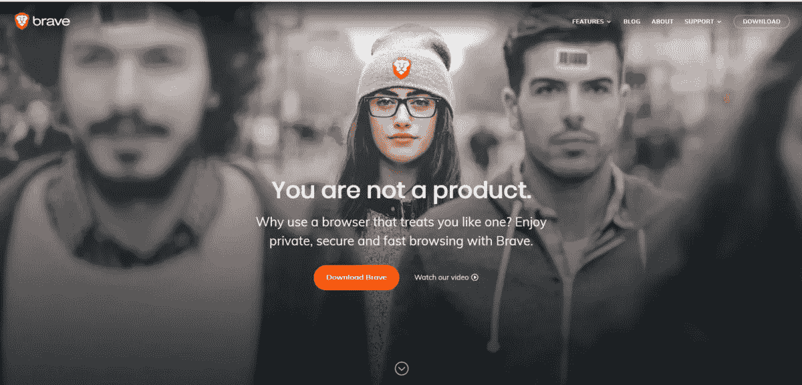

# 关于区块链勇敢浏览器:保护隐私，浏览无广告。

> 原文：<https://medium.com/coinmonks/what-is-brave-a-browser-on-the-blockchain-b254127d0ce9?source=collection_archive---------10----------------------->

Credits: [brave.com](https://brave.com)

**基于以太坊技术的基本注意力令牌(BAT)**[**勇者浏览器**](https://brave.com/fr/?ref=pie757) **允许您选择您浏览的网站上广告的可见性。但不仅仅是！**

## 勇敢独特的浏览器来保护您的隐私和删除广告。

与流行的广告拦截器 **Ad-Block** 类似，Brave web 浏览器让你在浏览时打开或关闭广告和网站跟踪器。非常有用，如果你关心保护你的个人数据和互联网上的安全，它还通过阻止所有不受欢迎的人来促进你的用户体验。

Introduction to Brave Privacy & Adblocker Browser.

## 勇敢和 Qwant 的最佳匿名在互联网上。

你可以选择你想要的搜索引擎:Google，Bing 等。默认情况下，[法国搜索引擎 qpwant](https://www.qwant.com/?l=fr)被激活，以获得最大的安全性和隐私保护。勇敢:比航海者更好

## Brave 远不止是一个网页浏览器。

它比移动浏览器快 7 倍，比电脑上的传统浏览器快 2 倍，由于集成了基于基本注意力令牌的微支付，它还允许您轻松地向您最喜欢的网站的出版商付款。

## 用勇敢捐赠给你热爱的网站。

免费或通过捐赠为你喜欢的网站付费。为了给你喜欢的网站提供报酬，你有两种可能:

*   像 [Utip](https://utip.io/) 一样，Brave browser 谨慎地为你提供了查看私人广告的选项。您接受并查看广告。然后，Brave 会自动向网站编辑发送一些校样。
*   该浏览器集成了一个捐赠/kitty 系统，也允许你在钱包里已经有一些证明的情况下直接向网站捐款。这种捐赠可以是一次性的，也可以是按月的，随你的便。

## 结论:Brave 是一个强大的区块链浏览器。

勇敢是一个强大和安全的互联网浏览器。最棒的是，它位于区块链。正在形成的技术变得越来越受欢迎，特别是由于比特币和以太坊的日益普及。

## 勇敢怎么下载？

如果你像我一样对勇敢的浏览器感兴趣，这里有一个链接可以发现并下载它。

[发现并下载勇敢浏览器](https://brave.com/?ref=pie757)。

— — — — — —

**如果你觉得这篇博文很有趣，欢迎分享这篇文章，以帮助内容创作。也跟着我去发现更多关于媒体的内容、经历和历史。**

> 加入 Coinmonks [电报频道](https://t.me/coincodecap)和 [Youtube 频道](https://www.youtube.com/c/coinmonks/videos)了解加密交易和投资

## 另外，阅读

*   [n rave 零点回顾](/coinmonks/ngrave-zero-review-c465cf8307fc) | [Phemex 回顾](/coinmonks/phemex-review-4cfba0b49e28) | [PrimeXBT 回顾](/coinmonks/primexbt-review-88e0815be858)
*   最佳[区块链分析](https://bitquery.io/blog/best-blockchain-analysis-tools-and-software)工具| [赚比特币](/coinmonks/earn-bitcoin-6e8bd3c592d9)
*   [加密套利](/coinmonks/crypto-arbitrage-guide-how-to-make-money-as-a-beginner-62bfe5c868f6)指南| [如何做空比特币](/coinmonks/how-to-short-bitcoin-568a2d0b4ae5)
*   [比特币基地 vs 瓦济克斯](https://blog.coincodecap.com/coinbase-vs-wazirx) | [比特鲁点评](https://blog.coincodecap.com/bitrue-review) | [波洛涅克斯 vs 比特鲁](https://blog.coincodecap.com/poloniex-vs-bittrex)
*   [德国最佳加密交易所](https://blog.coincodecap.com/crypto-exchanges-in-germany) | [Arbitrum:第二层解决方案](https://blog.coincodecap.com/arbitrum)
*   [币安交易机器人](/coinmonks/binance-trading-bots-d0d57bb62c4c) | [OKEx 审查](/coinmonks/okex-review-6b369304110f) | [Atani 审查](https://blog.coincodecap.com/atani-review)
*   [最佳加密交易信号电报](/coinmonks/best-crypto-signals-telegram-5785cdbc4b2b) | [MoonXBT 评论](/coinmonks/moonxbt-review-6e4ab26d037)
*   如何在 Bitbns 上购买柴犬(SHIB)币？ | [购买 Floki](https://blog.coincodecap.com/buy-floki-inu-token)
*   [CoinFLEX 评论](https://blog.coincodecap.com/coinflex-review) | [AEX 交易所评论](https://blog.coincodecap.com/aex-exchange-review) | [UPbit 评论](https://blog.coincodecap.com/upbit-review)
*   [十大最佳加密货币博客](https://blog.coincodecap.com/best-cryptocurrency-blogs) | [YouHodler 评论](https://blog.coincodecap.com/youhodler-review)
*   [AscendEx 保证金交易](https://blog.coincodecap.com/ascendex-margin-trading) | [Bitfinex 赌注](https://blog.coincodecap.com/bitfinex-staking)
*   [最好的卡达诺钱包](https://blog.coincodecap.com/best-cardano-wallets) | [Bingbon 副本交易](https://blog.coincodecap.com/bingbon-copy-trading)