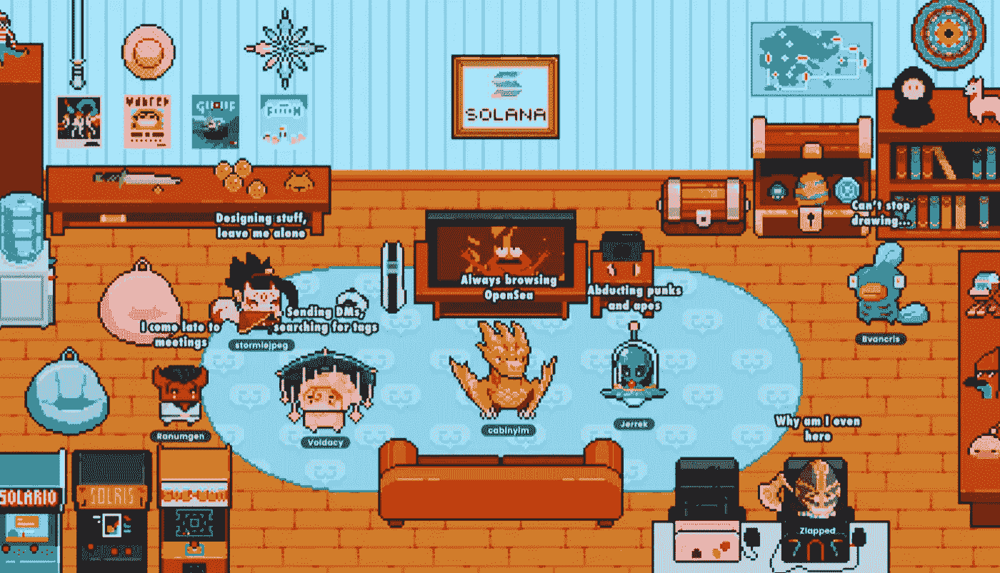

# 索拉纳、Crypto[dot]com 和 FTX 投资的 Chillchat 是什么

> 原文：<https://medium.com/coinmonks/what-is-chillchat-in-which-solana-crypto-dot-com-and-ftx-invested-38656b491e3f?source=collection_archive---------29----------------------->

Chillchat (CHILL)项目已经成功吸引了 FTX 风险投资公司、Crypto.com 资本公司和索拉纳风险投资公司等领先加密货币公司的兴趣，这些公司通过购买价值数百万欧元的代币为该项目提供了资金。

Chillchat 筹集了 650 万美元来创建自己的“Create2Earn”，这是一个社交 2D 像素艺术元宇宙，旨在促进人际关系和合作。

有了这些资金，Chillchat 将继续开发其社交元宇宙平台，在这个平台上，社区成员可以轻松地创建他们自己的世界、角色、物品和宠物，这些都可以立即转化为 NFTs。

这个社交像素艺术元宇宙允许用户轻松地为自己或其他社区成员创建游戏和 NFT 项目，包括世界、人物、物体和宠物。

Chillchat 将在今年晚些时候推出其在线平台，供玩家创建新的角色、世界和体验，可在 [https://chillchat.me.](https://chillchat.me.) 访问，其他功能将在不久的将来添加。

随后将在 Raydium 上进行首次 DEX 发行，并在 CEX 进行首次发行(具体细节将在临近发行日期时确认)。

参与协议轮的 Web3 投资者和领导者还包括 Griffin Gaming Partners、Animoca Brands、Spartan Capital、Diamond Hands Ventures、Morningstar Ventures 和其他知名投资者。

参与的社区和公会包括 Avocado Guild、GuildFi、Ancient8、SNACKCLUB、UniX Gaming、SwordFish Guild 和 MonkeVentures。

# Crypto.com 和 FTX 在说什么

FTX 风险投资公司的合伙人布莱恩·李说:

> “FTX 一直寻求推进加密货币生态系统，所以当我们看到 Chillchat 如何以有趣而简单的方式处理用户生成的内容时，我们认为这是加入下一波社交和日常加密玩家的绝佳机会。”

Crypto.com 资本的首席执行官 Bobby Bao 说:

> “Chillchat 易于使用的工具和广泛分布的平台的结合将开发新的创作机会，有利于创作者赚钱，并为玩家提供大量令人兴奋的世界供他们探索。”

# 今年晚些时候发布

Chillchat 将于今年晚些时候发布其平台，该平台将允许拥有 1500 个独特起源 NFT(Chillchat 用户发布的首批角色)中任何一个的社区成员使用像素编辑器，为新玩家创建新的 chill chat 角色。

随着该平台不断开发更多功能，Chillchat 将在 Raydium 上推出其初始 DEX 产品(IDO ),并在接近 2022 年底发布日期的平台上推出其初始 Exchange 产品(IEO)。

展望未来，Chillchat 将允许与元宇宙中的其他玩家进行实时 NFT 交易，允许玩家与他们的朋友和宠物一起冒险，创建可用于创建世界的自定义 Tilesets，等等。Chillchat 用户将能够设计他们自己的世界，开始他们自己的 NFT 商店或博物馆，甚至使用世界引擎工具将他们的世界变成游戏。

Chillchat 创始人兼首席执行官詹姆斯·欧(James Au)表示:

> “我们很高兴在加密货币和游戏领域有这么多经验丰富的合作伙伴来帮助我们实现 Chillchat 的愿景。团队、产品、集成、开发和令牌组学在我们创建元云的努力中被证明是非常宝贵的，元云允许用户快速、大规模地创建和消费内容。”

# 成功的首次公开销售

2022 年 1 月 21 日，Chillchat 在 NFT 成功举行了一次公开销售，从 1500 个限量版“起源”角色中剪下 1000 个。手工制作和动画制作的《起源》( Origins)将催生所有未来的 Chillchat 角色，以每 NFT 2 索尔(约 80 美元)的价格在几秒钟内售罄。

目前最低价格为 22 索尔(约 880 美元)，二级市场最高价格为 120 索尔(约 4800 美元)。Chillchat Origins 目前的总销售额为 42，856 索尔(约 1，700，000 美元)。

Chillchat 继续在每周三拍卖 10 个 NFT 起源，并旨在将剩余的 350 个 NFT 起源放到用户手中——他们的任务是通过为下一代及更远的一代创造新角色来扩展第一代系列。Chillchat Origins 拍卖会将在魔法伊甸园举行。

# 关于 Chillchat

这是一个日常的社交元宇宙，一个巨大的虚拟世界的集合，完全由它的玩家制作，在那里你可以用自己或另一个玩家一个像素一个像素地创造的新身份进入冒险。

任何人都可以成为什么样的人，他们可以创造什么，这是没有限制的。任何人都可以成为他们想象的任何人。像素编辑器，世界建设者和索拉纳区块链权力所有的行动。用户可以创建和切割无限的世界，人物，物品，宠物，并与其他玩家一起将它们带入生活。

*原载于 2022 年 6 月 12 日*[*【https://bitnewsbot.com】*](https://bitnewsbot.com/what-is-the-chillchat-in-which-solana-crypto-com-and-ftx-invested/)*。*

> 加入 Coinmonks [电报频道](https://t.me/coincodecap)和 [Youtube 频道](https://www.youtube.com/c/coinmonks/videos)了解加密交易和投资

# 另外，阅读

*   [印度的加密交易所](/coinmonks/bitcoin-exchange-in-india-7f1fe79715c9) | [比特币储蓄账户](/coinmonks/bitcoin-savings-account-e65b13f92451)
*   [OKEx vs KuCoin](https://coincodecap.com/okex-kucoin) | [摄氏替代度](https://coincodecap.com/celsius-alternatives) | [如何购买 VeChain](https://coincodecap.com/buy-vechain)
*   [币安期货交易](https://coincodecap.com/binance-futures-trading)|[3 commas vs Mudrex vs eToro](https://coincodecap.com/mudrex-3commas-etoro)
*   [如何购买 Monero](https://coincodecap.com/buy-monero) | [IDEX 评论](https://coincodecap.com/idex-review) | [BitKan 交易机器人](https://coincodecap.com/bitkan-trading-bot)
*   [CoinDCX 评论](/coinmonks/coindcx-review-8444db3621a2) | [加密保证金交易交易所](https://coincodecap.com/crypto-margin-trading-exchanges)