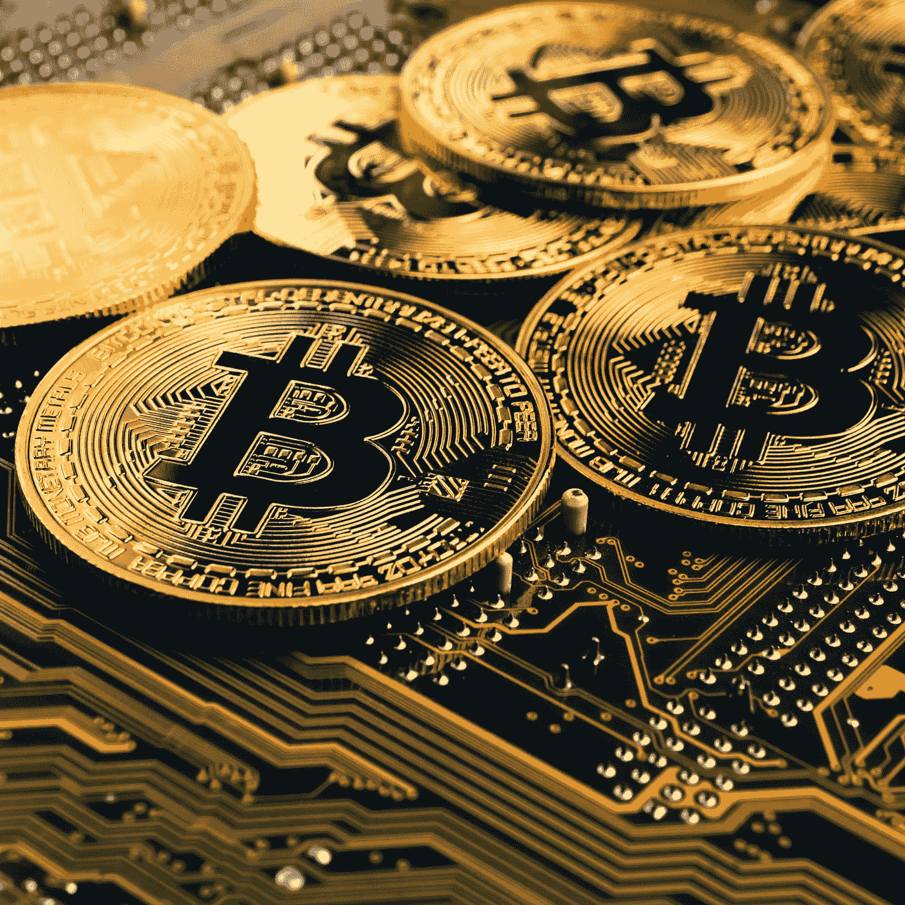
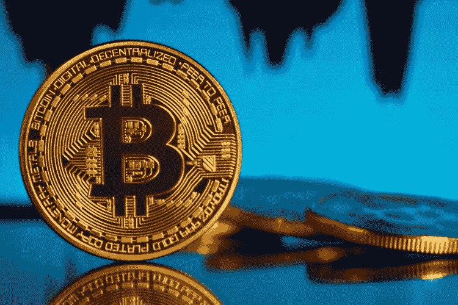
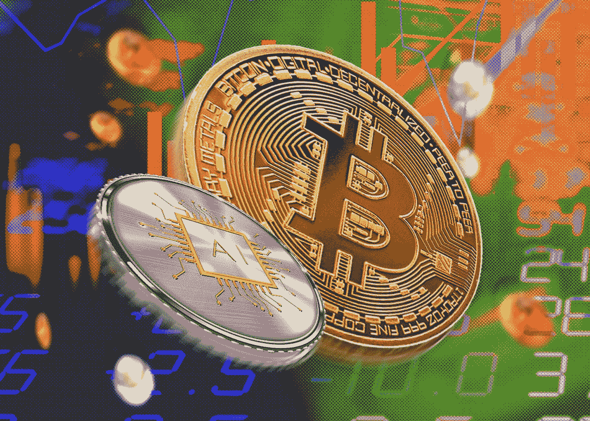
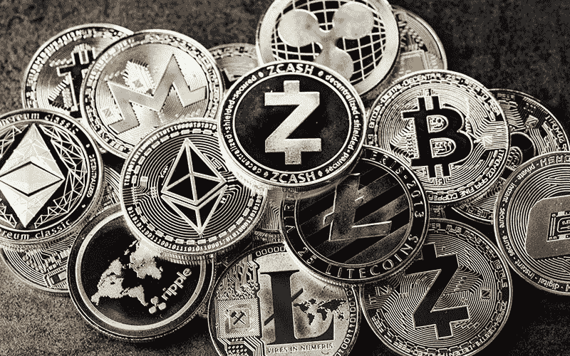
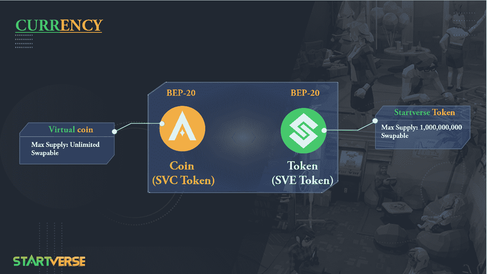

# 什么是加密？如何有效投资密码

> 原文：<https://medium.com/coinmonks/what-is-crypto-how-to-invest-in-crypto-effectively-1aed3364c2f4?source=collection_archive---------60----------------------->

## *加密货币概述*

**Cryptocurrency**

Crypto，俗称加密货币，是一种利用区块链交易数据进行操作的数字货币。加密也有不同的名称，如电子货币、加密货币、数字现金等等。

许多人将加密称为虚拟货币，然而这个术语并不准确。因为虚拟货币不值钱，比如游戏里的钱。密码的价值是真实的，它可以变成资产，交换，购买和出售。

如果我们从技术的角度来分析，加密被归类为一种数字资产。为了执行交易程序，crypto 充当中介。这种方法经常使用安全加密技术来确保交易顺利进行。用户可以轻松地管理额外单位的创建，并从那里验证帐户交易。

加密货币使用加密技术，使其无法伪造或操纵。此外，使用加密的个人确保他们的交易数据是完全安全的。

加密很容易理解，就像美元、欧元、越南盾等传统货币一样。另一方面，这种货币完全基于互联网。特别是他们不受任何组织或政府的管理。此外，所有交易数据都是匿名的。

交易密码时，成本低、速度快、安全性好都是优势。这就是所谓的“加密形式的纸币”。

**密码特征和分类**

**下放**

分散的加密货币不依赖于中央计算机或服务器。它们分散在一个有数千台计算机参与的网络中。这就是所谓的分散式网络。

**数字化**

密码术是一种在物理世界中不存在的数字化类型。因此，你不能像持有普通纸币一样持有密码。

**隐姓埋名**

兑换加密货币时，您无需透露任何个人信息。此外，对于加密货币的所有者或使用者，没有必要的规则。

**独立**

没有第三方或中间人管理独立的密码。因此，用户可以随时完全控制自己的资金和数据。他们也可以参与网络的交易过程。

**加密**

您将获得一个在交易期间使用的唯一密码。这可以保护您的信息不被陌生人访问。Crypto 的定义特性之一是使用加密技术。

**全球性**

每个国家都使用自己的货币，称为法定货币。这种货币只能在某些地区使用。然而，Crypto 恰恰相反。这种加密货币可以在世界各地使用。这被认为是非国家货币。

**流行的加密货币**

Crypto 如前所述，来源于比特币。然而，目前市场上有成千上万的这种硬币(据统计约有 3021 种)。再者，还有很多币没有更新。

Crypto 的快速增长表明，这种货币仍在获得牵引力。此外，由于其效率潜力，比特币投资领域正变得越来越突出。

有两种加密货币:硬币和代币。

**硬币**

这是一种完全自成体系的基于区块链的货币。Coin 负责解决支付、安全、金融、应用开发等区块链相关问题。

目前比较流行的两种币是比特币和 Altcoin。

1.比特币:最受欢迎的加密货币，基于比特币网络。这枚硬币的以下特点引起了用户的注意:

*   流动性高。
*   最高日交易量。
*   市值最高的加密货币。

2.Altcoin:单词“alternative”和“coin”的组合除比特币之外的所有硬币都被称为 altcoins。Altcoins 的用途与比特币非常相似。目前，最流行的加密货币像以太坊，系绳，莱特币，和其他可以遵循。

**令牌**

这笔钱是基于在特定区块链上创建的项目。代币对某个硬币的区块链起作用。大多数代币遵循 ERC-20 标准，并使用以太坊区块链。

索拉纳(SOL)、币安智能链(BSC)、雪崩(AVAX)，甚至比特币都被用来创造一些代币。Startverse Token (SVE)是一个基于 BEP-20 的电子钱包平台。

**加密货币的利与弊**

**优点**

1.它不受政府管理

如果你使用纸币，政府有权冻结你的账户。此外，您在撤销本地货币交易时可能会遇到困难。加密货币不可能做到这一点，因为政府并不控制它。

2.交易费用低

加密货币交易的成本几乎为零。许多加密硬币目前正在推动免费转让。同时，通过银行转账会产生一笔费用，如果你在国外工作，这笔费用会相当可观。

3.快速交易时间

通过银行进行的货币交易可能需要几个小时(国内)到几天(国际)(海外)。使用 Crypto，即使将越南的钱转移到国外也不超过 15-20 分钟。

4.国际商业交易

你可以在几秒钟内与地球上的任何人交换密码。例如，密码很容易使用，而且和纸币价格一样。

5.通货膨胀和伪造不是问题

cryptos 的数量是有限的，不能增加或减少(比特币有 2100 万个硬币)。因此，加密货币的发行方式将不同于传统货币。此外，由于密码以物理形式存在，因此无法伪造。

**缺点**

1.高波动性

与黄金和纸币相比，加密货币最大的缺点是缺乏一致性。加密货币极其不稳定。例如，比特币在 2017 年初只有 1000 美元，但到了年底，已经涨到了 2 万美元。最重要的是，如果有人有足够多的硬币，密码市场就非常容易操纵。

2.安保和安全

说到加密，如果你没有适当的信息和能力，你将很容易被窃取数据。黑客不断设计新的方法来获取您的加密货币钱包。然而，如果你是一个明智而认真的用户，你会明白如何保护你的加密货币的安全。

3.易受犯罪侵害

这是 Crypto 一段时间以来的主要问题。由于其匿名性和缺乏对信息的控制，加密经常成为各种犯罪分子的目标。他们使用加密货币在地下市场洗钱。

**星际旅行的加密货币**

Startverse 是一款元宇宙游戏，面向所有想要建立自己的创业公司的人。在这里，你可以成为老板、著名的艺术家、英俊的披萨外卖员，你甚至可以成为赌场的老板，或者建立一个专门从事土地承包的行会，随心所欲地经营你的帝国！

游戏将有两种主要货币:
**硬币(SVC Token):** 这是系统为玩家而生的虚拟货币，在整个游戏中使用，不限数量。SVC 将用于升级和游戏中的动作

**令牌(SVE 令牌):**这是一种更加稀有和稳定的硬币，玩家只能在特殊活动中获得。SVE 将用于从市场上购买/借贷。

在下一篇文章中，我们将讨论如何在 Startverse 中获得硬币和令牌！如果你有任何问题或者想和 **Startverse** 讨论这个帖子，请在下面留下评论！

*在****Startverse****加入世界各地的创业公司、老板、土地所有者的社区，同时接收最新的项目新闻，享受特别内容:*

[网站](https://startverse.io/) | [脸书](https://www.facebook.com/Startverse-Global-102077955725659/) | [推特](https://twitter.com/StartverseGame) | [不和](https://discord.gg/cfUSrHUvSz) | [电报](https://t.me/StarverseGlobal) | [白皮书](https://whitepaper.startverse.io/)

> 加入 Coinmonks [电报频道](https://t.me/coincodecap)和 [Youtube 频道](https://www.youtube.com/c/coinmonks/videos)了解加密交易和投资

# 另外，阅读

*   [如何开始通过加密贷款赚取被动收入](https://coincodecap.com/passive-income-crypto-lending)
*   [加密货币储蓄账户](/coinmonks/cryptocurrency-savings-accounts-be3bc0feffbf) | [加密交易机器人](https://coincodecap.com/best-crypto-trading-bots)
*   [BigONE 交易所评论](/coinmonks/bigone-exchange-review-64705d85a1d4) | [CEX。IO 审查](https://coincodecap.com/cex-io-review) | [交换区审查](/coinmonks/swapzone-review-crypto-exchange-data-aggregator-e0ad78e55ed7)
*   [最佳比特币保证金交易](/coinmonks/bitcoin-margin-trading-exchange-bcbfcbf7b8e3) | [比特币保证金交易](https://coincodecap.com/bityard-margin-trading)
*   [加密保证金交易交易所](/coinmonks/crypto-margin-trading-exchanges-428b1f7ad108) | [赚取比特币](/coinmonks/earn-bitcoin-6e8bd3c592d9)
*   [WazirX vs CoinDCX vs bit bns](/coinmonks/wazirx-vs-coindcx-vs-bitbns-149f4f19a2f1)|[block fi vs coin loan vs Nexo](/coinmonks/blockfi-vs-coinloan-vs-nexo-cb624635230d)