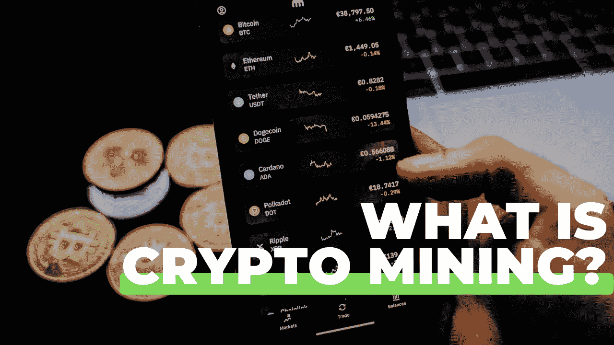

# 什么是加密挖掘？

> 原文：<https://medium.com/coinmonks/what-is-crypto-mining-6109dfc05256?source=collection_archive---------40----------------------->

**定义矿业** 本周在[了解加密](https://tinyurl.com/whatiscryptomining) *(我们的 iTunes 国际顶级投资播客…不是我们喜欢吹牛！)*我和主持人 Paul Abercrombie，又名 Captain Crypto explore，简化并尝试轻松定义**什么是 crypto mining** 。我们将分解该领域的流程、挑战和新趋势。

希望通过这个节目，我们甚至能够揭开为什么挖掘比特币如此困难以及股权证明的利弊。

那我们从哪里开始？我们先来定义一下采矿。挖掘是比特币和其他几种“加密货币”用来验证新交易的过程。它涉及到遍布全球的庞大、分散的计算机网络，这些网络验证并保护区块链——记录加密货币交易的虚拟账簿。作为对贡献其处理能力的回报，网络上的计算机会因其所做的工作而获得奖励— *通常“奖励”是以计算机正在工作的网络的货币支付的*也就是说，如果您将您的计算能力“捐赠”给以太网，您将在以太网中获得奖励。

*这是一个良性循环；*矿工维护并保护区块链，区块链以他们正在工作的货币奖励矿工，而“奖励”为矿工提供了维护区块链的激励。

**你是怎么挖矿的？** 以前采矿的必需品都挺基本的；几乎任何拥有一台像样的家用电脑的人都可以参加。然而，你现在需要专门的计算机来成功挖掘加密货币。尤其是比特币，因为它已经发展到了维护它所需的计算能力急剧增加的地步。比特币被设计成一种去中心化的货币，与主要金融机构、美联储或银行没有任何联系。为了让它工作，独立管理的计算机能力是必要的；如果建立一个唯一的服务器来运行比特币，这将背叛整个精神概念的前提。

采矿的缺点。
最大的限制就是成本。例如，如今，与专业公司竞争开采比特币所需的资金几乎是不可比拟的。据估计，现在挖掘一枚比特币的计算能力是最初创建时你需要的处理能力的 12 万亿倍。因此，许多矿工现在专注于替代网络，因为工作可以由 GPU 机器*(这仍然是相对高性能的，比你的普通 PC 或 Mac 贵得多！)*，这些被插入标准互联网连接，并在其他加密货币网络或区块链上运行。

这些机器以它们所工作的区块链的当地货币获得报酬，但是，就此而论，*这远不是一劳永逸的情况。*

根据市场的波动性，明智的做法可能是把已经开采出来的货币换成替代的加密资产，如比特币或以太坊，这可能会带来更大的投资回报。

采矿业目前面临的另一个重大挑战是其对生态极为不利的名声。现在，流行媒体和大型实体*(顺便说一句，他们对现状保持不变有既得利益),围绕这一点有一个真实的叙事。基本上是试图将全球变暖的确凿证据归罪于加密世界。*

当然，采矿机器——像任何形式的计算机一样——使用电力，但与普遍的看法相反，它们不是主流媒体想让你相信的碳死亡机器。

就目前的情况来看，互联网是广义的*(我意识到这是一个非常广义的术语！)*约占全球碳排放的 20%——**加密同时约占 0.2%。所以，这是相当大的差距，我想你会同意的。**

但是，随着该行业的发展，当然需要考虑排放问题，解决该领域效率问题的方法之一是提议转向一种新趋势，称为**“利益证明”**，在这种新趋势中，您可以有效地将您的加密资产锁定在网络中，然后提供共识机制。

**股权证明**

虽然加密领域正在谈论大量的股权证明，但向这种新格式的转变已经有一段时间了……而且这一转变的日期似乎已经被推迟了好几年。以太坊推出了一个全新的区块链，它将完全通过股权证明来工作。最初的以太坊(就像‘以太坊经典’一样)很可能仍然是一个‘工作证明’机制，而以太坊 2 是基于利害关系的证明。

然而，如上所述，这已经过去了很长时间；自 2016 年以来，人们一直在谈论 POS，这表明了这种向股权证明的转变需要多长时间，如果像以太网这样大的货币转换大约需要 6 年时间。

因此虽然矿商在投资硬件以获得可观的 web3 采矿收益时需要小心，但股权证明不太可能扼杀以太坊等区块链的采矿业务，即使其中一个主要网络发生了重大变化，仍有大量其他货币存在，需要采矿才能让整个 web3 世界保持运转。

> 加入 Coinmonks [电报频道](https://t.me/coincodecap)和 [Youtube 频道](https://www.youtube.com/c/coinmonks/videos)了解加密交易和投资

# 另外，阅读

*   [加密货币储蓄账户](/coinmonks/cryptocurrency-savings-accounts-be3bc0feffbf) | [YoBit 审核](/coinmonks/yobit-review-175464162c62)
*   [Botsfolio vs nap bots vs Mudrex](/coinmonks/botsfolio-vs-napbots-vs-mudrex-c81344970c02)|[gate . io 交流回顾](/coinmonks/gate-io-exchange-review-61bf87b7078f)
*   [CoinFLEX 评论](https://coincodecap.com/coinflex-review) | [AEX 交易所评论](https://coincodecap.com/aex-exchange-review) | [UPbit 评论](https://coincodecap.com/upbit-review)
*   [AscendEx 保证金交易](https://coincodecap.com/ascendex-margin-trading) | [Bitfinex 赌注](https://coincodecap.com/bitfinex-staking) | [bitFlyer 点评](https://coincodecap.com/bitflyer-review)
*   [Bitget 回顾](https://coincodecap.com/bitget-review)|[Gemini vs block fi](https://coincodecap.com/gemini-vs-blockfi)cmd |[OKEx 期货交易](https://coincodecap.com/okex-futures-trading)