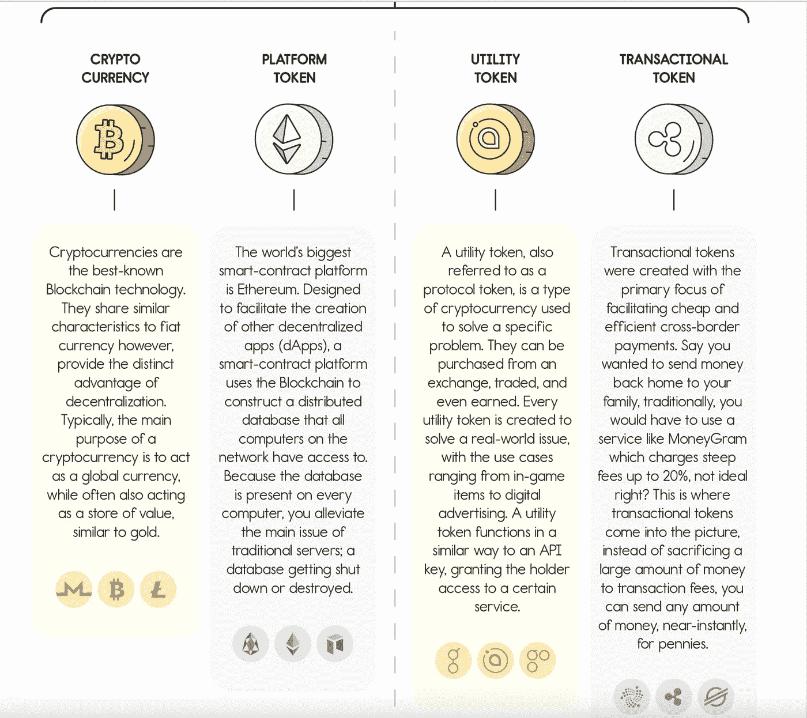

# 什么是加密货币？

> 原文：<https://medium.com/coinmonks/what-is-cryptocurrency-2e082676f4d?source=collection_archive---------52----------------------->

在我们的 YouTube 上观看视频的同时，享受这个流的资源！

YouTube:[https://youtu.be/plBNwHZGuFY](https://youtu.be/plBNwHZGuFY)

不和:【https://discord.gg/J73qhkj7kr】T2

推特:【https://twitter.com/CryptoverseDAO】

linktree:[https://linktr.ee/cryptoversedao](https://linktr.ee/cryptoversedao)

-

什么是加密货币？

基于网络(区块链)并分布在许多计算机上的数字资产被称为加密货币。

把它想象成电子现金。

是的，过去曾有过几次创造电子货币的尝试，然而，这些尝试与我们当前的货币体系相比，并没有太大的不同或很大的改进。因此，比特币的与众不同之处在于它巧妙利用了现有技术，如加密技术和分布式网络，使其更加安全高效。

虽然加密货币这个词经常被作为一个笼统的说法来描述任何在区块链上运行的令牌，但实际上，它有几个细分。了解这些加密资产之间的差异可以帮助你将交易提升到一个新的水平，它让你进入更深的加密世界，让你从投资中赚取利息，玩区块链游戏，并以几分钱的价格发送交易。

因为加密是分散的，这意味着它不像美元、欧元、日元和其他法定货币那样由政府或银行这样的中央机构发行。相反，加密货币是由分布式对等网络创建、交换和监管的。

大多数加密存在于区块链平台上。区块链是记录大多数加密交易的数字账本。这种将区块链技术作为加密货币基础元素的做法始于 2009 年，当时推出了比特币。但是区块链技术正在迅速发展，许多其他行业也在探索它的潜在应用。要了解什么是区块链以及它如何工作的更多信息，请访问

你可以在这里查看市面上所有的加密货币:[https://coinmarketcap.com/all/views/all/](https://coinmarketcap.com/all/views/all/)

下图显示了不同类型的加密以及如何利用它们来获得优势:

> 加入 Coinmonks [电报频道](https://t.me/coincodecap)和 [Youtube 频道](https://www.youtube.com/c/coinmonks/videos)了解加密交易和投资

# 另外，阅读

*   [OKEx vs KuCoin](https://coincodecap.com/okex-kucoin) | [摄氏替代品](https://coincodecap.com/celsius-alternatives) | [如何购买 VeChain](https://coincodecap.com/buy-vechain)
*   [ProfitFarmers 回顾](https://coincodecap.com/profitfarmers-review) | [如何使用 Cornix Trading Bot](https://coincodecap.com/cornix-trading-bot)
*   [如何匿名购买比特币](https://coincodecap.com/buy-bitcoin-anonymously) | [比特币现金钱包](https://coincodecap.com/bitcoin-cash-wallets)
*   [瓦济里克斯 NFT 评论](https://coincodecap.com/wazirx-nft-review) | [比茨盖普 vs 皮奥克斯](https://coincodecap.com/bitsgap-vs-pionex) | [坦吉姆评论](https://coincodecap.com/tangem-wallet-review)
*   [如何使用 Solidity 在以太坊上创建 DApp？](https://coincodecap.com/create-a-dapp-on-ethereum-using-solidity)