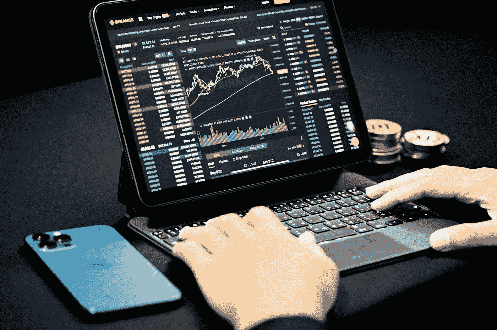
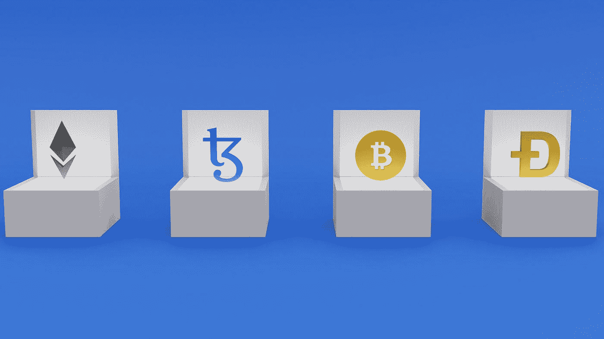

# 什么是加密货币？

> 原文：<https://medium.com/coinmonks/what-is-cryptocurrency-5255ff3625a5?source=collection_archive---------40----------------------->

它是如何工作的？

Photo by [Kanchanara](https://unsplash.com/es/@kanchanara?utm_source=medium&utm_medium=referral) on [Unsplash](https://unsplash.com?utm_source=medium&utm_medium=referral)

随着时间的推移，我们进行了大量的讨论，阅读了一些帖子、博客和文章，并遇到了“加密货币”这个术语。但是具体什么是加密货币呢？它是如何产生的？它是如何工作的？是金钱的未来吗？现在持有一个是否明智？加密货币能让你变得富有吗？怎么买？并且，它能被转换成真正的现金吗？

这些将在下面讨论，你不需要被这个概念淹没；

加密货币，顾名思义，是一种数字货币系统或商品和服务交换或债务支付的媒介。其由加密技术保护并在区块链网络上运行，也就是说，其在分布式公共分类账上运行。这种数字货币是在没有任何中央集权的计算机上运行的。它是一种加密的数字货币，所有用户都可以共享控制权。

**它是如何产生的？**

加密货币是通过我们称之为挖掘的过程创造出来的。挖掘涉及解决数学问题的操作，以实现以下目标:

在区块链网络上创建新的交易块。

验证网络上的未决事务。

将验证的或有效的交易添加到该块中。

将填满的块添加到网络上的其他块。

数学问题是使用哈希算法 SHA-256 来解决哈希难题，该算法获取数据并产生数据的 256 位表示。取候选块(将被验证的块)的标题。从头部，它们得到在块中完成的事务的回顾/总结、时间戳和前一个块的散列，然后将它们散列在一起。矿工们随便取一个数字。一个 nonce(只使用一次的数字)，一个四位数字，然后用哈希算法重新哈希它。这个报头用不同的 nonce 重新散列，直到找到解决方案。

解决方案是在开始处有一个精确的零的散列，就像前一个块或者比最后一个块的散列在开始处有更多的零。给出散列的现时记录有时间戳、先前的散列、工作证明(为候选块获得的散列)以及在该时间之前在网络中完成的事务的摘要。然后被添加到形成链的其他列表中，这就是我们所说的区块链网络，当这个问题被解决时，解决它的计算机或矿工会获得一些加密货币单位的奖励，这些加密货币可以被存储、出售或用于购买新的商品或支付所提供的服务。

Photo by [Shubham Dhage](https://unsplash.com/@theshubhamdhage?utm_source=medium&utm_medium=referral) on [Unsplash](https://unsplash.com?utm_source=medium&utm_medium=referral)

我们可以根据加密货币运行的区块链将其分为两类:硬币和代币。

硬币是一种加密货币，在其主要的区块链网络上运行。它是区块链网络的主要货币。例子包括:运行在比特币网络上的比特币(BTC)和运行在以太坊网络上的以太(eth)。代币是在另一个区块链网络上运行的加密货币。它们不是网络的主要/原始货币，而是在网络上运行以提供服务或功能。例子包括 tether(usdt)和 usdc，它们都建立在以太坊上，现在由几个区块链托管。

区块链技术的第一次应用是在比特币区块链的发明中，其本土货币被命名为比特币(BTC)。创始人和创造者是一个名叫“中本聪”的匿名团体或个人。

**投资加密货币明智吗？**

购买、交易或投资加密货币可能是赚钱或增加净值的绝佳机会，但前提是你能承担风险。这是因为加密货币的波动性很大。根据你投入资金的加密货币，你可能会获得巨额利润，也可能会损失部分或全部资金。

这不是为了制造恐慌感；像许多企业一样，你需要做研究，知道应该买哪种加密货币，不应该买哪种。通过适当的研究、投资方法和风险管理，加密货币可以让你变得富有。但比特币的主要目的不是让任何人变得富有，而是促进点对点交易，提供财务自由。我认为比特币正完美地做到这一点。

**你如何获得或拥有一种加密货币？**

拥有加密货币有几种方式。

1)挖矿:在区块链网上参与挖矿的时候。你对网络的贡献会得到一些加密货币的奖励。

2)购买:如果你不能挖掘，你可以选择通过 p2p 或交易所从另一个人那里购买加密货币。加密交易所是一个在线平台，加密货币的买家和卖家在这里会面。这是一个加密货币市场。

3)赚取:你可以选择不购买或开采加密货币，而是赚取；这可以通过提供服务和销售商品来实现。

4)下注:这是使用您的二手硬币或代币，并将硬币/代币提交给网络用于验证目的。通过这一点，你可以得到你的硬币或代币的承诺，你仍然可以在任何时候删除奖励。

5)农业:这是使用你的二手硬币或代币，并将硬币/代币投入市场，以借给另一个市场用户，并为市场和借款人提供流动性。根据协议，贷款人或农民可以获得相同类型或不同类型的加密货币。

Photo by [Jeremy Bezanger](https://unsplash.com/es/@unarchive?utm_source=medium&utm_medium=referral) on [Unsplash](https://unsplash.com?utm_source=medium&utm_medium=referral)

**如何购买加密货币？**

购买加密货币的过程很简单，如下所述；

1)了解你为什么要买。你是为了长期投资而购买，还是为了与其他加密货币进行交易而购买。

2)如果你购买的时间较长，你应该知道你希望保存它的媒介，是移动设备、笔记本电脑还是离线设备。

3)如果你想使用移动设备存储加密货币，注册一个有信誉的钱包和好的交易所(币安、FTX、比特币基地交易所等)。).你可以使用比特币基地钱包应用程序，信任钱包，Metamask 和 Exodus。你还可以使用其他一些不错的钱包应用程序，因为列表并不仅限于这四个。

如果你想要一个台式机或笔记本电脑，你可以使用 Electrum，Exodus for desktop 和 Bitcoin Core for Bitcoin(BTC)。你还可以选择其他不错的桌面钱包应用。

虽然你可以在这些平台上存储加密货币，但使用名为 cold storage 的离线设备是保护投资/加密货币的最佳方式。最受欢迎的两家公司是 Ledger 和 Nano。

4)当你用菲亚特付款时，让买家给你发送加密货币，或者你可以登录并登录到交易所平台(我们将以他们的币安交易所为例)，去他们的 p2p 部门找到买家。

5)选择您想要购买的加密货币，复制地址，然后记下您正在与之交互的网络，并将其粘贴到发送者或卖家，同时将您正在与之交互的网络交给卖家，以便卖家可以知道使用哪个网络。

6)等待 30 秒到几分钟进行确认。

7)您应该已经收到了您的加密货币。

你也可以使用 peer2peer 将你的加密货币转换成真实的现金，这意味着将你的硬币或令牌出售给你认识的另一个人或在市场上出售，这被称为加密交易所。加密交易所的例子有币安、FTX、比特币基地交易所、Okex，

注意:不同交易所的购买流程可能有所不同，但这是购买加密货币的一般方式。在后续的其他文章中，我们将深入研究不同的交易所和其他钱包应用程序。

> 加入 Coinmonks [电报频道](https://t.me/coincodecap)和 [Youtube 频道](https://www.youtube.com/c/coinmonks/videos)了解加密交易和投资

# 另外，阅读

*   [8 大加密联盟项目](https://coincodecap.com/crypto-affiliate-programs) | [eToro vs 比特币基地](https://coincodecap.com/etoro-vs-coinbase)
*   [最佳以太坊钱包](https://coincodecap.com/best-ethereum-wallets) | [电报上的加密货币机器人](https://coincodecap.com/telegram-crypto-bots)
*   [交易杠杆代币的最佳交易所](https://coincodecap.com/leveraged-token-exchanges) | [购买弗洛基](https://coincodecap.com/buy-floki-inu-token)
*   [3 commas vs Pionex vs Cryptohopper](https://coincodecap.com/3commas-vs-pionex-vs-cryptohopper)|[Bingbon Review](https://coincodecap.com/bingbon-review)
*   [加密复制交易平台](/coinmonks/top-10-crypto-copy-trading-platforms-for-beginners-d0c37c7d698c) | [如何在 WazirX 上购买比特币](/coinmonks/buy-bitcoin-on-wazirx-2d12b7989af1)
*   [货币评论](https://coincodecap.com/coinloan-review)|[Crypto.com 评论](/coinmonks/crypto-com-review-f143dca1f74c)