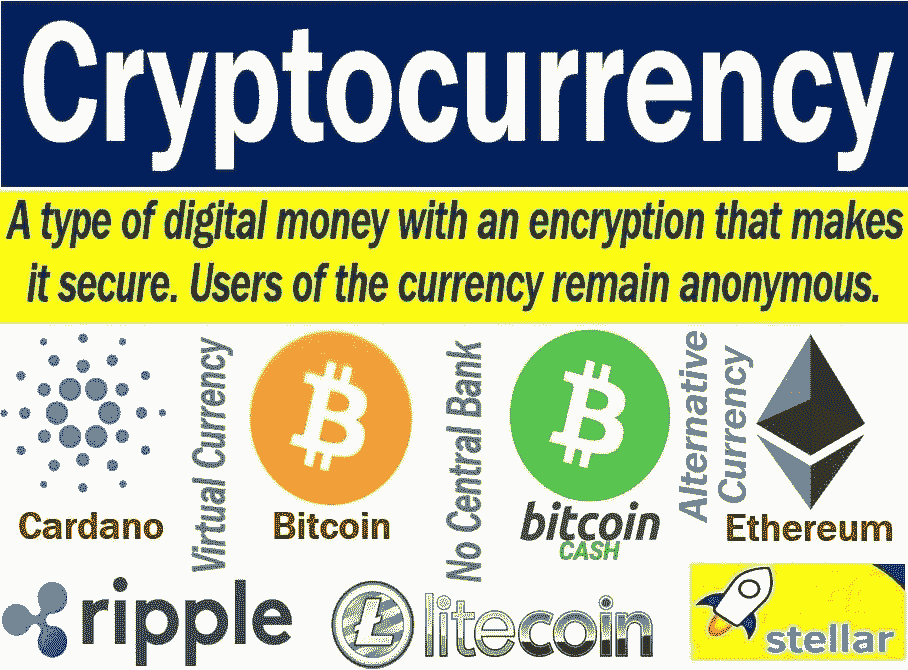

# 什么是加密货币？—初学者理解加密货币工作原理的地图

> 原文：<https://medium.com/coinmonks/what-is-cryptocurrency-the-beginners-map-to-understanding-how-cryptocurrency-works-52d5b3f21bb4?source=collection_archive---------54----------------------->

当你几乎无法给货币下一个合适的定义时，很难想象“加密”到底意味着什么，更不用说加密货币了。

很明显，钱在进化。我想每 10 个人中至少有 5 个人会意识到，在人类决定赋予物品、物体或概念价值的道路上，会出现一条人类启发的曲线。

因此，在一个技术发展速度几乎超过闪电本身的时代，金钱也决定虚拟化就不足为奇了(为什么不呢，当房地产已经虚拟化的时候？).

(拥有不能有身体接触的宝物，不觉得不可思议，甚至见不得光吗？我不认为曼萨·穆萨喜欢这样储存财富。哦，好吧，除了他首先读这个来找出它是关于什么的)。

但在我们谈论现在贴上“加密”标签的货币之前，也许我们应该提醒自己什么是货币，以及它所代表的货币意味着什么。

> 交易新手？试试[加密交易机器人](/coinmonks/crypto-trading-bot-c2ffce8acb2a)或者[复制交易](/coinmonks/top-10-crypto-copy-trading-platforms-for-beginners-d0c37c7d698c)

# 钱是什么？

货币是一种计算或测量单位。更好地说，货币是我们在间接贸易中用来确定一个项目或一项服务的价值的东西(易货贸易体系是一种直接的贸易方式。但是，货币的进化出乎意料地解释了这一点)。有三种主要的货币。

它们是商品货币(本身具有价值的货币，如金币和银币)；代表性货币(被授权代替一种货币发行的物品或概念，即使它们本身没有价值，例如支票和本票)以及最后的法定货币(由政府发行的法定货币)。

# 什么是货币？

根据一些货币观点，货币，在其最真实的意义上，是一个概念或想法，并不完全有形。首先是头脑中的价值观。

只有人类认为和衡量的价值或价值。那么，货币就是它的有形表现，是我们决定用来表达或揭示货币价值的物品或方式。

因此，钱仍然是钱，不管你在哪里、什么时候、和谁交易，但是货币经常根据地点、时间、季节、和你交易或储存财富的个人而变化。

因此，货币是用来促进货币或金融交易的对象或概念。

# 什么是“加密”？

“crypto”一词是“cryptography”的缩写。加密或密码术是使用加密和解密来防止第三方访问数据。

密码学的一个简单例子是对社交媒体(例如 WhatsApp)上的聊天进行加密。在 WhatsApp 新对话的顶部，有一段文字:“信息是端到端加密的。这个聊天之外的任何人，甚至 WhatsApp，都无法阅读或收听它们……”

为了保护数据，通过计算机化的编码过程，字母可以被其他字符代替。

您的对话变得安全，不会受到第三方的影响。因此，密码学是关于编写和解决来自不速之客的安全代码(嘿，我们知道这些窃听者别有用心，不是吗？).

密码术保护数据免受未授权元素的侵害(如果你觉得“窃听者”很粗鲁的话)。它通过将数据转换成第三方无法识别的形式来做到这一点。

# 那么什么是加密货币呢？

加密货币是一种数字货币或虚拟货币，在加密的前提下发挥作用。它基于区块链技术(数据库)工作，并作为一个支付门户，一个买卖和确定价值的媒介。

简单地说，加密货币就是电脑里的钱。

如果你猜测这是一个分散的系统，你是对的。加密货币不由公司、公司集团、金融机构、政府或任何中央机构发行、控制和管理。

鉴于这些条件，加密货币交易是快速独立的操作，具有 100%的功能成功。

虽然关于数字货币的预测持续了几十年，但第一种加密货币是由一个化名“中本聪”的个人或团体在 2009 年创造的

他将其命名为比特币，自那以后，无数加密货币浮出水面，有些走上了同样的成功之路，有些则遭遇了悲惨的失败——它们都是虚拟货币发展世界中“公平互动”的一部分。

然而，加密货币是不稳定的(它有可能在短时间内大幅升值或贬值)。因此，很难判断什么样的加密货币是成功还是失败，尽管这是相对的。

# 关键带回家的要点:

*   众所周知，货币会时不时地改变形态，因此加密货币现在作为一种价值衡量手段已经很好了。人类现在选择赋予基于计算机的货币以价值。
*   货币和金钱不一样。每种货币都可能是货币，但货币本身不是货币。每个人都在全球范围内接受和使用货币，但并不是所有的货币都在全球范围内被接受和使用。
*   加密货币是一种在互联网上运行的数字货币，作为交换和支付的媒介。
*   加密货币是分散的，因此不受任何中央机构的发行、控制和管理。
*   比特币是密码学的第一种货币。
*   加密货币是不稳定的。正确的买卖可以让你变得富有，失误会让你陷入困境。

阅读更多信息:

 [## 什么是加密货币？-初学者理解加密货币工作原理的地图

### 当你几乎不能给货币下一个恰当的定义时，很难想象“加密”到底意味着什么，更不用说…

36crypto.com](https://36crypto.com/cryptocurrency/what-is-cryptocurrency-the-beginners-map-to-understanding-how-cryptocurrency-works/) 

另请阅读:

## [2022 年 NFT 最受欢迎的五大游戏](https://36crypto.com/nfts/top-5-nft-games-to-play-in-2022/)