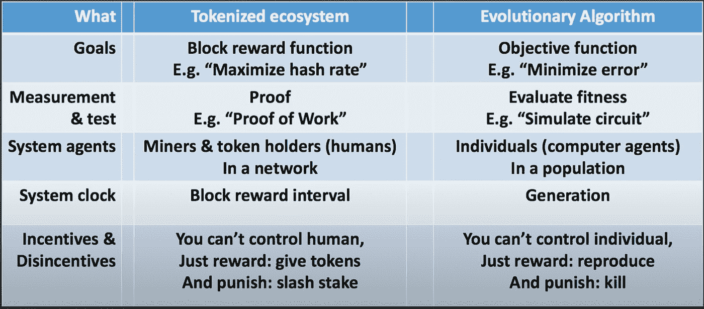
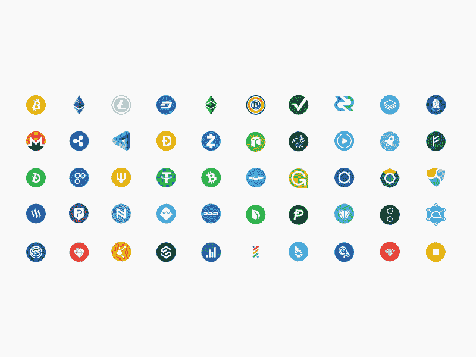
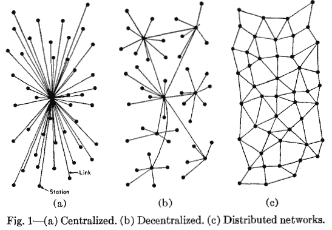

# 什么是密码经济学？

> 原文：<https://medium.com/coinmonks/what-is-cryptoeconomics-98ebc9ddacd8?source=collection_archive---------32----------------------->

# 介绍

从我们的祖先时代起，人类就一起合作来增加他们在野外生存的机会。即使在自然界，一个群体也因为合作而生存。协作/协调是人们在大群体中工作以解决共同问题的一种方式，它产生于共同的动机和激励。WW1 的例子是“互相容忍”，战壕两边的敌人停止了战斗。随着时间的推移，合作的演变和复杂性有所提高。

协作/合作也有哲学上违反直觉的黑暗面，因为它可能导致共谋。如果协调任其发展或以不平衡的方式改善会导致有害的结果。

通过加密经济协议，我们可以实现反共谋合作，朝着共同的目标努力。

# 加密经济学 ELI5

激励机制的设计影响了人们进行合作博弈的行为，同时为了一个共同的目标优化了个人的自我博弈，同时也防止了合谋。这是分散自治自下而上系统的秘密成分。

它在 web3 社区中也有不同的名称，如令牌化生态系统、机制设计、令牌经济学、金融加密或激励工程，并且可以有不同的上下文含义

# 秘密经济系统的底层结构。

秘密经济系统基本上是一个系统，即复杂系统。复杂系统是这样的系统，其集合子部分具有不能从其子部分的性质推断出的涌现行为。它们是多尺度时空动态网络，系统内的人们可以利用全球信息做出局部决策。人们受到系统的激励，带着自己的兴趣朝着系统目标函数努力。对于社会经济活动，这些秘密经济系统提供了治理基础设施。这些系统具有涌现性、非线性、适应性、自发秩序和反馈环等特性，是博弈论、机制设计、密码学、控制理论、微分对策和复杂系统领域的交叉融合。

# 作为生物启发系统的密码经济学

每个密码经济协议都有目标函数。优化问题是从所有可行解中寻找最佳解的迭代方法。优化领域有梯度体面的方法，以全球优化方法，甚至进化算法适者生存发生。目标函数应该有公式化的问题，需要最大化或最小化。在比特币的案例中,**通过散列率最大化其网络的安全性。根据目标函数，可以使用不同类型的优化算法。**

密码经济系统与自然界部署的进化算法有许多相似之处。

进化算法和密码经济学都有一个目标函数。然后，我们进行测量和评估，以了解我们的优化器是否工作正常，在区块链，它是 proof power。在进化算法中，适者生存和智能体围绕要评估的目标函数工作。在比特币/加密经济系统中，矿工会做任何事情来获得随机数，这与进化算法非常相似。EA 算法与许多优化算法有很大的不同，如梯度下降法，这是一种自上而下的方法，但类似于群体优化算法。EA 和 CE 都有系统时钟，其中 CE 中是块奖励间隔，CE 中是生成。现在 CE 中的奖励是惩罚的代币，惩罚是砍杀。同样，在 EA 中，奖励是以死亡作为惩罚的后代。无论是 CE 的矿工，还是 EA 的代理商，都控制不住。

# 代币:密码经济系统的原子状态单位

代币是加密经济系统的经济状态的表示。人们通常把它与只代表货币价值的法币相混淆。代币赋予改变系统经济状态的权利。由于现有的通用状态，这些令牌是可证明的和持久的，并且解决了与在线网络相关联的双重花费问题。它们配备有用于分散网络的自主形成和操作、维护通用状态、p2p 交易和协调的机制

# 权力下放的需要

网络需要去中心化来实现容错(异构)、抗攻击、抗共谋。有时，系统会表现得像自利的单一垄断企业，系统必须有机制来防止不健康的协调。去中心化也使流动所有权成为可能，即使网络像海星鱼一样被切碎，它也能重新生长。有了这样的拱门租金提取通过中间人被减轻，价值可以有效地分配给从事代理。

# 参考

[https://vitalik.eth.limo/general/2021/09/26/limits.html](https://vitalik.eth.limo/general/2021/09/26/limits.html)

【https://osf.io/wzf85/? view _ only = a 10581 AE 9 a 804 aa 197 AC 39 ebbba 05766

【https://vitalik.ca/general/2020/09/11/coordination.html 

Systems.pdf 的[https://epub.wu.ac.at/7309/8/Foundations](https://epub.wu.ac.at/7309/8/Foundations)

[https://medium . com/block-science/on-engineering-economic-systems-1 CFF 055d 3 a5f](/block-science/on-engineering-economic-systems-1cff055d3a5f)

 [## 为什么权力下放很重要

### 我们已经忘记了有更好的方式来建立互联网服务

onezero.medium.com](https://onezero.medium.com/why-decentralization-matters-5e3f79f7638e) 

> 加入 Coinmonks [电报频道](https://t.me/coincodecap)和 [Youtube 频道](https://www.youtube.com/c/coinmonks/videos)了解加密交易和投资

# 另外，阅读

*   [我的密码交易经历](/coinmonks/my-experience-with-crypto-copy-trading-d6feb2ce3ac5) | [《比特币基地评论》](/coinmonks/coinbase-review-6ef4e0f56064)
*   [CoinFLEX 评论](https://coincodecap.com/coinflex-review) | [AEX 交易所评论](https://coincodecap.com/aex-exchange-review) | [UPbit 评论](https://coincodecap.com/upbit-review)
*   [AscendEx 保证金交易](https://coincodecap.com/ascendex-margin-trading) | [Bitfinex 赌注](https://coincodecap.com/bitfinex-staking) | [bitFlyer 审核](https://coincodecap.com/bitflyer-review)
*   [麻雀交换评论](https://coincodecap.com/sparrow-exchange-review) | [纳什交换评论](https://coincodecap.com/nash-exchange-review)
*   [支持卡审核](https://coincodecap.com/uphold-card-review) | [信任钱包 vs 元掩码](https://coincodecap.com/trust-wallet-vs-metamask)
*   [Exness 回顾](https://coincodecap.com/exness-review)|[moon xbt Vs bit get Vs Bingbon](https://coincodecap.com/bingbon-vs-bitget-vs-moonxbt)