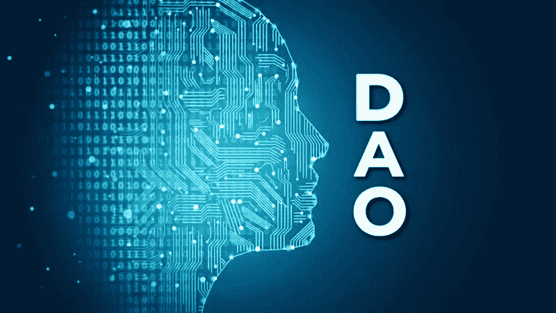

# 什么是道:分散自治组织的优势和劣势

> 原文：<https://medium.com/coinmonks/what-is-dao-advantages-and-disadvantages-of-decentralized-autonomous-organizations-e099b8e1b5dd?source=collection_archive---------2----------------------->

Dao 已经取代了传统的集中式组织管理模式。我们告诉你什么是去中心化的自治组织，它是如何运作的，以及新方案的优势是什么。

Source : [https://brightnode.io/whats-a-crypto-dao-and-why-is-interesting/](https://brightnode.io/whats-a-crypto-dao-and-why-is-interesting/)

[道是什么？](#18d4)
[下面是 Dao 的工作方式:](#84c0)
∘ [问题的技术方面](#117c)
[为什么需要 Dao，它们比](#afc1)好在哪里……