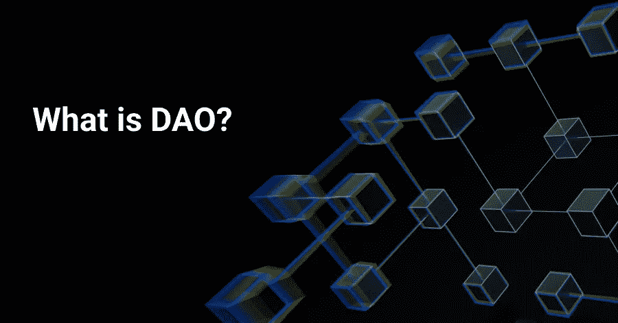

# 什么是 DAO(去中心化自治组织)？

> 原文：<https://medium.com/coinmonks/what-is-dao-decentralized-autonomous-organization-8216e9fa5967?source=collection_archive---------13----------------------->

我们都知道什么是组织。想想元平台(以前叫做脸书)。他们有一个集中的管理团队，拥有和管理组织，总部设在某个国家，成员可以有几十万。

然而今天，一种新的组织形式出现了。想象一下一个去中心化的组织，其中社区拥有并管理他们自己，而不是一个由 CEO、CFO 和首席运营官组成的团队。想象一个完全在线的，不受物理边界限制的组织。这些组织由区块链技术实现，被称为 DAOs。

# **介绍刀**

DAO 代表分散的自治组织。为了设置 DAO，一个开发人员或一组开发人员创建智能合约。这些智能契约包含指导 DAO 治理的规则，并且必须部署在区块链上。

一旦部署，开发人员就没有比其他社区成员更多的发言权。所有关于"一体行动"的决定都必须在新的治理提案中提出，这些提案将经过多数表决。

Dao 通常有自己的治理令牌来从社区成员那里筹集资金。反过来，成员获得对提案的投票权。这意味着 DAO 中的成员可以共同努力实现共同的组织目标(例如，现已解散的[宪法 DAO](https://mobile.twitter.com/constitutiondao) 的成员如何聚集在一起购买美国宪法的副本)，甚至改变他们的管理规则，只要提案得到大多数人的批准。

道和一个简单的兴趣俱乐部的主要区别在于道是通常具有经济效用的实体。由于社区成员拥有自己的治理令牌和金库，因此他们在投票决定如何使用 DAO 的储备基金以及其他财务相关问题时会非常小心。

# **刀的利弊**

优点
●没有等级观念；社区自治
●民主；任何人都可以提出建议，并通过多数投票做出决定
●透明；代码是开源的，所有人都可以看到

缺点
●决策可能效率低下，因为需要多数表决
●智能合同规则一旦部署到区块链就很难更改
●法律灰色区域，因为 Dao 不受任何特定司法管辖区的约束

# **Web3 的提升**

区块链科技帮助概念化和建立 Dao，Web3 帮助推广它们。

这个词是 Polkadot 创始人兼以太坊联合创始人加文·伍德在 2014 年创造的。Web3 被认为是互联网的下一代。一个 Web3 世界将是一个在线分散的生态系统，融合了区块链技术，如加密和 NFTs。

用户可以控制自己的个人数据，并对自己的身份拥有主权。他们还可以参与分散融资，这是非托管的，没有集中参与。

Dao 的分散治理和所有权似乎正好符合 Web3 的理想。然而，Web3 技术仍然是原始的，概念仍然是一个模糊的乌托邦式的愿景。

此外，Dao 还面临着一个意识形态问题，在这个问题上，民主投票可能不是最佳选择。有人认为，集体无法做出合理的决策。这与当前的世界秩序形成对比，在当前的世界秩序中，决策是由精英(例如政府、领导人)做出的。即使这是高度集中的，我们大多数人相信他们有知识和经验做出好的决定。

Dao 可能会继续从 Web3 的推动中获利，但我们可能会在未来几年看到新形式的 Dao。

> 加入 Coinmonks [电报频道](https://t.me/coincodecap)和 [Youtube 频道](https://www.youtube.com/c/coinmonks/videos)了解加密交易和投资

## 也阅读

 [## 杠杆代币[多头代币]终极指南

### 杠杆化令牌是具有杠杆化风险敞口的 ERC20 令牌，不考虑保证金、要求、管理…

medium.com](/coinmonks/leveraged-token-3f5257808b22)  [## 最佳加密交易所| 2022 年十大加密货币交易所| CoinCodeCap

### 哪一个是最好的加密交换？在本文中，我们将根据多种加密货币列出 10 大加密货币交易所

coincodecap.com](https://coincodecap.com/crypto-exchange)  [## 2022 年 2 月值得关注的三大游戏代币| CoinCodeCap

### 排名前 3 位的游戏也占交易总量的 85%以上。Defi 王国、Axie Infinity 和 Pegaxy…

coincodecap.com](https://coincodecap.com/top-3-gaming-tokens-to-look-out-for-in-february-2022)  [## 2022 年最佳加密交换平台| CoinCodeCap

### 随着时间的推移，我们大多数人将转向 dex 以获得更好的安全性和隐私。因此。在这里，我们将讨论…

coincodecap.com](https://coincodecap.com/best-swap-platforms)  [## 10 大最佳在线赌场|赢得并赢取免费 BTC 2022 | CoinCodeCap

### 接收、支付和赚取加密货币| |有各种各样的最佳在线赌场可供选择，有可能…

coincodecap.com](https://coincodecap.com/best-online-casinos)