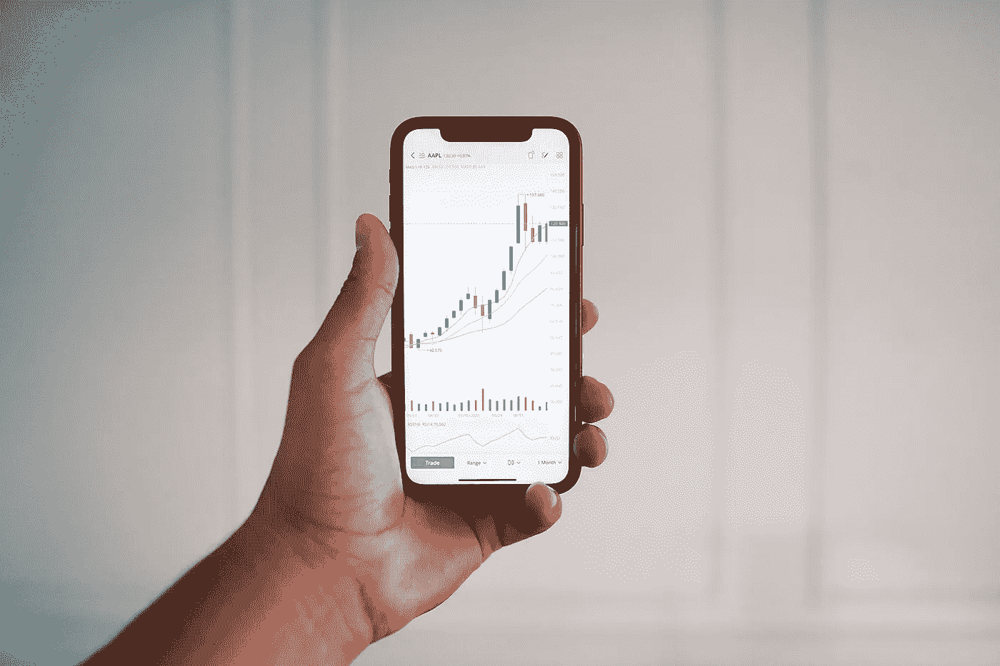

# 什么是日内交易？你需要知道的一切

> 原文：<https://medium.com/coinmonks/what-is-day-trading-everything-you-need-to-know-644b08c2127b?source=collection_archive---------43----------------------->

在过去的十年里，日内交易变得非常流行。许多人现在使用日内交易作为他们的主要投资策略。真的值得吗？日内交易的利弊是什么？

这篇文章来自我的网站[投资组合中心](http://www.portfolio-hub.co.uk)

在今天的文章中，我将讲述日内交易到底是什么。我还将讨论为什么它不同…