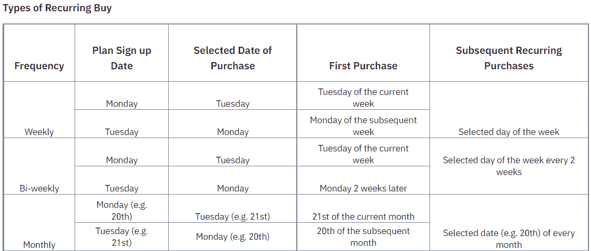
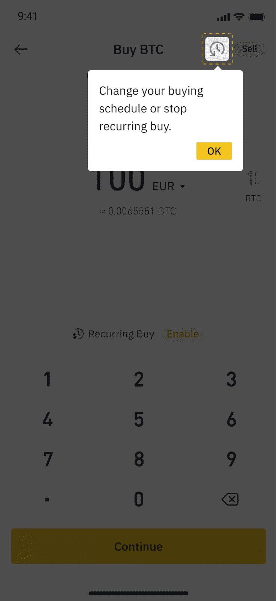
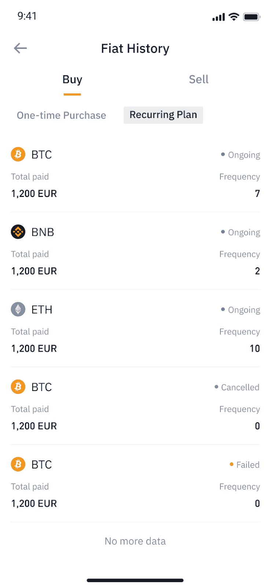
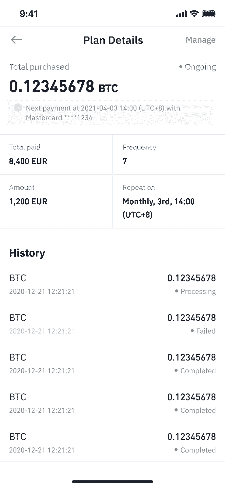
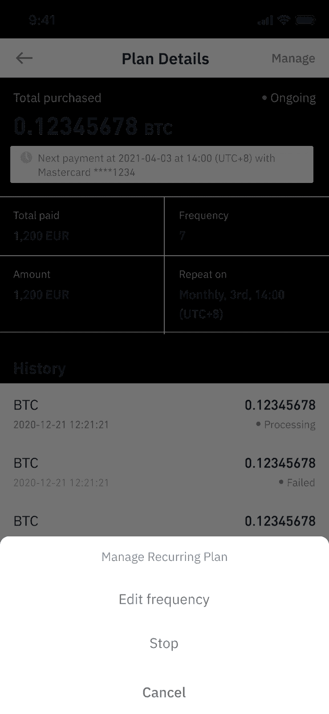
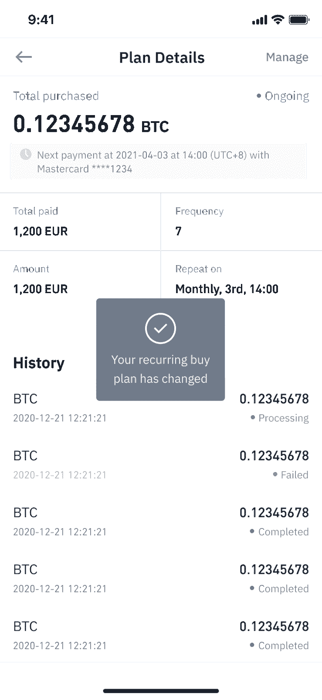
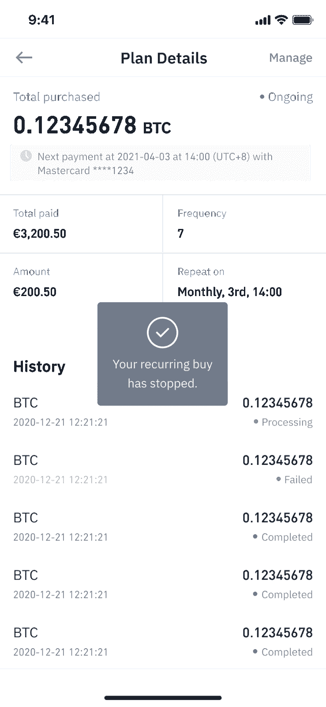
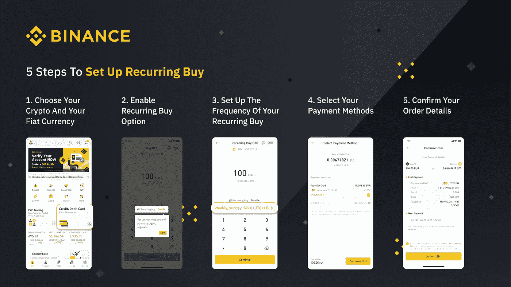

# 什么是 DCA？

> 原文：<https://medium.com/coinmonks/what-is-dca-1b003afc0593?source=collection_archive---------52----------------------->

*用美元成本平均法对您的加密货币投资策略进行数学优化。*

忘记担心通过 DCA 或美元成本平均法发现投资你最喜欢的加密货币的最佳时机。是的，DCA 是解决加密货币财富积累难题的合适答案。

在 DCA 投资方法中，一定数量的货币价值定期投资于加密货币。潜在的想法是，即使在市场下跌时，也能持续获取利润。DCA 投资策略有助于维持更高的流动性，同时将现金风险降至最低。

请放心，有了 DCA investing，无论市场涨跌，你的投资都会为你所用。DCA 使您的投资免受一次性投资的潜在冲击。

**什么是币安经常性购买？**

[币安定期购买](https://www.binance.com/en/buy-sell-crypto?channel=card&fiat=EUR&recurring=open?ref=UUTW4MZQ) (BRB)是通过 VISA/MasterCard 主导的预先安排的加密货币购买/出售，以美元成本平均化您的加密货币投资组合。

**注意** : *一次最多只能保存 5 张卡。支持 Visa 和 Mastercard(信用卡和借记卡)。*

BRB 自动购买加密货币，其中用户通过 DCA 投资策略选择购买其首选加密货币的数量和频率。通过币安的 BRB 功能(应用程序和网络)，用户可以每周、每两周和每月自动购买加密货币。

[*如何用币安循环买入*](https://www.binance.com/en/blog/fiat/how-to-grow-your-crypto-portfolio-with-recurring-buy-421499824684903346) *(BRB)来增长你的加密货币投资组合。*

[*如何使用 BRB*](https://www.binance.com/en/support/faq/3b628537b6314964bb08b5b22fab6c18) *。*

**管理你的币安经常性购买**

修改、暂停和取消你的定期购买计划非常容易。

*   只需点击下图中突出显示的图标:

*   点击“重复计划”显示所有订单。选择您希望更改的计划。

*   点击“管理”

*   如果您希望更改 BRB 计划，请点击“编辑频率”

*   核实你的新计划的细节，评估其充分性后，点击“确认”

*   这样做后，您将收到一条弹出消息，确认您的定期购买计划的更改。

如何停止你的币安重复购买计划？

要停止您的币安定期购买计划，请点击“停止”，并执行以下操作:

将显示一个停止重复计划弹出窗口，单击“确认”后，您的 BRB 计划将立即停止。

您将收到一份停止定期购买计划的确认函，如下所示:

[如何使用币安定期购买](https://www.binance.com/en/support/faq/3b628537b6314964bb08b5b22fab6c18)？

通过[参考常见问题解答](https://www.binance.com/en/support/faq/3b628537b6314964bb08b5b22fab6c18)获得关于注册币安重复购买的答案。

[在币安免费注册](https://accounts.binance.com/en/register?ref=UUTW4MZQ)。

> 加入 Coinmonks [电报频道](https://t.me/coincodecap)和 [Youtube 频道](https://www.youtube.com/c/coinmonks/videos)了解加密交易和投资

# 另外，阅读

*   [AscendEx Staking](https://coincodecap.com/ascendex-staking)|[Bot Ocean Review](https://coincodecap.com/bot-ocean-review)|[最佳比特币钱包](https://coincodecap.com/bitcoin-wallets-india)
*   [霍比评论](https://coincodecap.com/huobi-review) | [OKEx 保证金交易](https://coincodecap.com/okex-margin-trading) | [期货交易](https://coincodecap.com/futures-trading)
*   [网格交易机器人](https://coincodecap.com/grid-trading) | [Cryptohopper 审查](/coinmonks/cryptohopper-review-a388ff5bae88) | [Bexplus 审查](https://coincodecap.com/bexplus-review)
*   [7 个最佳零费用加密交易平台](https://coincodecap.com/zero-fee-crypto-exchanges)
*   [氹欞侊贸易评论](https://coincodecap.com/anny-trade-review) | [霍比保证金交易](/coinmonks/huobi-margin-trading-b3b06cdc1519)