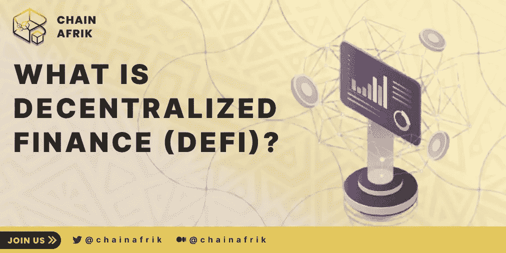

# 什么是分权金融

> 原文：<https://medium.com/coinmonks/what-is-decentralized-finance-6387e4f91460?source=collection_archive---------61----------------------->

分散融资被吹捧为一种可能的解决方案，可以降低那些难以获得银行账户的人的准入门槛。最近，它被加密货币所有者用于另一个目的:赚更多的钱。

# 什么是 DEFI

总的来说，DeFi 应用程序是运行在公共区块链上的金融产品，如以太坊、BNBchain、Avalenche、Cosmos 等。这些产品是未经许可的，这意味着它们不使用第三方。取代金融中介，如经纪人和银行，所有的东西都通过智能合约自动进入协议。

想贷款吗？你不需要银行给你钱。可以直接找同行贷款。准备好押注比特币期货和其他衍生品了吗？忘了找庄家吧。你可以让协议来处理。想把一项资产换成另一项资产？分散的交易所可以促进交易，而无需收取巨额佣金。

# 为什么炒作

首先，它是“开放的”，意味着你可以通过创建一个钱包来使用这些应用程序——通常不显示任何识别信息，如姓名和地址。这在理论上(如果不是技术上)比拥有一个银行账户更简单。

其次，你可以通过区块链近乎即时地转移资金，因此无需等待银行转账清算。

第三，尽管交易成本因区块链网络的不同而不同，但利率(至少目前)比传统银行要高得多。

最后，DeFi 应用程序像“金钱乐高积木”一样一起工作这种“可组合性”允许任何人在未经许可的情况下创建、修改、混合和匹配、链接或构建任何现有的 DeFi 产品。不幸的是，这一特性也可能是 DeFi 的最大弱点，因为如果一个关键组件，如戴稳定币，变得脆弱或损坏，围绕戴建立的整个生态系统可能会崩溃。

# 你能用 DEFI 做什么

**借出/借入:**如果你拥有加密货币，你可以将其借给 Aave 或 Compound 之类的协议，以换取利息和/或奖励。同样，您可以从这样的协议中借用数字资产，如果您想进行交易，这尤其有用。但是要小心！大多数 DeFi 协议使用超额抵押，这意味着你必须提供超过你想借的金额；如果资产价值下跌太多，协议可能会没收你的抵押品以避免损失。

许多 DeFi 用户将此作为通过“收益农业”赚取资产的一种方式，在这种方式中，他们将资金锁定在一个资产池中以获得回报。由于费率因协议和资产而异，熟练的高产农民会转移他们的资产，以利用最好的费率。

交易:在比特币基地和币安这样的中央交易所，你的每笔交易都要依靠交易所来保管你的资产。分散交易消除了中介，因此人们可以直接交易。此外，Uniswap 和 PancakeSwap 等指数允许人们列出新的代币进行交易。缺乏审查增加了风险，但也让人们在新资产进入更广泛的市场之前“提前进入”。

**衍生品:**有时候你不想被局限于交易特定的硬币或代币。dYdX 和 Synthetix 等衍生品平台让人们可以做的不仅仅是现货交易。例如，用户可以进行杠杆交易，在这种交易中，他们可以下比他们拥有的更多的赌注，甚至可以创建模仿传统股票和商品的“合成资产”。

# 摘要

截至 2020 年 11 月，各种 DeFi 产品锁定的价值不到 200 亿美元，其中大部分是在以太坊上。到第二年，它的价值超过 2600 亿美元，其中 190 亿美元来自币安智能链。

如果这种趋势继续下去，并且赤字最大化者是正确的，这只是一个大规模赤字浪潮的开始。真正的信徒认为，开放和去中心化的金融体系的优势实在是太引人注目了，以至于不能不获得数万亿美元的价值。

但是挑战依然存在。2021 年 11 月，风险管理公司 Elliptic 估计，在过去两年中，DeFi 用户因黑客和诈骗损失了 105 亿美元

> 加入 Coinmonks [电报频道](https://t.me/coincodecap)和 [Youtube 频道](https://www.youtube.com/c/coinmonks/videos)了解加密交易和投资

# 另外，阅读

*   [Bookmap 评论](https://coincodecap.com/bookmap-review-2021-best-trading-software) | [美国 5 大最佳加密交易所](https://coincodecap.com/crypto-exchange-usa)
*   最佳加密[硬件钱包](/coinmonks/hardware-wallets-dfa1211730c6) | [Bitbns 评论](/coinmonks/bitbns-review-38256a07e161)
*   [新加坡十大最佳加密交易所](https://coincodecap.com/crypto-exchange-in-singapore) | [购买 AXS](https://coincodecap.com/buy-axs-token)
*   [红狗赌场评论](https://coincodecap.com/red-dog-casino-review) | [Swyftx 评论](https://coincodecap.com/swyftx-review) | [造币厂评论](https://coincodecap.com/coingate-review)
*   [投资印度的最佳密码](https://coincodecap.com/best-crypto-to-invest-in-india-in-2021)|[WazirX P2P](https://coincodecap.com/wazirx-p2p)|[Hi Dollar Review](https://coincodecap.com/hi-dollar-review)
*   [加拿大最佳加密交易机器人](https://coincodecap.com/5-best-crypto-trading-bots-in-canada) | [库币评论](https://coincodecap.com/kucoin-review)