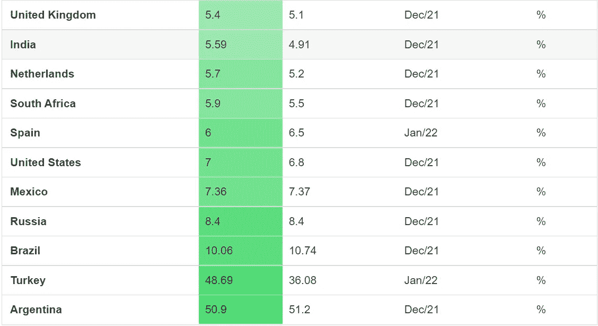

# 什么是分散金融？为什么重要？

> 原文：<https://medium.com/coinmonks/what-is-decentralized-finance-defi-why-it-matters-4fb281b3ff28?source=collection_archive---------14----------------------->

在来讲什么是 DeFi 之前，我们先来了解一下什么是集权财政我们现在有什么。目前我们使用顶级银行发行的不同货币(例如美国联邦银行、印度储备银行)。他们控制着我们市场上的货币供应。我们用这些货币消费、储蓄和投资不同的工具。作为货币的使用者，我们无法控制货币的价值，因为它是由政府控制的，而政府反过来影响顶级银行对货币的决策。

所以，我们来了解一下对于俗人的生活对于这个的影响。由于一些管理不善或任何政府决定印更多的钱([正是在 covid 时代](https://www.usatoday.com/in-depth/money/2020/05/12/coronavirushow-u-s-printing-dollars-save-economy-during-crisis-fed/3038117001/)发生的)，随着货币供应量的增加，货币的价值将会下降。这将极大地影响普通人的购买力和储蓄。

让我们看看现在不同国家的通货膨胀率-

如果任何人把他/她的大部分储蓄放在定期存款中，根据通货膨胀率，他/她在年底没有储蓄任何东西。即使是其他投资工具，也会对回报产生不利影响。

基本上，我们可支配资金的价值取决于其他几个外部因素，这些因素反过来会影响政府和顶级银行的决策。

**这是因为中央集权的财政体制。**

现在，分散金融开始出现。在这个体系中，没有任何机构拥有控制货币流动的权力。它由加密货币使用的点对点金融网络来维护。因此，不存在像当前系统那样由于外部因素导致的波动性和不确定性。由于它是由基于区块链技术的金融网络维护的，所以系统中有更多的透明度。它有可能将我们当前的金融体系从银行、NBFC 和其他不同中介机构的束缚中解放出来。

分散式金融系统的好处不仅限于在线支付。资金转移只是我们金融系统的一个方面，但是 **DeFi** 希望取代每一个方面，包括交换、贷款、保险和储蓄计划。

在 DeFI 中，借贷可以在几分钟内完成，而不需要做任何书面工作。在分散交易中，不需要任何经纪人或机构来促进股票的买卖。

[以下是不同领域的 DeFi 应用列表](https://101blockchains.com/decentralized-finance-applications/)。

总的来说，它可以通过民主化来彻底改变我们当前的金融体系。

*~再见*

让我们成为朋友吧—

**推特:** [*@S_Sarkar_0*](https://twitter.com/S_Sarkar_0)

> *加入 Coinmonks* [*电报频道*](https://t.me/coincodecap) *和* [*Youtube 频道*](https://www.youtube.com/c/coinmonks/videos) *了解加密交易和投资*

# 另外，阅读

*   [3 商业评论](/coinmonks/3commas-review-an-excellent-crypto-trading-bot-2020-1313a58bec92) | [Pionex 评论](https://coincodecap.com/pionex-review-exchange-with-crypto-trading-bot) | [Coinrule 评论](/coinmonks/coinrule-review-2021-a-beginner-friendly-crypto-trading-bot-daf0504848ba)
*   [莱杰 vs n rave](/coinmonks/ledger-vs-ngrave-zero-7e40f0c1d694)|[莱杰 nano s vs x](/coinmonks/ledger-nano-s-vs-x-battery-hardware-price-storage-59a6663fe3b0) | [币安评论](/coinmonks/binance-review-ee10d3bf3b6e)
*   [Bybit Exchange 审查](/coinmonks/bybit-exchange-review-dbd570019b71) | [Bityard 审查](https://coincodecap.com/bityard-reivew) | [Jet-Bot 审查](https://coincodecap.com/jet-bot-review)
*   [3 commas vs crypto hopper](/coinmonks/3commas-vs-pionex-vs-cryptohopper-best-crypto-bot-6a98d2baa203)|[赚取加密利息](/coinmonks/earn-crypto-interest-b10b810fdda3)
*   最好的比特币[硬件钱包](/coinmonks/hardware-wallets-dfa1211730c6) | [BitBox02 回顾](/coinmonks/bitbox02-review-your-swiss-bitcoin-hardware-wallet-c36c88fff29)