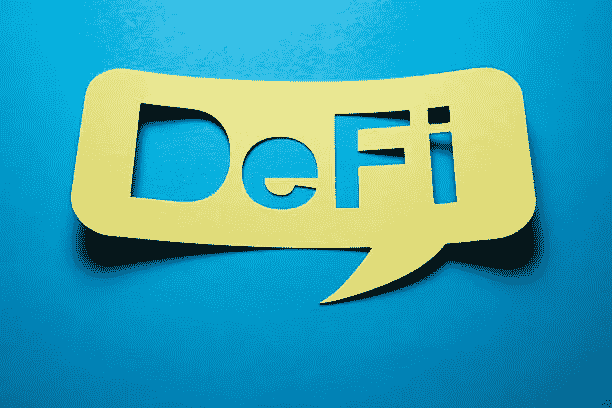

# 什么是 DeFi？理解分散金融的初学者指南。

> 原文：<https://medium.com/coinmonks/what-is-defi-a-beginners-guide-to-understanding-decentralized-finance-9ee4fd809978?source=collection_archive---------40----------------------->

# Defi。

Defi，读作 Dee-Fye，是分散融资的简称。这是一个广义的术语，指的是任何人都可以通过互联网连接获得的金融服务和产品。你可以用 Defi 赚取利息，借钱，贷款，买保险，交易衍生品，交易资产。Defi 和金融机构的唯一区别是没有集中的权力机构，没有文书工作，也没有第三方。

在使用传统金融系统接收或发送资金之前，你需要中间人，通常称为“中间人”这些中间人是商业银行、证券交易所和支付网关。

这些中介需要证明你的交易是有效的，然后资金才能流向你或从你那里流出。在 Defi 中，这些中间体被代码和软件所取代。人们可以使用基于区块链的智能合约直接相互交易，而不是直接与银行交易进行支付。这些智能合约验证交易，并确保它们是有效的。

# 金融部门的历史。

Photo by [Markus Winkler](https://unsplash.com/@markuswinkler?utm_source=medium&utm_medium=referral) on [Unsplash](https://unsplash.com?utm_source=medium&utm_medium=referral)

20 世纪 20 年代，会计机和穿孔卡的使用是改革金融部门的首批尝试之一。20 世纪 50 年代，大型计算机紧随其后。20 世纪 50 年代后，自动柜员机(ATM)和信用卡的使用出现在 20 世纪 70 年代。20 世纪 70 年代的另一个巨大进步是股票市场。手工订单输入被机器取代了。

到了 90 年代，由于互联网的兴起，金融的计算机化开始了。银行账户、电汇和股票交易出现了。PayPal、Robinhood、TransferWise 和 Stripe 等机构像脸书、亚马逊等其他科技公司一样，采取了技术优先的融资方式。这是一种与我们所知的金融业完全不同的方法。尽管有这些逐步的改进，这个行业还远非完美。

# 金融部门的漏洞。

债券、股票和其他金融证券的结算需要大量的时间来处理，并需要大量的资本。关键的财务决策是秘密做出的。大规模的金融丑闻和挪用公款仍然司空见惯。由于国际银行和汇款服务非常昂贵，发展中国家获得金融服务的机会不平等。

金融科技领域的新参与者进入门槛很高，无法获得大量资本。这些因素以及更多因素困扰着金融业。这就是 Defi 发挥作用的地方。它使用密码术、去中心化和区块链来建立更有效的系统。尽管玩家处于不同的地理位置，但是金融交易几乎是瞬间完成的，从这个意义上来说，该系统是高效的。

# 为什么 Defi？

Defi 可以在最少的人工干预下实现无摩擦的国际资金转移。任何能上网的人都可以使用这个系统。不需要银行证明、公民身份证明、收入报表或其他任何东西。因为 Defi 协议不受中央权威机构的控制，所以它可以抵抗审查。

与金融系统相比，Defi 系统是开放的，因为任何人都可以在现有的 Defi 应用程序(也称为 dapps)上进行构建。新的应用程序可以利用现有的协议来创建有益于整个生态系统的解决方案。会计记录、交易量、未偿贷款和总债务都可以在[区块链](/coinmonks/why-is-blockchain-important-ab54d511d2ef)上看到，这使得它非常透明。这就是最受欢迎的加密货币比特币和以太坊的起源。

# Defi 的好处

每一个金融系统都围绕着国际支付、借贷、交易和衍生品。更高的安全性、更低的成本以及通过持有密码获得更高收入的能力都是 Defi 的优势。

Defi 的所有主要优势都基于分散式应用。据[CEX 公司的创始人兼首席执行官 Oleksandr Lutskevych](https://twitter.com/lutskevycho) 称。IO，即分散应用程序，允许人们在世界任何地方转移资本，实现点对点借贷、加密交换服务、NFTs、加密钱包和存储解决方案。

交易、游戏、金融、赌博、开发、存储、高风险、钱包、治理、财产、身份、媒体、社会、安全、能源、保险和健康是 dApps 的 17 个类别。[预测市场平台 Augur](https://augur.net/) 和基于以太坊的游戏 [Crypto Kittie](https://www.cryptokitties.co/) 就是两个例子。

其他例子有:[block stack](https://www.stacks.co/)——开发去中心化应用的平台；Steem 是一个博客和社交媒体平台；以及[uni swap](https://uniswap.org/)——一个去中心化的加密货币交易所。虽然比特币是更受欢迎的加密货币，但以太坊更适合更广泛的用途，这意味着基于以太坊的软件被用于大量的 dapps 和协议中。

分散式应用程序的应用包括:

*   金融交易。从支付到证券和保险交易，再到借贷，任何事情都可以通过 Defi 发生。
*   分散式交易所，简称 dex。加密投资者最常用的交易所是比特币基地和 T2 的双子座交易所。dex 有助于点对点金融交易，并让用户保留对其资金的控制权。
*   加密钱包。Defi 正在开发可以独立于加密货币交易所工作的数字钱包，并让投资者能够访问从加密货币到区块链游戏的所有内容。
*   稳定的硬币。与加密货币不同，稳定硬币试图通过与非加密货币(如美元)挂钩来稳定其价值。
*   [不可替代令牌](/design-bootcamp/what-is-an-nft-non-fungible-tokens-explained-e5b4e49f24f0)。NFT 从不能交易的资产中创造了数字资产。灌篮视频或 Twitter 上的第一条推文就是两个例子。
*   闪贷。这些是加密货币贷款，允许你一次借款和还款。借款人可以从以太坊区块链合约中获利，该合约借入资金，执行交易，然后立即偿还贷款。如果交易失败，资金将自动返还给贷方。如果盈利，扣除任何利息或费用后，可以保留。将快速贷款视为一种分散套利。

Defi 协议目前的总锁定价值接近 430 亿美元。区块链的无处不在推动了 Defi 的采用:一旦 dApp 在区块链上被编码，它就变得全球可用。dApps 存在于这些规则之外，增加了他们的潜在回报，同时也增加了他们的风险。虽然大多数集中的金融工具和技术随着时间的推移缓慢推出，但它们受到区域经济的规则和条例的制约。

# 优点和缺点

尽管 Defi 是金融领域的一项惊人创新，但这项技术仍有很多缺点。以太坊区块链的交易率波动就是一个例子。这意味着随着时间的推移，活跃的交易会变得昂贵。这就是以太坊上燃气费高的问题。

Defi 的一个主要问题是高波动性的存在。此外，出于税务目的，您必须保留您的记录，不同地区的法规可能会有所不同。真相取决于我们继续教育人们 Defi 的潜力。但是，我们也需要继续努力工作，以建立工具，让人们自己看到它。

如果你喜欢这篇文章，请为它鼓掌，如果你觉得它有帮助，请发表评论。

*您是否有即将到来的区块链项目，并且需要一名优秀的作家？*

通过 e.nwaka1512@gmail.com 联系我。作为一个坚定不移的原则，我将始终以透明的方式关注合作伙伴关系，并且只与我认为真正与众不同、值得深入了解的企业合作。

再见… [艾曼纽](https://linktr.ee/emmanuelnwaka)。

> 加入 Coinmonks [电报频道](https://t.me/coincodecap)和 [Youtube 频道](https://www.youtube.com/c/coinmonks/videos)了解加密交易和投资

# 另外，阅读

*   [3 商业评论](/coinmonks/3commas-review-an-excellent-crypto-trading-bot-2020-1313a58bec92) | [Pionex 评论](https://coincodecap.com/pionex-review-exchange-with-crypto-trading-bot) | [Coinrule 评论](/coinmonks/coinrule-review-2021-a-beginner-friendly-crypto-trading-bot-daf0504848ba)
*   [莱杰 vs n rave](/coinmonks/ledger-vs-ngrave-zero-7e40f0c1d694)|[莱杰 nano s vs x](/coinmonks/ledger-nano-s-vs-x-battery-hardware-price-storage-59a6663fe3b0) | [币安评论](/coinmonks/binance-review-ee10d3bf3b6e)
*   [Bybit Exchange 评论](/coinmonks/bybit-exchange-review-dbd570019b71) | [Bityard 评论](https://coincodecap.com/bityard-reivew) | [Jet-Bot 评论](https://coincodecap.com/jet-bot-review)
*   [3 commas vs crypto hopper](/coinmonks/3commas-vs-pionex-vs-cryptohopper-best-crypto-bot-6a98d2baa203)|[赚取秘密利息](/coinmonks/earn-crypto-interest-b10b810fdda3)
*   最好的比特币[硬件钱包](/coinmonks/hardware-wallets-dfa1211730c6) | [BitBox02 回顾](/coinmonks/bitbox02-review-your-swiss-bitcoin-hardware-wallet-c36c88fff29)
*   [BlockFi vs 摄氏度](/coinmonks/blockfi-vs-celsius-vs-hodlnaut-8a1cc8c26630) | [Hodlnaut 审核](/coinmonks/hodlnaut-review-best-way-to-hodl-is-to-earn-interest-on-your-bitcoin-6658a8c19edf) | [KuCoin 审核](https://coincodecap.com/kucoin-review)
*   [Bitsgap 评审](/coinmonks/bitsgap-review-a-crypto-trading-bot-that-makes-easy-money-a5d88a336df2) | [Quadency 评审](/coinmonks/quadency-review-a-crypto-trading-automation-platform-3068eaa374e1) | [Bitbns 评审](/coinmonks/bitbns-review-38256a07e161)