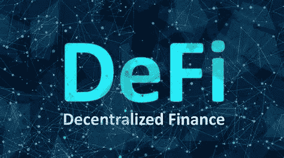

# 什么是 DeFi，4 大优势是什么？

> 原文：<https://medium.com/coinmonks/what-is-defi-and-what-are-the-main-advantages-4c8cdeb0eb3c?source=collection_archive---------44----------------------->

Source photo [defi — Bing images](https://www.bing.com/images/search?view=detailV2&ccid=YiiFvo8M&id=6AA174534081AECC3299636FAE6A986F054DE21F&thid=OIP.YiiFvo8MA3d6EuRzvgGjOQHaEJ&mediaurl=https%3a%2f%2fcdn.publish0x.com%2fprod%2ffs%2fimages%2f9b5091cab8769f3d57293528ae756f131ca0a5e82273e3ab6c202ffc1eb7970f.jpeg&cdnurl=https%3a%2f%2fth.bing.com%2fth%2fid%2fR.622885be8f0c03777a12e473be01a339%3frik%3dH%252bJNBW%252bYaq5vYw%26pid%3dImgRaw%26r%3d0&exph=882&expw=1572&q=defi&simid=607993397499231969&FORM=IRPRST&ck=696CC4AAB5340195A2C6254DD8C8EE51&selectedIndex=3&ajaxhist=0&ajaxserp=0)

# 什么是 DeFi？

“分散金融”是“DeFi”的缩写有几个不同的公共区块链应用和倡议，旨在改变传统金融在这一总括短语下的工作方式。基于区块链技术的智能合约被称为 DeFi。