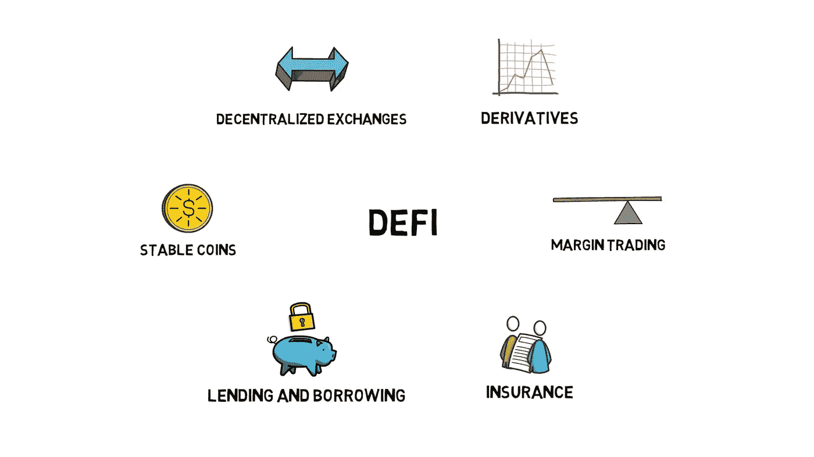
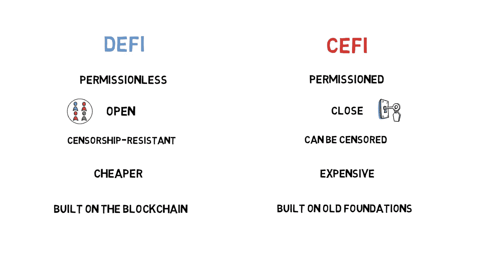

# 什么是 DeFi？

> 原文：<https://medium.com/coinmonks/what-is-defi-cdd3da096329?source=collection_archive---------50----------------------->

在我们的 YouTube 上观看视频的同时，享受这个流的资源！

YouTube:[https://youtu.be/Dvodk5H_KWY](https://youtu.be/Dvodk5H_KWY)

不和:【https://discord.gg/J73qhkj7kr】T2

推特:【https://twitter.com/CryptoverseDAO】

linktree:[https://linktr.ee/cryptoversedao](https://linktr.ee/cryptoversedao)

-

什么是 Defi？

Defi 或分散金融是一个运动，旨在建立一个新的金融系统，对所有人开放，不需要像银行这样的信任中介。为了实现这一点，defi 非常依赖密码学、区块链和智能合约。

智能合约是 defi 的主要组成部分。如果你不知道什么是智能合约，或者你想更新你的知识，你可以看看我以前的博客文章。

值得注意的是，目前大多数 defi 项目都是建立在以太坊之上的。其主要原因是以太坊相当强大的编程语言 Solidity，它允许编写高级智能合同，可以包含 defi 应用程序的所有必要逻辑，此外，以太坊在所有智能合同平台上拥有最发达的生态系统，每天有数千名开发者构建新的应用程序，智能合同锁定了最大的价值，从而产生了额外的网络效应。本文提到的所有 defi 协议都是建立在以太坊之上的。

历史的 Defi

MakerDAO 是启动分散金融运动的首批项目之一。

MakerDAO 成立于 2015 年，允许用户锁定 ETH 等抵押品，并生成 DAI——一种通过使用某些激励机制跟随美元价格的稳定货币。戴在创客的绿洲平台上也可以用来存钱。这重新创造了金融体系的支柱之一——借贷。Defi 正试图以一种自由开放的方式创建一个全新的金融生态系统。借贷只是这个生态系统的一部分。其他一些重要的部分是稳定的硬币、分散的交易所、衍生品、保证金交易和保险。

Defi vs Cefi

下图描述了 Defi 和 Cefi 的主要区别，这两个机构分别代表集中金融和传统金融。

Defi 用例:

放款与借款

除了我们刚刚提到的 MakerDAO，在这一类别中还有其他一些重要的 defi 项目。

主要的是复合。撰写本文时，Compound 是贷款类别中最大的 defi 项目，协议中锁定了价值约 6 . 3 亿美元的资产。

该化合物是一种算法，自主利率协议，允许用户提供资产，如以太，蝙蝠，0x 或系绳，并开始产生利息。提供的资产也可以作为借入其他资产的抵押品。

这一类别中另一个流行的 defi 项目是 Aave。

算法稳定硬币

通过巧妙利用智能合约和某些激励措施，我们可以创造一种与美元挂钩的稳定货币，而不必在现实世界中储存美元。我们已经提到了 MakerDAO，它本质上允许用户锁定他们的宣传资料并生成 DAI。戴是算法稳定币的一个很好的例子。

除了戴，还有其他多种非算法稳定硬币，如、或 PAX。它们的主要问题是，它们是集中的，因为它们背后有一家公司负责持有相当于稳定货币价值的美元或其他资产。然而，这些稳定的化合物获得了广泛的欢迎，并广泛用于 defi 应用，如化合物或 Aave。

分散交易所

与标准的集中式加密交换相反，分散式交换或 dexes 允许以完全分散和无许可的方式交换加密资产，而无需放弃硬币的保管权。有两种主要类型的指数基于流动性池和基于订单簿的指数。

基于流动性池的例子有 Uniswap、Kyber、Balancer 和 Bancor。Loopring 和 IDEX 是基于订单簿的例子。

派生物

与传统金融类似，衍生品是从基础资产的表现中获取价值的合约。

该领域的主要 defi 应用是 Synthetics，这是一个分散的平台，提供不同资产的链上曝光。
保证金交易

保证金交易也类似于传统金融，是利用借入的资金来增加某种资产的头寸。

保证金交易领域的主要 defi 应用是 dYdX 和 Fulcrum。
保险

保险是传统金融的另一部分，可以在分散金融中复制。它提供一定的赔偿保证，作为支付保险费的回报。保险在 defi 领域最受欢迎的应用之一是防止智能合约失效或保护存款。

这一领域最受欢迎的 defi 项目是 Nexus Mutual 和 Open。

神谕

另一个重要的(但并不严格限于)设备生态系统的财务部分 oracle services 专注于将来自外部世界的可靠数据输入到智能合同中。这个领域最受欢迎的项目是 Chainlink。

这些几乎都是设备生态系统的主要部分。它们也可以以多种方式组合。我们可以将它们视为“金钱乐高”，因为更复杂的 defi 项目可以在现有积木的基础上构建。

总结:

你可能已经注意到，defi 是一个超级有趣和充满活力的空间，充满了机会。不过，我们必须记住，这仍然是一个非常新兴的行业，所以这是一个高风险和高回报的游戏。

Defi 是最能颠覆传统金融行业的东西。与大多数金融科技公司相反，defi 建立在新的轨道上，而不是依赖过时的技术和程序。

目前，大多数金融产品只能由银行创造。Defi 是开放的，无权限的，以类似于互联网的方式支持合作工作。

虽然 defi 目前主要是建立在以太坊上，但是随着更多的互操作性协议的采用，我们可能会在未来看到更多的项目建立在不同的链上。

> 加入 Coinmonks [电报频道](https://t.me/coincodecap)和 [Youtube 频道](https://www.youtube.com/c/coinmonks/videos)来了解加密交易和投资

# 另外，阅读

*   [如何在印度购买比特币？](/coinmonks/buy-bitcoin-in-india-feb50ddfef94) | [WazirX 审核](/coinmonks/wazirx-review-5c811b074f5b)
*   [CryptoHopper 替代品](/coinmonks/cryptohopper-alternatives-d67287b16d27) | [HitBTC 审查](/coinmonks/hitbtc-review-c5143c5d53c2)
*   [CBET 评论](https://coincodecap.com/cbet-casino-review) | [库科恩 vs 比特币基地](https://coincodecap.com/kucoin-vs-coinbase)
*   [折叠 App 审核](https://coincodecap.com/fold-app-review) | [Kucoin 交易机器人](/coinmonks/kucoin-trading-bot-automate-your-trades-8cf0ca2138e0) | [Probit 审核](https://coincodecap.com/probit-review)
*   [如何匿名购买比特币](https://coincodecap.com/buy-bitcoin-anonymously) | [比特币现金钱包](https://coincodecap.com/bitcoin-cash-wallets)
*   [币安 vs FTX](https://coincodecap.com/binance-vs-ftx) | [最佳(SOL)索拉纳钱包](https://coincodecap.com/solana-wallets)