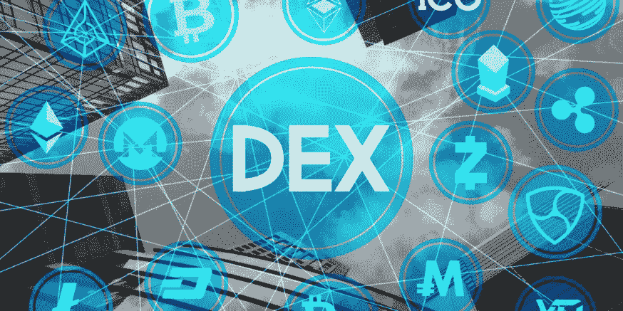

# 分散交易所(DEX)更好吗？

> 原文：<https://medium.com/coinmonks/what-is-dex-is-dex-safe-c0ad7e6c975b?source=collection_archive---------72----------------------->

*简单来说，DEX 就是一堆互相交易的加密货币钱包，而不是促成交易的金融中间人(集中交易所)*。它产生的最大影响是资产的所有权，这完全取决于用户——他们负责自己的私钥、财产和所有相关数据。

那么，DEX 比常规交易所更好吗？好吧，让我们看看事实。

1.  *对 KYC 说“不”* — DEX 消除了 KYC 的复杂性，意味着不与任何第三方共享您的文档。这样的救济权！
2.  *没有“额外”佣金*——由于所有交易都是直接在“链上”完成的，没有任何中间人为其提供便利，它免除了对每笔交易收取的交易佣金。
3.  *不要责怪任何人—* 你不可能把所有的积极因素都想对了！德克斯也一样。由于你是你财产的保管人，你有责任保护你的财产安全。
4.  *没有任何政府控制—* 由于 DEX 不拥有任何数据，政府不能要求任何开发者/DEX 向他们提供用户数据。

那么，它被采用了吗？截至 2021 年底，全球最大的 DEX 之一 Uniswap 每天的交易量约为 100 亿美元 1B。

你觉得怎么样？DEX 是否优于集中式交易所？请在评论中告诉我！

如果你喜欢这些东西，请跟我来！快乐阅读！

> 加入 Coinmonks [电报频道](https://t.me/coincodecap)和 [Youtube 频道](https://www.youtube.com/c/coinmonks/videos)了解加密交易和投资

# 另外，阅读

*   [AscendEx Staking](https://coincodecap.com/ascendex-staking)|[Bot Ocean Review](https://coincodecap.com/bot-ocean-review)|[最佳比特币钱包](https://coincodecap.com/bitcoin-wallets-india)
*   [霍比评论](https://coincodecap.com/huobi-review) | [OKEx 保证金交易](https://coincodecap.com/okex-margin-trading) | [期货交易](https://coincodecap.com/futures-trading)
*   [网格交易机器人](https://coincodecap.com/grid-trading) | [Cryptohopper 审查](/coinmonks/cryptohopper-review-a388ff5bae88) | [Bexplus 审查](https://coincodecap.com/bexplus-review)
*   [7 个最佳零费用加密交换平台](https://coincodecap.com/zero-fee-crypto-exchanges)
*   [氹欞侊贸易评论](https://coincodecap.com/anny-trade-review) | [火币保证金交易](/coinmonks/huobi-margin-trading-b3b06cdc1519)
*   [分散交易所](https://coincodecap.com/what-are-decentralized-exchanges) | [比特 FIP](https://coincodecap.com/bitbns-fip) | [Pionex 评论](https://coincodecap.com/pionex-review-exchange-with-crypto-trading-bot)