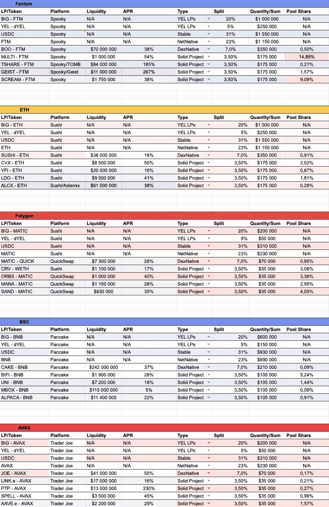

# 什么是染料——自下而上

> 原文：<https://medium.com/coinmonks/what-is-dyel-bottom-up-2370a61afbac?source=collection_archive---------9----------------------->

本文是根据有关 dYel 的预发布信息撰写的。最终产品可能会有一些变化。

dYel 是多链 DeFi 指数。简单地说，你可以在掉期交易中买入 dYel，它将跟随 DeFi value 作为一个基准或指数。

内部工作稍微复杂一点，涉及$大代币、$BANG 代币和一个金库；为此，我想写两篇关于它文章:一篇自下而上，一篇自上而下。他们将解释相同的概念，但一个(这)将从底部向上到令牌开始，另一个将从令牌向下到底部开始。

在本文中，我们将从$BIG 开始，到$BANG，再到$dYEL，在另一篇文章中，我们将从$dYel 到$BANG，再到$BIG。

## 美元大

$BIG 是一种代币，你可以在掉期交易中购买，也可以铸造。如果你选择铸造，你将会得到一个与 DEX 价格相比有折扣的$BIG token，但是你需要等待一段时间来铸造。(具体要等多少，在写的时候还有待决定)。

$BIG 的效用是用它来赌注得到$BANG，$BANG 的效用是包装它得到 dYel。

如果你想赚大钱，你需要存放一些抵押品，你可以在五个链上这样做:以太坊，多边形，雪崩，Fantom 和 BSC。

您可以将链本机令牌、stables 或链上主协议的 LP 选集作为抵押品存放，以下是您可以存放的已启用抵押品的初始列表:

每种抵押品都有不同的折扣:同样的美元价值，你会有或多或少的美元，这取决于你选择存入哪种抵押品。这些折扣值不是静态的:它们会根据 dYel 协议每次在金库中需要什么而动态变化。

因此，你可以以市场价格买入一只 DEX，支付更多的钱，然后现在就得到它，或者你可以折价铸造它，然后延迟一段时间得到它。

$BIG 是一种没有可用上限的代币:每次有人铸造它时，它都会被无限印刷，除此之外，你可以用它来换取固定的 APY(固定在$BIG，而不是美元价值)。(在撰写本文时，APY 仍未确定)。

每个链都有一个$BIG 令牌，并且$BIG 不是多链(Avalanche 上的 BIG 不同于以太坊上的$BIG)。

## $砰

下注$大代币可以获得$BANG 代币。如果你保持你的$BIG 不挂牌，它们将随着时间的推移而贬值，因为有一个持续的排放，但如果你把它们挂牌，那么$BANG token 将每天三次以新的$BIG 排放量为基数。您将获得稳定的 APY(不是以美元价值，而是以美元价值)，因此每次$BANG 刷新其在赌注池中的价值时，其价值都会越来越大。

您还可以直接在 DEX 中兑换$BANG，并从$BANG 赌注池中撤回$BIG。

获得$BANG 的主要原因是包装它以获得 dYel，但您也可以交易它或出售收获。

每个链都有一个$BANG 令牌，并且$BANG 不是多链(雪崩上的 BANG 不同于以太坊上的$BIG)。

# $dYel

你可以用 DEX 买$dYel，或者包装一些$BANG。

$dYel 是$BIG 和$BANG 代币的最终目标，它是多链的(因此您可以桥接它),并且它是 bot 有限和无限供应的:让我解释一下，因为它很复杂，也很关键。

所有用于铸造$大代币的抵押品都进入国库，一套由代币、有限合伙人、赌注有限合伙人、马厩组成的资产，并且有可能烧掉 dYel 来取回一部分国库。我们需要做一个简单的例子，然后把它复杂化来理解它。

## 第一个例子

假设我们只有$USDC 的国库，国库里有 10，000.00 $USDC。在这个例子中，铸造了 10 个 dYel，所以如果你在 yel.finance 上赎回一个 dYel，你得到 1，000.00(这是国库的 1/10，因为总共有 10 个 dYel，国库价值除以流通中的所有 dYel)。

有两种方式购买染料:你去掉期交易，价格会是 1000.00 USDC 或更多，因为如果价格更低，有人会在掉期交易中购买，并在网站上赎回他的 1000.00 USDC；或者你可以购买 1，000.00 USDC 的$BIG，这样你的国库券总价值就增加了 1，000.00 USDC，用$BIG 换成$BANG，用$BANG 换成新的 dYel。在这种情况下，您将得到一张新的面值为 1，000.00 USDC 的钞票，国库中将有 11，000.00 USDC，总共有 11 张新钞票。货币的价值没有改变，但是国库的规模增加了，货币的总流通量也增加了。

## 第二个例子

现在让我们把事情变得复杂一点:财政部不在$USDC，而是在 ETH。你做同样的往返:存款$ETH，得到$BIG，得到$BANG，包装$dYel。

在这个例子中，当有人存入新的$ETH 时，国库可以增加价值，在这种情况下，像前面的例子一样，$dYel 价格不会改变，因为将有更多的 dYel 按比例分配给国库；但是国库也可以增加价值，因为美元增加价值。在这种情况下，染料的总数不变，但是每种染料的价格会更高，因为每种染料都可以兑换价值增加的代币($ETH)。

## 第三个例子

让我们把事情变得更复杂:财政部这次是 bot $USDC 和 ETH:你可以存你喜欢的东西。除了你做同样的往返:存款$ETH 或$USDC，得到$BIG，得到$BANG，包装$dYel。

在这个例子中，我们有一个我们无法控制的变量:如果 100%的人将存款$USDC，财政部永远不会改变价值，如果他们存款 100% $ETH，它只会跟随$ETH 的价值。修复在第四个示例中:

## 第四个例子

在这个例子中，我们有$ETH 和$USDC 的存款，但是我们鼓励人们存入我们更需要的东西，以达到我们喜欢的国库组合。例如，如果我们希望国库中有 50%的 USDC 和 50%的 ETH，但目前我们有 20% $USDC 和 80% $ETH，我们将激励$USDC 的存款(从 20%增长到 50%)，抑制$ETH 的存款(从 80%增长到 50%)。怎么才能做到呢？

有折扣限制。

如果用户存入我们更需要的抵押品，我们将使铸币大的价格更方便。例如，对于相同的美元价值，如果他们铸造$USDC，可以获得 1000 美元，如果他们铸造相同价值的$ETH，只能获得 950 美元。除此之外，机制与前面的例子相同。

通过这样做，我们使 dYel 成为一个有 DeFi 资产支持的指数。

## 第五个例子

这是最后一个了！

真正的戴尔有很多可供你使用的抵押资产，而且是多链的。因此，你还必须考虑套利的可能性，这将在所有链中拉平和稳定 dYel 的价值，从而创建一个具有支持最小值的真实 DeFi 指数。

## 结论

由于戴尔国库资产的组成大部分是有限合伙人和股份有限合伙人，财政部将收取互换费和农业奖励，使国库的总价值不断增长。

当我说不断增长时，我的意思是在稳定的市场和稳定的价格条件下，它会增长。如果价格在熊市下跌，戴尔指数确实会跟随市场，但来自掉期和农业的收入将使其表现优于市场。

根据马厩和租赁马厩的百分比，即使在牛市中也可能比市场要好。当然，风险会更小，因为它由分散在许多链上的许多资产组成。

你好我是 DvD。我是 Yel.finance 和 Changer.io 的社区经理— [这就是我投资 Yel.finance](/@-DvD-/why-its-time-to-invest-in-yel-finance-dc5652789ede) 的原因。
在这些社区中，我意识到了 DeFi 最容易被误解的概念，我试图在这里简化它们。

我相信知识应该是免费的，所有人都可以获得，但如果你想给我提供任何在你的文化中好的饮料，你可以给我小费:0x ebdbbca 4744 c 66 E3 AE 39 f 997 FD 5 FB 7 de 29874 ce 5，我会非常高兴知道我帮助了别人！干杯！

> 加入 Coinmonks [电报频道](https://t.me/coincodecap)和 [Youtube 频道](https://www.youtube.com/c/coinmonks/videos)了解加密交易和投资

# 另外，阅读

*   [BlockFi vs Celsius](/coinmonks/blockfi-vs-celsius-vs-hodlnaut-8a1cc8c26630)|[Hodlnaut 点评](/coinmonks/hodlnaut-review-best-way-to-hodl-is-to-earn-interest-on-your-bitcoin-6658a8c19edf) | [KuCoin 点评](https://coincodecap.com/kucoin-review)
*   [Bitsgap 审查](/coinmonks/bitsgap-review-a-crypto-trading-bot-that-makes-easy-money-a5d88a336df2) | [Quadency 审查](/coinmonks/quadency-review-a-crypto-trading-automation-platform-3068eaa374e1) | [Bitbns 审查](/coinmonks/bitbns-review-38256a07e161)
*   [密码本交易平台](/coinmonks/top-10-crypto-copy-trading-platforms-for-beginners-d0c37c7d698c) | [Coinmama 审核](/coinmonks/coinmama-review-ace5641bde6e)
*   [印度的加密交易所](/coinmonks/bitcoin-exchange-in-india-7f1fe79715c9) | [比特币储蓄账户](/coinmonks/bitcoin-savings-account-e65b13f92451)
*   [OKEx vs KuCoin](https://coincodecap.com/okex-kucoin) | [摄氏替代品](https://coincodecap.com/celsius-alternatives) | [如何购买 VeChain](https://coincodecap.com/buy-vechain)
*   [币安期货交易](https://coincodecap.com/binance-futures-trading)|[3 commas vs Mudrex vs eToro](https://coincodecap.com/mudrex-3commas-etoro)
*   [如何购买 Monero](https://coincodecap.com/buy-monero) | [IDEX 评论](https://coincodecap.com/idex-review) | [BitKan 交易机器人](https://coincodecap.com/bitkan-trading-bot)