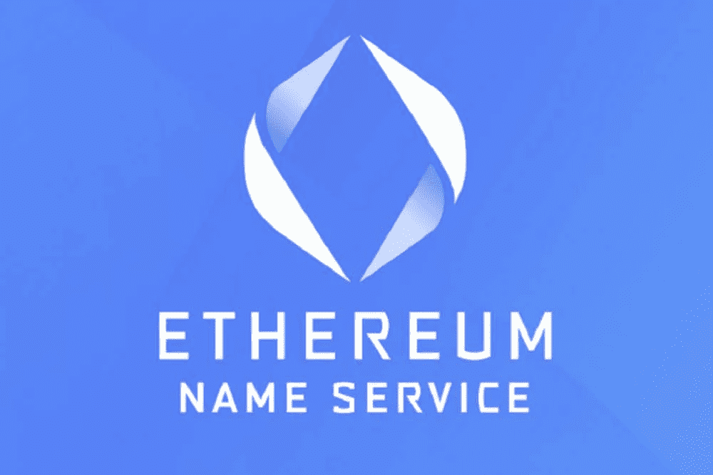

# ENS 是什么，为什么这么特别？

> 原文：<https://medium.com/coinmonks/what-is-ens-and-why-is-it-so-special-391cfcb3a95d?source=collection_archive---------19----------------------->

Source photo [ens ethereum name service — Bing images](https://www.bing.com/images/search?view=detailV2&ccid=eAWjflY7&id=F4D0A8A929067FFC9A25D43785C47BC921270FE9&thid=OIP.eAWjflY7K6SuWT6Xgq779gHaE8&mediaurl=https%3a%2f%2fcoinfomania.com%2fwp-content%2fuploads%2f2018%2f09%2fethereum-name-service.jpg&cdnurl=https%3a%2f%2fth.bing.com%2fth%2fid%2fR.7805a37e563b2ba4ae593e9782aefbf6%3frik%3d6Q8nIcl7xIU31A%26pid%3dImgRaw%26r%3d0&exph=667&expw=1000&q=ens+ethereum+name+service&simid=608003404709959031&FORM=IRPRST&ck=00FE444B7350F118E72E5964988DD82A&selectedIndex=3&ajaxhist=0&ajaxserp=0)

ENS 代表“以太坊名称服务”，这是一种在以太坊网络上实现一系列有趣活动的协议。事实上，它们将机器可读的地址转换为人类可读的地址，这几乎可以肯定是最有价值的特性。

## ENS 可能有哪些应用？