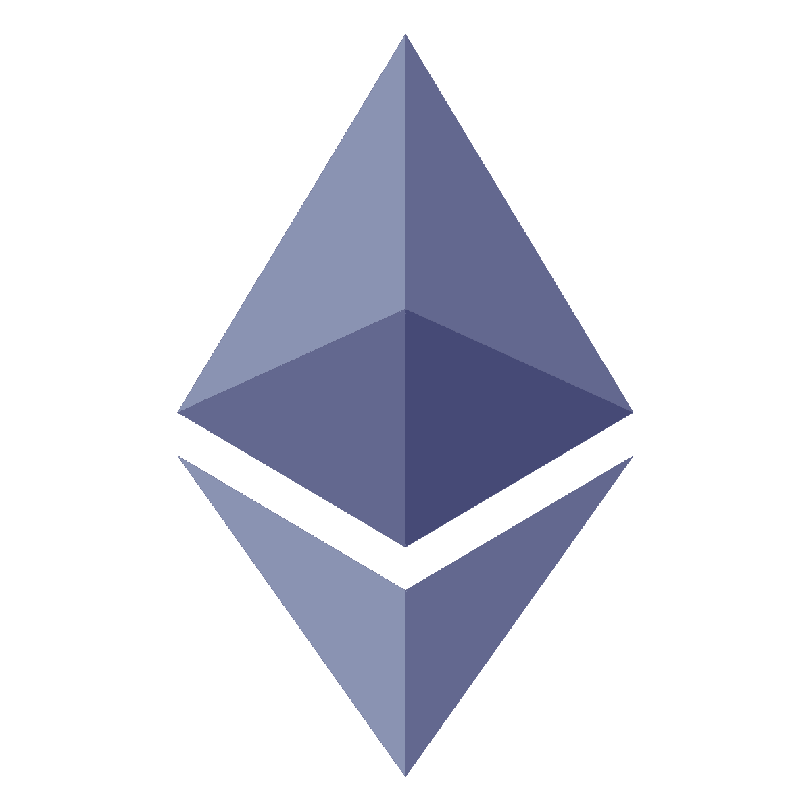

# 以太坊是什么？

> 原文：<https://medium.com/coinmonks/what-is-ethereum-2c82d1339701?source=collection_archive---------38----------------------->

## 以太坊简史

以太坊是由加密货币研究人员和程序员 Vitalik Buterin 在 2013 年底提出的下一代区块链。2015 年 7 月 30 日实施，采用“预采”方式，对应 1190 万个虚拟单位。

## **以太坊是什么？**

以太坊是一个开放的软件平台，开发者可以在其中构建分散的数字应用，并使用区块链技术来运行这些应用。它是一个应用程序，允许其用户直接达成协议和交易，以分散的方式销售或购买商品和服务并进行交易。

以太坊是公司用来制作新程序的账本技术。它被设计成具有适应性和灵活性。

建立以太坊的主要目的是通过使用我们之前提到的一种叫做智能合约的程序，将系统交互和支付减少到短时间，通过消除第三方和中介机构，将额外的支付和税收等费用降到最低甚至为零。

货币缩写为“ETH”。

## **以太坊是如何运作的？**

以太坊已经采用并开发了区块链技术，并被编程用于各种各样的领域，而不仅仅是通过智能合同保存记录的设施。以太坊区块链不仅存储交易列表，还存储网络的最后状态。这是一个为许多应用程序开发人员提供创造性环境的系统。它在以太坊的区块链结构中存储了所有交易历史的副本。两者之间的主要区别在于，节点存储每个智能合约以及所有以太网事务的最新状态。

以太坊有自己的互联网网络、应用平台和支付系统。应用程序开发人员可以在这个网络上发布他们的应用程序，并在以太坊自己的应用程序平台上向客户提供产品。他们可以提供这些服务，而不必支付任何佣金。

## **什么是以太？**

以太是便于以太网上交易的交易令牌。所有连接到以太坊网络的程序和服务都需要计算能力(而且这种计算能力不是免费的)。以太网是为网络参与者在网络上执行请求的交易而开发的一种支付形式。

## **以太币和比特币的区别**

截至 2021 年，以太是全球市值第二大的虚拟货币。按市值计算，它仅次于比特币(BTC)。与比特币不同，以太代币总数没有绝对限制——它会根据需求不断变化和增长。

两者之间的另一个关键区别是，虽然比特币区块链只是一个账本，但以太坊区块链的参与者可以通过向交易添加更多代码来创建“智能合约”。因此，虽然以太坊网络上的交易可能包含可执行代码，但与比特币网络交易相关的数据通常仅用于记录。

创建一个新的区块所需的时间也因两种虚拟货币而异。以太坊区块链上的一个新区块可以在几秒钟内确认，而比特币的等价物需要几分钟才能形成。

最重要的是，网络的一般用途是不同的。作为一种安全的点对点分散支付系统，比特币是作为传统货币的替代品而诞生的。以太坊平台的创建是为了方便合同和应用程序，以太是使这些交易成为可能的环境。以太从未打算成为一种替代货币或取代其他交换手段。相反，它的目的是促进以太坊平台的运营并将其货币化。

理论上，这两种技术不应该相互竞争；以太坊区块链实际上支持比特币。因此，尽管它们在功能上并不相互竞争，因为它们是出于不同的原因开发的，并且具有不同的内部动力，但它们都吸引了投资者的大量投资。因此，可以说这两种技术正在争夺投资者的资金。

## **为什么比特币被称为数字黄金，以太坊被称为数字白银？**

比特币被称为数字黄金，因为它是第一种加密货币，也是最大的加密货币，市值超过 1 万亿美元，其有限的供应(最多可开采的比特币数量为 2100 万)可以保持其价值。以太坊被称为数字白银，因为它是市值第二大的加密货币，具有贵金属等广泛的应用。

## **NFT 的简称是什么**

NFT 是我们可以用来表示唯一项目所有权的令牌。它们让我们能够象征艺术品、收藏品甚至房地产。一次只能有一个官方所有者，他们由以太坊区块链保护——没有人可以改变所有权记录或复制/粘贴新的 NFT。

## **以太坊使 NFTs 能够工作有几个原因:**

交易历史和令牌元数据可公开验证，易于证明所有权历史。

一旦交易被确认，几乎不可能操纵该数据来“窃取”所有权。

NFT 交易可以以点对点的方式进行，而不需要可以收取大量费用作为补偿的平台。

所有以太坊产品共享同一个“后端”。换句话说，所有以太坊产品都可以很容易地相互理解——这使得 NFTs 可以在产品之间移植。你可以在一种产品中买到 NFT，在另一种产品中轻松卖出。作为创建者，您可以一次列出多个产品的 NFT，每个产品都有最新的所有权信息。

以太坊永不掉价，因此您的代币将永远可供出售。

## **简而言之什么是 DeFi**

DeFi 是分散金融的缩写。它是任何可以使用以太坊的人都可以获得的金融产品和服务的统称，也就是说，任何有互联网连接的人都可以获得。有了 DeFi，市场总是开放的，没有中央权力机构可以阻止支付或阻止你访问任何东西。

## **以太坊和 DeFi**

以太坊是 DeFi 的优秀基础，原因如下:

没有人拥有以太坊或其上的智能合约——这给了每个人使用 DeFi 的机会。这也意味着没有人能改变你身上的规则。

在幕后，所有 DeFi 产品都使用同一种语言:以太坊。这意味着许多产品可以无缝地协同工作。你可以在一个平台借出代币，在另一个市场用完全不同的应用程序交换计息代币。这就像在你的银行兑换忠诚度积分。

代币和加密货币嵌入以太坊，这是一个共享的账本——跟踪交易和所有权在某种程度上是以太坊的业务。

以太坊提供完全的财务自由——大多数产品永远不会保管你的钱并让你控制。

## **简而言之**

在我们的文章里，我简单讲了一下以太坊，以太坊是用来做什么的。感谢您的阅读。

## 埃姆雷·巴萨兰

*来源:*

[https://en.wikipedia.org/wiki/Ethereum](https://en.wikipedia.org/wiki/Ethereum)**//维基百科-以太坊**

[https://www . investopedia . com/terms/e/ether-cryptocurrency . ASP](https://www.investopedia.com/terms/e/ether-cryptocurrency.asp)**//什么是 ether？**

[https://ozgurlukicin . com/teknoloji-haberleri/ether eum-nedir-ve-nasil-CALIS IR/](https://ozgurlukicin.com/teknoloji-haberleri/ethereum-nedir-ve-nasil-calisir/)**//以太坊如何运作？/以太坊 nasl al zir？**

[https://ethereum.org/en/nft/#ethereum-and-nfts](https://ethereum.org/en/nft/#ethereum-and-nfts)**//以太坊和 NFT**

[https://ethereum.org/en/defi/#what-is-defi](https://ethereum.org/en/defi/#what-is-defi)//**什么是 DeFi**

> 加入 Coinmonks [电报频道](https://t.me/coincodecap)和 [Youtube 频道](https://www.youtube.com/c/coinmonks/videos)了解加密交易和投资

# 另外，阅读

*   [如何在加拿大购买加密货币？](https://coincodecap.com/how-to-buy-cryptocurrency-in-canada)
*   [无聊猿游艇俱乐部(BAYC)评论](https://coincodecap.com/bored-ape-yacht-club-bayc-review)
*   [5 款最佳加密交易终端](https://coincodecap.com/crypto-trading-terminals) | [最佳 DeFi 应用](https://coincodecap.com/best-defi-apps)
*   [在美国如何使用 BitMEX？](https://coincodecap.com/use-bitmex-in-usa) | [BitMEX 评论](https://coincodecap.com/bitmex-review)
*   [最佳期货交易信号](https://coincodecap.com/futures-trading-signals) | [流动性交易所评论](https://coincodecap.com/liquid-exchange-review)
*   [南非的加密交易所](https://coincodecap.com/crypto-exchanges-in-south-africa) | [BitMEX 加密信号](https://coincodecap.com/bitmex-crypto-signals)
*   [MoonXBT 副本交易](https://coincodecap.com/moonxbt-copy-trading) | [阿联酋的加密钱包](https://coincodecap.com/crypto-wallets-in-uae)