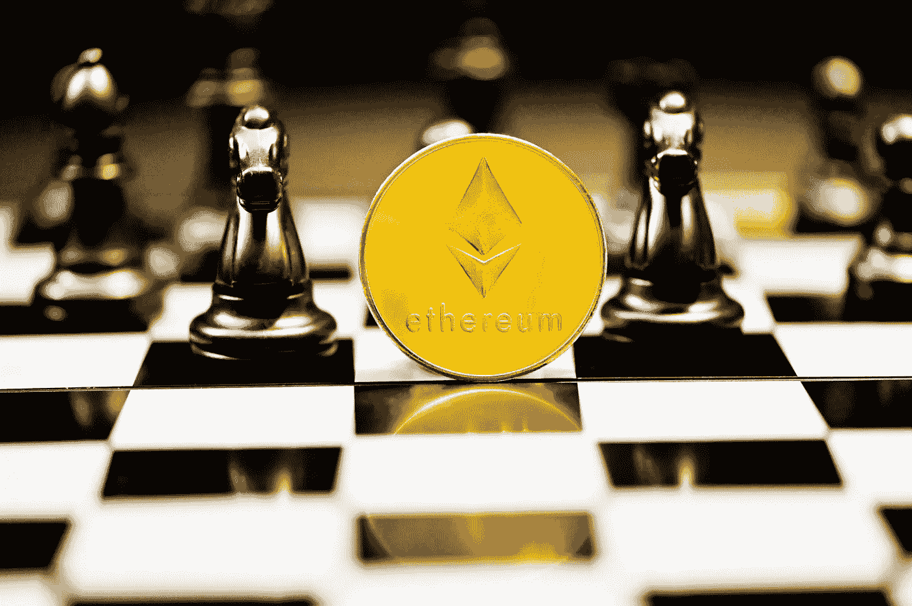

# 以太坊是什么？

> 原文：<https://medium.com/coinmonks/what-is-ethereum-9940d691d714?source=collection_archive---------51----------------------->

Source photo Unsplash.com

以太坊是世界上市值第二大的加密项目，也是第一个为行业提供智能合约功能的项目。

以太坊是一个总部位于区块链的软件平台，主要用于推动世界第二大加密货币，按市值计算，仅次于比特币。与其他加密货币一样，以太坊可以用于国际转账和收款，而不需要第三方…