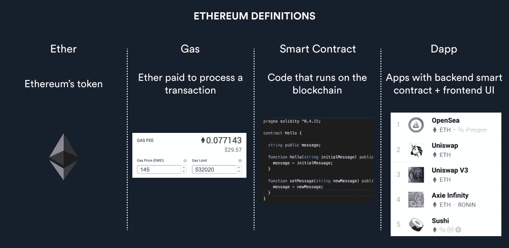
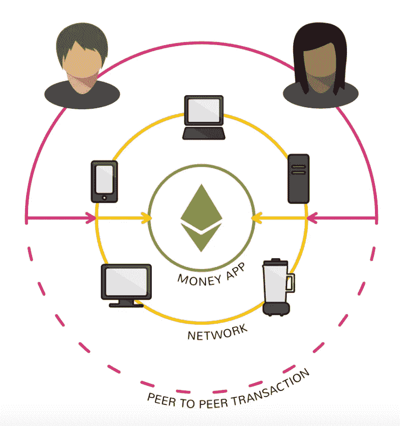
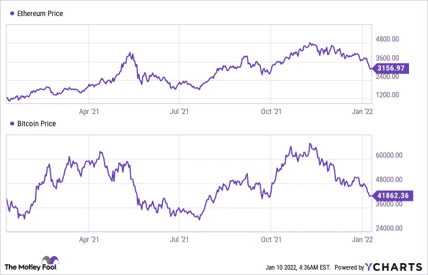

# 以太坊是什么？简单解释

> 原文：<https://medium.com/coinmonks/what-is-ethereum-simply-explained-d8e24041562b?source=collection_archive---------37----------------------->

**预计阅读时间:**只有 2 分 25 秒。

我将**每周五的一个** Web 3 主题从$ETH 简化为 L2 的“5 岁术语”——[在此免费订阅！](https://samfarber.substack.com/p/coming-soon?r=1frabl&s=w&utm_campaign=post&utm_medium=web)

# 以太坊是什么？

以太坊有 **2** 个关键部件。

1.  网络:以太坊的平台由区块链技术支持，该技术允许个人直接在网络上构建分散的应用程序。
2.  代币:名为 Ether ($ETH)，是一种类似比特币的价值储存手段，但其主要目的是奖励网络上处理交易的个人。

**总之:**以太坊是一个完全去中心化的网络，个人可以在其上构建去中心化的应用。—也被称为 Web 3.0 的“主干”

# 以太坊想取代什么？

假设你拥有一家小企业。每当有人在你的商店使用他们的信用卡时，你就不得不把一定比例的销售额交给信用卡处理机构，如 Visa 或 Mastercard。

对于像您这样每一分钱都很重要的企业来说，这可能是非常昂贵的。

现在，想想你有多信任 Visa。您相信它们可以促进客户的所有交易，安全地存储客户的信用卡号码，并始终保持运行。

虽然看起来这些信用卡处理器是安全的，但事实并非总是如此，如这里的，或者这里的，或者这里的…你明白了。

以太坊允许我们使用应用程序，如银行平台或社交媒体网站，而不需要中介或把我们所有的信任放在一个平台上。导致更便宜、更安全和更快速的交易。

# 以太坊和我们今天的互联网有什么不同？

以太坊使用计算机网络来存储数据，而不是像亚马逊网络服务那样集中在一个位置。

由于以太坊运行在一个计算机网络上，而不是一台，它变得几乎不可能被黑客攻击。

以太网的另一个重要方面是**智能合约**兼容性。

智能合同只是存储在区块链上的数字合同。

**例如，** Kickstarter 是一家企业与其支持者之间的中介。

想众筹一个企业的人把钱转到 Kickstarter，如果满足某些条件，Kickstarter 再把钱转到企业，收取一定的费用。

在这种情况下，双方都相信 KickStarter 能够准确、安全地转移资金。

有了**智能合约**，就不需要中介来监督交易。

支持者可以将$ETH 直接发送到合同，只有满足数字合同中概述的某些条件，合同才会将钱发送给企业。

**为什么要使用智能合同？**它们是存储在区块链上，这意味着它们永远不会被更改，也不需要第三方。导致更便宜、更安全和更快速的交易过程。

其他潜在的用例包括银行发放贷款、保险索赔或任何其他双边交易。

# 以太坊和比特币一样吗？

以太坊创始人 Vitalik Buterin 利用比特币的灵感建立了以太坊。

但是，严格来说，比特币本质上是一种类似于黄金的价值储存手段。而以太坊是一个托管分散式应用、智能合约和其他交易的网络。

# 以太坊有哪些现实意义？

*   投票系统中的潜在用途(结果不可更改)
*   分散融资(无需签证)
*   数字身份(不需要护照)
*   安全基础设施(分散数据库)
*   健康数据存储

如果你喜欢这篇文章，并且想在比特币、NFTs 和其他复杂的 Web 3.0 主题上变得更聪明…

我简化了**一个** Web 3 主题，从$ETH 到 L2 的每周五“5 岁条款”——[在这里免费订阅！](https://samfarber.substack.com/p/coming-soon?r=1frabl&s=w&utm_campaign=post&utm_medium=web)