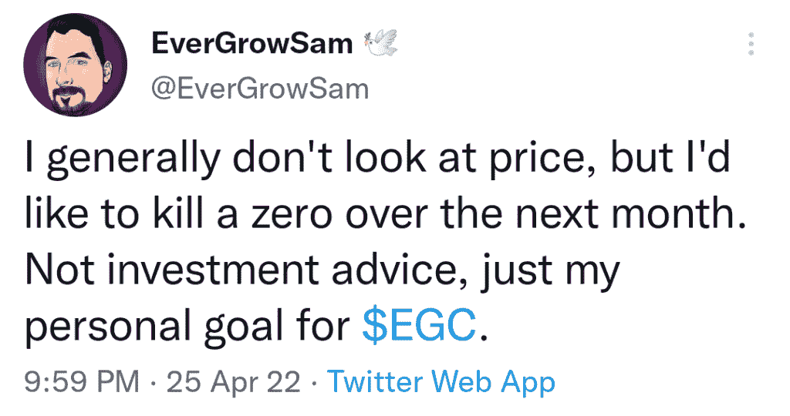
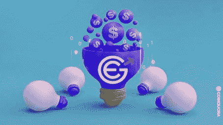
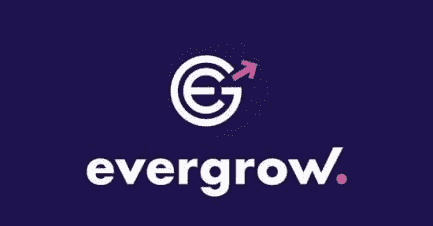

# 什么是恒丰币——恒丰币会达到 1 美元吗？

> 原文：<https://medium.com/coinmonks/what-is-evergrow-coin-will-evergrow-coin-reach-1-d743807a62f3?source=collection_archive---------11----------------------->

恒丰钱币董事长正式宣布推出恒丰 Nfts 市场“LunaSky”和 NFTs 系列。公告发布后不久，团队就开始行动了。

***也读作:*** [*空投即付 2022*](/coinmonks/airdrops-that-pay-instantly-2022-aaacbb36251f)

与此同时，主席大胆地发推特；他喜欢下个月杀一个零，这给社区带来了正面的关注；这可能是真的，如果他们最终推出他们的 Nfts 市场和 Nft 收藏

然而，该团队表示，这将是 15k 个美丽的系列，将是独一无二的，主席在宣布两天后提出了市场的名称。该团队购买了一个域名，并聘请一些开发人员立即开始工作

因此，如果团队按照承诺努力开发该项目，并推动该项目为 crypto/NFTs 爱好者所知，这可能会使 Evergrow Coin 飙升至 1 美分。

# 恒丰币是什么？

恒丰硬币是一种通货紧缩的象征，旨在随着时间的推移变得更加稀缺。所有 EGC 的持有者将从 BUSD 的每笔买卖交易中获得 8%的回报。

每笔买入/卖出交易的 3%被存入回购钱包，而 2%被转入 Pancakeswap 的流动性池，以创建一个稳定的价格下限。

恒丰生态系统由 [NFT](https://bulliscoming.com/azuki-nft/) 借贷、市场、内容订阅平台、赌注池& [即玩即赚](https://bulliscoming.com/most-profitable-play-to-earn-games/)游戏组成，其生态系统的一些功能仍在开发中。

# 不断增长的令牌组学

*   每笔买入/转让/卖出的 8%被重新分配给 BUSD 的所有持有人。
*   每笔交易的 3%被转移到 Pancakeswap 的流动性池中，以创建一个稳定的价格下限。
*   每笔交易的 2%用于战略回购和烧钱。
*   每笔交易的 1%被发送到营销钱包，用于资助营销、公用事业开发和社区管理。

# 恒丰币会达到 1 美元吗？

许多恒丰投资者都在等待恒丰币在不久的将来飙升至 1 美元，而该团队则更专注于开发。

与此同时，顶级加密大师和一些加密技术分析师预测，恒丰币的价格将在 9 年内上涨 400%，该币将在 9 年内取消一(1)个零，正如顶级大师所预测的那样。

也就是说，一枚恒丰币的价格不可能涨到 1 美元。

**查看:** [Steem 币价格预测——现在买 Steem 币好吗？](https://bulliscoming.com/steem-coin-price-prediction/)

# 定论

如果你想知道以目前的汇率在哪里购买恒丰币，目前用于交易恒丰币股票的顶级加密货币交易所有:DigiFinex、BitMart、Bitrue、LBank 和 Bibox。

因此，这不应该被视为投资建议，因为这篇文章只包含信息/教育内容，而不是投资建议

加入我们的电报社区，获取加密新闻、加密宝石、支持和加密教程；

电报链接:[https://t.me/+6ek5FpdVW89jNjE0](https://t.me/+6ek5FpdVW89jNjE0)

> 加入 Coinmonks [电报频道](https://t.me/coincodecap)和 [Youtube 频道](https://www.youtube.com/c/coinmonks/videos)了解加密交易和投资

# 另外，阅读

*   [有哪些交易信号？](https://coincodecap.com/trading-signal) | [Bitstamp vs 比特币基地](https://coincodecap.com/bitstamp-coinbase)
*   [10 本关于加密的最佳书籍](https://coincodecap.com/best-crypto-books) | [英国 5 个最佳加密机器人](https://coincodecap.com/uk-trading-bots)
*   [ko only Review](https://coincodecap.com/koinly-review)|[Binaryx Review](https://coincodecap.com/binaryx-review)|[Hodlnaut vs CakeDefi](https://coincodecap.com/hodlnaut-vs-cakedefi-vs-celsius)
*   [40 个最佳电报频道](https://coincodecap.com/best-telegram-channels) | [1xBit 评论](https://coincodecap.com/1xbit-review) | [Keevo 钱包评论](https://coincodecap.com/keevo-wallet-review)
*   [如何在印度购买以太坊？](https://coincodecap.com/buy-ethereum-in-india) | [如何在币安购买比特币](https://coincodecap.com/buy-bitcoin-binance)