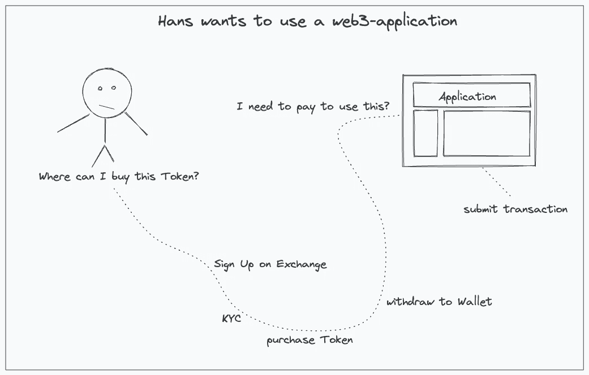
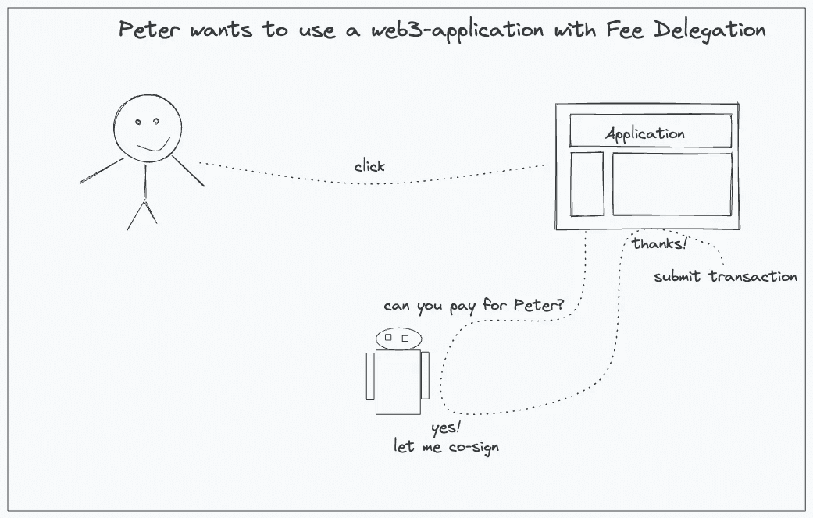

# 什么是费用委托？

> 原文：<https://medium.com/coinmonks/what-is-fee-delegation-f8c3ba0c29b6?source=collection_archive---------22----------------------->

在 crypto 和 web3 的世界里，发送交易的用户需要付费。

费用委托是一种允许其他人付费的功能。

消除付费的需要减少了用户创建交易和签署交易的交互。

## 为什么重要？

它阻止用户立即使用应用程序。

需要为交易付费的用户需要从某处获得令牌。普通用户不知道去哪里，研究一个地方购买和访问一个(不)集中的交换对一个想使用你的应用程序的用户来说太难了。

Hans want to use a web3-application without fee delegation

## 它允许什么？

用户可以打开一个应用程序并立即与之交互。应用程序可以在后台提交事务，不再能够与常规的(web2)替代方案区分开来。

费用委托解决了用户登陆区块链应用程序的最大障碍，而没有使 web3 原则失效。

Peter wants to use a web3-application with fee delegation

## 想了解更多？

您可以在“[如何集成 VIP-191](https://docs.vechain.org/tutorials/how-to-integrate-VIP-191-1.html) ”上了解 vechain.org 的更多功能。

作为 VeChain 开发者，你可以看看 [vechain.energy，一个收费委托服务](https://vechain.energy/)并自己测试一下。

> *加入 Coinmonks* [*电报频道*](https://t.me/coincodecap) *和* [*Youtube 频道*](https://www.youtube.com/c/coinmonks/videos) *了解加密交易和投资*

# 另外，阅读

*   [Bookmap 评论](https://coincodecap.com/bookmap-review-2021-best-trading-software) | [美国 5 大最佳加密交易所](https://coincodecap.com/crypto-exchange-usa)
*   最佳加密[硬件钱包](/coinmonks/hardware-wallets-dfa1211730c6) | [Bitbns 评论](/coinmonks/bitbns-review-38256a07e161)
*   [新加坡十大最佳加密交易所](https://coincodecap.com/crypto-exchange-in-singapore) | [购买 AXS](https://coincodecap.com/buy-axs-token)
*   [红狗赌场评论](https://coincodecap.com/red-dog-casino-review) | [Swyftx 评论](https://coincodecap.com/swyftx-review) | [造币厂评论](https://coincodecap.com/coingate-review)
*   [投资印度的最佳密码](https://coincodecap.com/best-crypto-to-invest-in-india-in-2021)|[WazirX P2P](https://coincodecap.com/wazirx-p2p)|[Hi Dollar Review](https://coincodecap.com/hi-dollar-review)