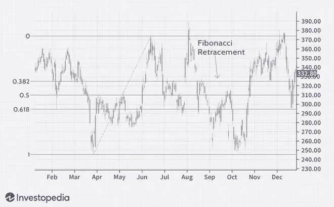

# 什么是斐波那契回撤，如何使用它

> 原文：<https://medium.com/coinmonks/what-is-fibonacci-retracement-and-how-to-use-it-c93d1a02b7b0?source=collection_archive---------41----------------------->

在我们的 YouTube 上观看视频的同时，享受这个流的资源！

YouTube:[https://youtu.be/lBXoVRY7Al4](https://youtu.be/lBXoVRY7Al4)

不和:【https://discord.gg/J73qhkj7kr】T2

推特:【https://twitter.com/CryptoverseDAO】

linktree:[https://linktr.ee/cryptoversedao](https://linktr.ee/cryptoversedao)

-

什么是斐波那契回撤水平？

斐波纳奇回撤线——源自斐波纳奇数列——是水平线，表示支撑位和阻力位可能出现的位置。

每个级别都与一个百分比相关联。百分比是指价格已经回撤了多少。斐波纳契回撤水平分别为 23.6%、38.2%、61.8%和 78.6%。虽然不是正式的斐波那契比率，但 50%也是被使用的。

该指标很有用，因为它可以在任何两个重要的价格点之间绘制，如高点和低点。然后，指示器将在这两点之间创建级别。

假设股票价格上涨 10 美元，然后下跌 2.36 美元。在这种情况下，它已经回撤了 23.6%，这是一个斐波那契数列。斐波那契数在自然界随处可见。因此，许多交易者认为这些数字也与金融市场相关。

斐波那契回撤水平是以意大利数学家莱昂纳多·皮萨诺·比戈洛的名字命名的，他以列奥纳多·斐波那契而闻名。然而，斐波纳契并没有创造斐波纳契数列。相反，斐波纳契在从印度商人那里了解到这些数字后，将它们引入了西欧。1 斐波纳契回撤水平是在公元前 450 年至公元前 200 年之间的古印度制定的。

斐波纳契回撤水平连接交易者认为相关的任何两点，通常是高点和低点。
所提供的百分比水平是价格可能停滞或反转的区域。
最常用的比率有 23.6%、38.2%、50%、61.8%、78.6%。
不应该完全依赖这些水平，所以假设价格在达到特定的斐波纳契水平后会反转是危险的。比列奥纳多·斐波那契早几个世纪，印度数学家就开始使用斐波那契数列。

数字最早在古印度制定:

尽管有它的名字，斐波纳契数列并不是由其同名者开发的。相反，在列奥纳多·斐波那契和西欧分享它之前的几个世纪，它就被印度数学家开发和使用了。

最值得注意的是，印度数学家阿卡雅·维拉汉卡在公元 600 年左右发明了斐波那契数和它们的排序方法。在维拉汉卡的发现之后，印度其他几代数学家——戈帕拉、赫马坎德拉和纳拉亚娜·潘迪塔——引用了这些数字和方法。潘迪塔通过绘制斐波纳契数和多项式系数之间的关系，扩展了它的用途。

据估计，斐波那契数早在公元 200 年就存在于印度社会。

斐波纳契回撤水平的公式:

斐波纳契回撤线没有公式。当这些指标应用于图表时，用户选择两个点。一旦选择了这两个点，就在移动的百分比处画线。

假设价格从 10 美元涨到 15 美元，这两个价位就是用来画回撤指标的点。那么，23.6%的水平将是 13.82 美元(15—(5 美元 x 0.236)= 13.82 美元)。50%的水平将是 12.50 美元(15—(5 x 0.5 美元)= 12.50 美元)。

如何计算斐波纳契回撤水平:

如上所述，当涉及到斐波纳契回撤水平时，没有什么可计算的。它们只是所选价格范围的百分比。

然而，斐波那契数列的起源是迷人的。它们基于一种叫做黄金比例的东西。以 0 和 1 开始一系列数字。然后，继续将前面的两个数字相加，得到如下所示的数字字符串:

0，1，1，2，3，5，8，13，21，34，55，89，144，233，377，610，987…字符串无限延续。

斐波纳契回撤水平都是从这个数字串中得出的。序列开始后，一个数除以下一个数得到 0.618，即 61.8%。用一个数除以它右边的第二个数，结果是 0.382 或 38.2%。所有的比率，除了 50%(因为不是官方的斐波那契数)，都是基于一些涉及这个数字串的数学计算。

* *有趣的事实:黄金比例，被称为神圣比例，可以在各种空间找到，从几何图形到人类 DNA。**

有趣的是，0.618 或 1.618 的黄金比例存在于向日葵、星系形成、贝壳、历史文物和建筑中。

斐波那契回撤水平告诉你什么？

斐波纳契回撤可以用来下进场单，确定止损水平，或设定价格目标。例如，一个交易者可能看到一只股票上涨。在向上移动后，它回撤至 61.8%的水平。然后，它又开始上升。因为反弹发生在上升趋势的斐波纳契水平，交易者决定买入。交易者可能会在 61.8%的水平设置止损，因为低于该水平的回报可能表明反弹失败。

在技术分析中，斐波纳契水平也以其他方式出现。例如，它们普遍存在于 Gartley 模式和 Elliott 波浪理论中。在价格大幅上涨或下跌后，这些形式的技术分析发现反转往往发生在接近特定的斐波纳契水平。

当其他分析工具和斐波纳契方法一起使用时，市场趋势可以被更准确地识别。

斐波那契回撤线是静态的，不像均线。价格水平的静态性质允许快速和容易的识别。这有助于交易者和投资者在价格水平受到考验时做出谨慎的预测和反应。这些水平是预期某种价格行为的拐点，无论是反转还是突破。

使用斐波纳契回撤水平的限制:

虽然回撤水平表明价格可能会在哪里找到支撑或阻力，但不能保证价格会在那里停止。这就是为什么经常使用其他确认信号，例如价格开始反弹。

反对斐波纳契回撤线的另一个论点是，它们数量太多，价格可能经常在其中一个附近反转。问题是交易者很难知道哪一个在特定的时间有用。当它不起作用时，可以说交易者应该看另一个斐波纳契回撤线。

为什么斐波那契回撤很重要？

在技术分析中，斐波纳契回撤水平表明股票可能反转或停止的关键区域。常见的比率包括 23.6%、38.2%和 50%等。通常，这些将发生在安全的高点和低点之间，旨在预测其价格运动的未来方向。

什么是斐波那契比率？

斐波纳契比率源自斐波纳契数列:0、1、1、2、3、5、8、13、21、34、55、89、144、233 等等。这里，每个数字等于前面两个数字之和。斐波纳契比率是由这个公式中的数学关系提供的。因此，它们产生以下比率:23.6%、38.2%、50%、61.8%、78.6%、100%、161.8%、261.8%和 423.6%。虽然 50%不是一个纯粹的斐波纳契比率，但它仍然被用作支撑和阻力指标。

你如何在图表中应用斐波纳契回撤线？

作为最常见的技术交易策略之一，交易者可以使用斐波纳契回撤线来指示他的交易位置。例如，如果交易员注意到，在经历了显著的上涨势头后，一支股票下跌了 38.2%。当股票开始面临上涨趋势时，他决定进入交易。因为股票达到了斐波纳契水平，这被认为是买入的好时机，交易者推测股票将会回撤，或者收复最近的失地。

怎么画斐波纳契回撤线？

斐波纳契回撤是在图表上绘制的两个重要点之间的趋势线，通常在绝对低点和绝对高点之间。相交的水平线位于斐波那契水平线上。

结论:

斐波纳契回撤是帮助交易者识别支撑位和阻力位的有用工具。有了收集到的信息，他们就可以下订单，确定止损水平，并设定价格目标。虽然有用，但交易者经常使用其他指标来更准确地评估趋势，做出更好的交易决策。

> 加入 Coinmonks [电报频道](https://t.me/coincodecap)和 [Youtube 频道](https://www.youtube.com/c/coinmonks/videos)了解加密交易和投资

# 另外，阅读

*   最佳[密码借贷平台](/coinmonks/top-5-crypto-lending-platforms-in-2020-that-you-need-to-know-a1b675cec3fa) | [杠杆令牌](/coinmonks/leveraged-token-3f5257808b22)
*   最佳[加密制图工具](/coinmonks/what-are-the-best-charting-platforms-for-cryptocurrency-trading-85aade584d80) | [最佳加密交易所](/coinmonks/crypto-exchange-dd2f9d6f3769)
*   [比斯勒评论](https://coincodecap.com/bitsler-review)|[WazirX vs coin switch vs coin dcx](https://coincodecap.com/wazirx-vs-coinswitch-vs-coindcx)
*   [7 大副本交易平台](https://coincodecap.com/copy-trading-platforms) | [BuyCoins 点评](https://coincodecap.com/buycoins-review)
*   [my constant Review](https://coincodecap.com/myconstant-review)|[8 款最佳摇摆交易机器人](https://coincodecap.com/best-swing-trading-bots)