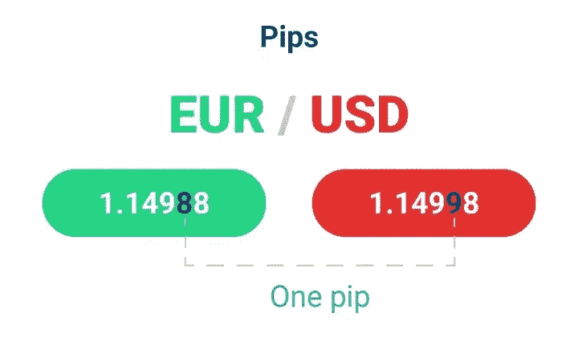
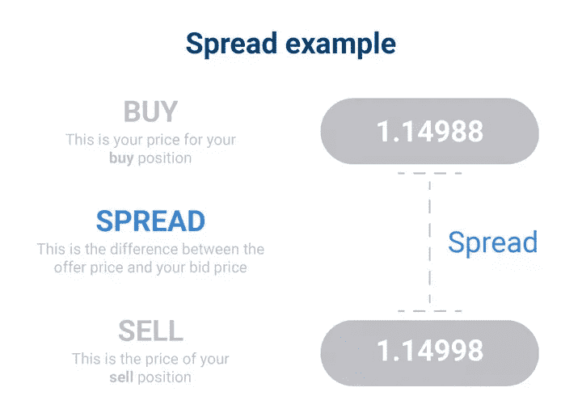
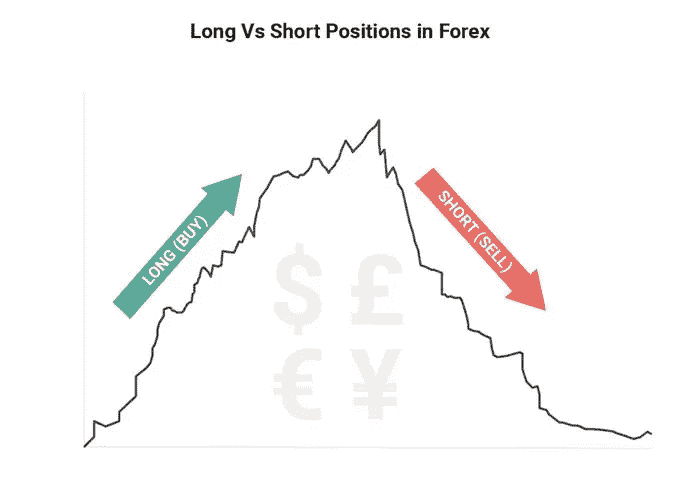

# 什么是外汇交易？

> 原文：<https://medium.com/coinmonks/what-is-forex-trading-aec0e8258c36?source=collection_archive---------55----------------------->

在我们的 YouTube 上观看视频的同时，享受这个流的资源！

YouTube:[https://youtu.be/L-_rcuOWAVQ](https://youtu.be/L-_rcuOWAVQ)

不和:【https://discord.gg/J73qhkj7kr】T2

推特:【https://twitter.com/CryptoverseDAO】

linktree:[https://linktr.ee/cryptoversedao](https://linktr.ee/cryptoversedao)

-

什么是外汇交易？

外汇(FX 或 forex)市场是一个全球市场，交易者在这里兑换各国货币

交易术语:

1.即期外汇

这种形式的外汇交易包括买卖真实货币。例如，你可以购买一定数量的英镑并将其兑换成欧元，然后一旦英镑升值，你可以再次将欧元兑换成英镑，从而获得比最初购买时更多的钱。

2.CFDs

CFD 一词代表“差价合约”。这是一种用来表示金融工具价格变动的合约。用外汇术语来说，这意味着你可以利用价格波动而不必拥有资产本身，而不是买卖大量货币。除了外汇，差价合约还可用于股票、指数、债券、商品和加密货币。在所有情况下，它们允许你在没有购买的情况下交易这些工具的价格变动。

如果你有兴趣更详细地了解差价合约是如何运作的，我们推荐下面这篇为初学者解释差价合约交易的文章:什么是差价合约交易？

3.点

在非日元货币对中，点是货币对价格的基本单位或报价的 0.0001。因此，当欧元/美元对的买入价从 1.16667 升至 1.16677 时，这代表了 1 点的差价。

4.传播

价差是一种货币对的买价和卖价之间的差额。对于最受欢迎的货币对，价差往往很低，有时甚至不到一个点子！对于交易不频繁的货币对来说，价差往往要高得多。在外汇交易变得有利可图之前，货币对的价值必须超过价差。

5.边缘

保证金是在开始交易时保留在交易账户中的钱。然而，由于普通的“零售外汇交易者”缺乏足够高的交易量以获得良好利润所需的保证金，许多外汇经纪人为他们的客户提供了利用杠杆的机会。

6。杠杆作用

这个概念对于外汇交易新手来说是必须的。杠杆是外汇经纪商为增加客户交易量而提供的资本。

示例:

一份合约或一批合约的面值等于 100，000 单位的基础货币。在欧元/美元的情况下，它将是 100，000 欧元。如果您使用 1:10 的杠杆比率，并且您的交易账户中有 1000 欧元，您可以交易一个头寸大小为 10000 美元的货币对。如果交易成功，杠杆将使你的利润最大化 10 倍。然而，请记住，杠杆也同样会增加你的损失。

因此，无论我们谈论的是新手交易还是专家交易，都应该谨慎使用杠杆。如果你的账户余额低于零欧元，你可以申请你的经纪人提供的负余额政策。受 ESMA 监管的经纪商提供了这种保护。使用这种保护将意味着你的余额不能低于零欧元，所以你不会欠经纪人。

7.熊市

这是一个用来描述股市下跌趋势的术语。换句话说，当股票价格下跌时。如果一只股票价格下跌得又快又深，就被认为是非常悲观的。

8。牛市

熊市的反面是牛市。当股市正在经历一段股价上涨的时期，我们称之为熊市。一只股票，以及一个部门，也可以被称为看涨或看跌。

9.贝塔

表示股票价格相对于整个市场运动的关系的指标。如果一只股票的贝塔系数为 1.5，这意味着当市场移动 1 点时，这只股票移动 1.5 点，反之亦然。

10.经纪人

经纪人是通过他们的平台(在线经纪人的情况下)帮助你买卖工具的个人或公司。他们通常收取佣金。

11.出价

出价是交易者愿意支付的每股价格。它与卖出价相对，卖出价是卖方愿意出售股票的价格。我们把买价和卖价之间的差额叫做什么？价差。

12。交换

这是一个进行交易的地方。两个著名的证券交易所是纳斯达克和纽约证券交易所。

13.关闭

这是交易所关闭和交易停止的时间。纳斯达克和纽约证券交易所的正常交易时间是东部时间上午 9 点到下午 4 点 30 分。盘后交易持续到晚上 8 点

14.日间交易

这是指交易者在一天内的买卖。日内交易是一种常见的交易策略。然而，如果有人日内交易，他们也可能做长期投资(长期投资组合)。

以下两个术语仅适用于股票交易:

15.股息

公司收益的一部分，支付给股东，即持有其股票的人。这些股息按季度(每年四次)或按年(每年一次)支付。不是每个公司都给股东分红。例如，发行细价股的公司可能不支付股息。

16.蓝筹股

这些是大型行业领先公司的股票。许多交易者被蓝筹股所吸引，因为蓝筹股享有支付稳定股息和展示长期稳健财务管理的声誉。一些人认为“蓝筹”一词来源于赌场中使用的蓝筹，蓝筹是筹码的最高面额。

给新手的 10 个外汇交易技巧:

1.了解你的市场

避免交易损失的最有效方法之一是外汇市场教育。在你拿你的资金冒险之前，花点时间自学货币对以及什么会影响它们的价格，这可能会让你避免犯一些简单的错误，这些错误可能会让你付出比你所能承受的损失更大的代价。这是一项时间投资，可能会让你免受压力和损失大量资金。

2.坚持你的计划

制定交易计划是避免损失的重要组成部分。很多交易者包括自己的盈利目标，风险承受水平，评估标准和方法论。一旦你制定了计划，确保你做的每笔交易都不超出你计划的范围。记住，你可能在交易前是最理性的，而在交易后是最不理性的。

3.实践

使用免费的模拟帐户将您的计划付诸实践。(在手机上下载 METATRADER 4)

你会看到用你的交易计划进行货币对交易，而不拿你的资金冒险。4 .预测市场状况

一些交易者选择根据新闻或其他政治和金融数据来预测市场。这些人被称为基本面交易者。其他人选择根据技术分析工具预测市场走势，如均线、斐波那契回撤和其他指标。这些人被称为技术交易者。许多交易者两者都用。不管你的交易风格如何，重要的是不要忘记通过你的平台可以帮助你更准确地预测市场的工具。

5.了解你的极限

这是一个简单而关键的规则。这包括知道何时退出亏损的交易，而不是继续等待，相应地设置止损水平，根据你的需要使用杠杆比率，并记住永远不要冒险超过你能承受的损失。

6.知道什么时候停下来

你没有时间每天每分钟都坐着看市场。通过止损单和限价单，你可以更好地管理你的风险和保护潜在的利润，让你以你设定的价格退出市场。跟踪止损特别有用；当市场波动时，它们在特定的距离跟踪你的头寸，在市场反转时帮助保护利润。下临时订单不一定会限制你的损失风险。7 .
。把你的情绪留在门外

你有一个未平仓头寸，而市场并没有按照你的方向发展。也许你可以用一两个不符合你的交易计划的交易来弥补…只是几个不会有坏处，对吗？

“报复性交易”很少有好结果。不要让情绪影响你成功交易的计划。当你有亏损的交易时，不要全押去试图一次赚回来；坚持你的计划，一次赚回一点损失，比突然发现自己有两个严重的损失更聪明。

8.保持缓慢和稳定

交易的一个关键是一致性。所有的交易者都亏损了，但是如果你保持优势，你就有更大的机会赢。自学和制定交易计划是好的，但是真正的考验是通过耐心和自律坚持这个计划。

9.不要害怕成长

虽然一致性很重要，但是如果事情不像你想的那样，不要害怕重新评估你的交易计划。随着你阅历的增长，你的需求可能会发生变化；你的计划应该始终反映你的目标。如果你的目标或财务状况改变了，你的计划也应该改变。

10.选择适合你的经纪人

参与外汇市场时，选择正确的交易伙伴至关重要。定价、执行和客户服务质量都会影响你的交易体验。

> *加入 Coinmonks* [*电报频道*](https://t.me/coincodecap) *和* [*Youtube 频道*](https://www.youtube.com/c/coinmonks/videos) *了解加密交易和投资*

# 另外，阅读

*   [Bookmap 评论](https://coincodecap.com/bookmap-review-2021-best-trading-software) | [美国 5 大最佳加密交易所](https://coincodecap.com/crypto-exchange-usa)
*   最佳加密[硬件钱包](/coinmonks/hardware-wallets-dfa1211730c6) | [Bitbns 评论](/coinmonks/bitbns-review-38256a07e161)
*   [新加坡十大最佳加密交易所](https://coincodecap.com/crypto-exchange-in-singapore) | [收购 AXS](https://coincodecap.com/buy-axs-token)
*   [红狗赌场评论](https://coincodecap.com/red-dog-casino-review) | [Swyftx 评论](https://coincodecap.com/swyftx-review) | [CoinGate 评论](https://coincodecap.com/coingate-review)
*   [投资印度的最佳加密软件](https://coincodecap.com/best-crypto-to-invest-in-india-in-2021)|[WazirX P2P](https://coincodecap.com/wazirx-p2p)|[Hi Dollar Review](https://coincodecap.com/hi-dollar-review)